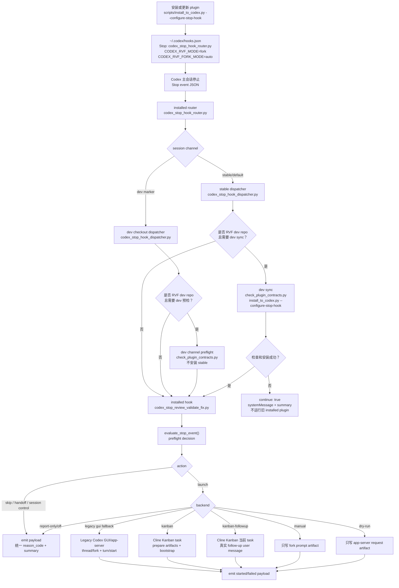

# Review Validate Fix

这是 `$review-validate-fix` workflow 的源仓库。仓库同时是 Claude Code 与 Codex 的本机 marketplace，承载一个跨 harness plugin：`plugins/review-validate-fix/`。其中 `skills/review-validate-fix/` 是运行期 skill 内容。安装器会启用 Codex 侧 `review-validate-fix@local-codex-plugins` slot 与 Claude Code 侧 `review-validate-fix@review-validate-fix-local` slot。

本仓库形态遵循 `docs/multi-harness-plugin-guideline/` 推荐的 Pattern A，并采用其 **(M+N) Marketplace + Nested manifest** 变体——repo-root `.claude-plugin/marketplace.json` 列出 plugin；plugin manifest 留在 `plugins/review-validate-fix/.{claude,codex}-plugin/` nested 位置。这与指南 06 隐含的 (P+R) 「repo=plugin」字面形态不同；具体落点见仓库结构。

## 跨 harness 支持

as-built 兼容性矩阵、(M+N) vs (P+R) 区别、core ↔ adapter 边界与 plugin payload 实测枚举见 [`docs/architecture/cross-harness.md`](docs/architecture/cross-harness.md)；通用原则见 [`docs/multi-harness-plugin-guideline/`](docs/multi-harness-plugin-guideline/)。一句话现状：

- **Claude Code** = Adapter-backed（trigger-only, bridged to Codex core）：`Stop` + `UserPromptSubmit` 两个 hook 入口为薄 shim，转发到 Codex core 脚本（路径 C），不重写 review 逻辑。
- **Codex CLI** = Native（hook 由 `install_to_codex.py --configure-stop-hook` 注册进 `~/.codex/hooks.json`）。
- **OpenCode / Cursor / Hermes / OpenClaw** = 作为 **host adapter** 仍 Reference-only（仅 `agentskills.io` skill 文档，不接线 hook/subagent）。注意：这只针对「RVF 寄居其中的 harness」这一 host-adapter 角色；另有一条独立的 **alternative reviewer**（santa-method 外部评审员）线——`cursor-agent` 已作为可选 alternative reviewer 受支持（仓库自带 `config/alternative-reviewer.cursor.json` 模板，`--config` 即可激活），与其 host-adapter 的 Reference-only 状态互不影响。

分析/归因层已 host-agnostic：transcript 解析（`core/transcript/` + `adapters/{codex,claude_code}/transcript.py`）、write-op 计数、子代理捕获与调用向量（`core/subagents/` + 各 adapter）均不消费 host 工具名或硬编码 host 布局。三份 manifest 的 `name`/`version`/`source` 一致性由 `scripts/sync-manifest.sh` fail-fast 守护。

## 当前结论

Codex 可以接受 plugin。这个 workflow 仍以 plugin 作为唯一维护源；plugin 通过 `.codex-plugin/plugin.json` 声明能力，并携带 `skills/review-validate-fix/` 作为实际运行内容。当前 Codex CLI 的 slash 菜单与 Codex GUI 的 skill picker 行为并不完全一致；安装脚本只负责安装并启用 plugin，不再通过同名本机 skill 目录伪造第二个入口。人工修改仍只进入 plugin skill 源码。

## 核心设计支柱：Stop 后 GUI Fork

`review-validate-fix` 的 Stop hook 自动化必须以“父会话停止，Cline Kanban task 或 Kanban follow-up 承载 review checkpoint”为中心设计。父会话触发 Stop hook 后应结束；hook 默认通过 `kanban` CLI 创建真实 Cline Kanban task，或在已有 Kanban task 中注入 follow-up 用户消息。Codex GUI fork 只保留为 legacy fallback，是 backup-of-backup，不是默认路径。

Cline Kanban task 必须在独立 worktree/checkpoint 中重放当前 session-owned dirty scope，并成为 review/validate/fix 的可审查执行面。默认首选路径不得打开 Terminal，不得运行 `codex fork <session-id>` TUI，也不得用当前 chat continuation 代替 review 启动；如果 Kanban follow-up 和新 Cline Kanban task 都不可用，才允许进入 legacy Codex GUI fork fallback。Stop continuation 不会创建真正的新用户 prompt，只会作为 hook system context 出现在当前轨迹中，因此不能作为 fallback。

## 维护模型

| 维度 | 当前策略 |
| --- | --- |
| canonical 源码 | `plugins/review-validate-fix/skills/review-validate-fix/` |
| 形态 | (M+N) Marketplace + Nested manifest：repo-root `.claude-plugin/marketplace.json` 列出 plugin；plugin manifest 在 `plugins/review-validate-fix/.claude-plugin/plugin.json` 与 `plugins/review-validate-fix/.codex-plugin/plugin.json` |
| Codex 安装位置 | `~/plugins/review-validate-fix`、`~/.agents/plugins/marketplace.json`、`~/.codex/config.toml` 中 `[plugins."review-validate-fix@local-codex-plugins"]`、Codex marketplace cache `~/.codex/plugins/cache/local-codex-plugins/review-validate-fix/<version>/` |
| Claude Code 安装位置 | `~/.claude/local-marketplaces/review-validate-fix/.claude-plugin/marketplace.json` 与 `plugins/review-validate-fix/`、Claude Code cache `~/.claude/plugins/cache/review-validate-fix-local/review-validate-fix/<version>/`、`~/.claude/settings.json` 中 `enabledPlugins["review-validate-fix@review-validate-fix-local"]` + `extraKnownMarketplaces["review-validate-fix-local"]` |
| 触发方式 | plugin 暴露 `$review-validate-fix` skill 与 namespaced skill slash 入口（Claude Code 形如 `/review-validate-fix:review-validate-fix`、`/review-validate-fix:rvf-land`）；`agents/openai.yaml` 控制隐式调用；Claude Code 走 Stop hook 转发到 Codex core（路径 C） |
| 跨 harness 抽象 | `core/`（host-agnostic：`transcript/`=S1、`subagents/`=S2）+ `adapters/{claude_code,codex}/`（host-specific transcript/subagent 实装）；hook host-ownership 契约 `hooks/_claude_hook_entry.py`=S3。as-built 矩阵见 [`docs/architecture/cross-harness.md`](docs/architecture/cross-harness.md) |

## 仓库结构

```text
.claude-plugin/marketplace.json            # 源仓库 marketplace 文件：列出本仓库提供的 plugin（(M+N) 关键文件）
plugins/review-validate-fix/               # plugin payload（marketplace.json 中 source 指向这里）
plugins/review-validate-fix/.claude-plugin/plugin.json   # Claude Code 侧 nested plugin manifest
plugins/review-validate-fix/.codex-plugin/plugin.json    # Codex 侧 nested plugin manifest
plugins/review-validate-fix/hooks/hooks.json             # 注册 Stop + UserPromptSubmit 两个 Claude Code hook
plugins/review-validate-fix/hooks/stop.py                # Stop hook 薄 shim（路径 C：转发 Codex core）
plugins/review-validate-fix/hooks/user_prompt_submit.py  # UserPromptSubmit hook 薄 shim
plugins/review-validate-fix/hooks/_claude_hook_entry.py  # 两入口共享的单一 host-ownership 契约（S3，stdlib-only）
plugins/review-validate-fix/commands/                    # 1 个 slash command：rvf-handoff-commit（其余入口已由同名 namespaced skill 承接）
plugins/review-validate-fix/skills/                      # 6 个 skill：review-validate-fix / rvf-analyze / rvf-handoff-intake / rvf-land / rvf-local-deploy / rvf-reopen
plugins/review-validate-fix/skills/review-validate-fix/
                                            # 主工作流 canonical skill 内容，人工修改这里
core/transcript/                           # host-agnostic NormalizedTranscript / TranscriptRecord（S1）
core/subagents/                            # host-agnostic SpawnRecord / InvokeCommand（S2）
adapters/claude_code/{transcript.py,subagent.py}  # Claude 栈实装（transcript 解析 + 子代理发现/调用向量）
adapters/codex/{transcript.py,subagent.py}        # Codex 栈实装（归一基线）
scripts/sync-manifest.sh                   # 校验三份 manifest 的 name/version/source 一致（S4）
scripts/check_plugin_contracts.py          # 仓库级契约检查入口，委托 check_skill_contracts.sh
scripts/check_skill_contracts.sh           # 覆盖 plugin runtime、安装脚本和 tests/ 的契约检查
scripts/install_to_codex.py                # 安装 plugin 到本机 Codex plugin 空间 + 同步 Claude Code marketplace
tests/                                     # 开发和契约测试；不随 plugin runtime 分发
plugins/review-validate-fix/skills/review-validate-fix/scripts/codex_stop_hook_dispatcher.py
                                            # Stop hook 稳定入口：必要时先检查并安装本 repo plugin
plugins/review-validate-fix/skills/review-validate-fix/scripts/codex_stop_hook_router.py
                                            # Stop hook channel router：按 session marker 选择 stable/dev
```

## 开发维护流程

日常改动只应把运行期代码放在 `plugins/review-validate-fix/skills/review-validate-fix/`，把开发测试、仓库级契约检查和安装辅助脚本放在仓库根目录的 `tests/` 与 `scripts/`。plugin runtime 不应携带 `test_*.py`、`*_test.py` 或仓库级契约脚本；`scripts/check_skill_contracts.sh` 会检查这条边界。

推荐维护顺序：

```bash
bash scripts/check_skill_contracts.sh
python3 scripts/check_plugin_contracts.py
python3 scripts/install_to_codex.py --configure-stop-hook
```

`scripts/check_skill_contracts.sh` 是最完整的本地验证入口，会执行 shell 语法检查、Python 编译检查和仓库级测试。`scripts/check_plugin_contracts.py` 保留为 plugin 契约入口，当前会委托同一套仓库级检查。安装脚本默认保留本机 `alternative-reviewer.json` 和 `state/`，因此不会覆盖机器相关 setup。

验证入口默认只输出简短成功信息；排查失败或需要查看每个测试脚本输出时，加 `--verbose`。

契约检查默认会并行运行较重的测试脚本，并把部分大测试文件拆成进程级 shard。默认配置是：

- `RVF_CONTRACT_PARALLEL_TESTS=1`
- `RVF_CONTRACT_PARALLEL_JOBS=8`
- `RVF_CONTRACT_REVIEW_SUPPORT_SHARDS=4`
- `RVF_CONTRACT_STOP_HOOK_SHARDS=4`
- `RVF_CONTRACT_DISPATCHER_SHARDS=1`

这些 shard 只影响测试 runner 的进程调度，不改变测试语义。需要复现串行行为或排查时可运行：

```bash
RVF_CONTRACT_PARALLEL_TESTS=0 bash scripts/check_skill_contracts.sh
RVF_CONTRACT_PARALLEL_TESTS=0 python3 scripts/check_plugin_contracts.py
```

需要查看 contract check 内部耗时分布时，可写出 timing report：

```bash
python3 scripts/check_plugin_contracts.py --timing-report /tmp/rvf-contract-timing.json
```

新增测试时不需要手写 shard 逻辑；只需要把测试函数加入对应文件的集中 runner 清单：

- `tests/test_review_support_scripts.py`：加入 `review_support_test_cases(root)`。
- `tests/test_codex_stop_review_validate_fix.py`：加入 `main()` 里的 `tests` 列表。
- `tests/test_codex_stop_hook_dispatcher.py`：加入 `main()` 里的 `tests` 列表。
- `tests/test_review_reopen_marker.py`：rescope marker（失败再入）单测，加入 `main()` 里的 `tests` 列表；该文件已登记进 `check_skill_contracts.sh` 的合约门 runner，新增测试函数务必同步进 `tests` 列表，否则静默假绿。

新测试应继续使用传入的 `tmp` / `tmp_path` 派生独立目录，避免共享固定路径、端口、全局环境或可长期存在的进程。确实需要临时修改 `os.environ`、模块 monkeypatch、socket/port、sleep/timeout 的测试，必须在 `finally` 中恢复状态；这类测试在高并发下容易成为 flake，应优先使用更宽松的超时边界，或放在默认不拆分的测试组中。

## 安装机制

日常开发只改 `plugins/review-validate-fix/skills/review-validate-fix/`。改完后运行契约检查：

```bash
python3 scripts/check_plugin_contracts.py
```

这个脚本运行 plugin skill 自带的契约检查，不复制内容。

安装到本机 Codex plugin 空间：

```bash
python3 scripts/install_to_codex.py
```

安装会把 plugin payload 复制到 `~/plugins/review-validate-fix`，在 `~/.agents/plugins/marketplace.json` 中登记本机 plugin entry `review-validate-fix`，在 `~/.codex/config.toml` 写入 `[plugins."review-validate-fix@local-codex-plugins"] enabled = true`，写 Codex marketplace cache 到 `~/.codex/plugins/cache/local-codex-plugins/review-validate-fix/<version>/`。如果检测到本机已存在 Claude Code plugin install（或显式传 `--sync-claude-plugin`），还会把源仓库 `.claude-plugin/marketplace.json` 同步到 `~/.claude/local-marketplaces/review-validate-fix/.claude-plugin/marketplace.json`、把 plugin payload 同步到该 marketplace 的 `plugins/review-validate-fix/` 与 Claude Code cache `~/.claude/plugins/cache/review-validate-fix-local/review-validate-fix/<version>/`，并维护 `~/.claude/settings.json` 与 `~/.claude/plugins/installed_plugins.json` 中的对应条目。

> 历史 layout 注意：曾经使用 `rvf` 作为 Codex plugin id（slot `rvf@local-codex-plugins`、cache `~/.codex/plugins/cache/local-codex-plugins/rvf/<version>/`）。本仓库未分发，rename 不附带兼容代码——清理动作由 `dev_backward_compatibility/2026-05-14-s0-v2-*.md` 与 `dev_backward_compatibility/2026-05-14-s0-bc-removal.md` 记录，需要手动 `rm -rf` 旧路径并删除 `~/.codex/config.toml` 中旧 `[plugins."rvf@local-codex-plugins"]` section。

配置 Codex Stop hook：

```bash
python3 scripts/install_to_codex.py --configure-stop-hook
```

这会更新 `~/.codex/hooks.json`，让 Stop hook 用 `CODEX_RVF_MODE=fork CODEX_RVF_FORK_MODE=auto` 调用 installed plugin skill 的 `codex_stop_hook_router.py`。router 默认选择 stable dispatcher；只有当前 session 显式设置 `RVF_STOP_HOOK_CHANNEL: dev` 或已有 dev channel marker 时，才转发到 dev checkout 的 dispatcher。router 选定 channel 后再由 dispatcher 转交给 `scripts/codex_stop_review_validate_fix.py`。`auto` 会在 Stop event 或环境里发现 `KANBAN_TASK_ID` / `CLINE_KANBAN_TASK_ID` / `KANBAN_HOOK_TASK_ID` / `task_id` 时选择 `kanban-followup`，否则默认创建新的 Cline Kanban task。Codex GUI fork 是 legacy backup-of-backup：只有自动模式下 Cline Kanban task 启动失败且失败不属于可诊断的 Kanban 管理面错误（例如端口 listener 不属于 tmux `cline-kanban` / `cline-kanban-*` session），或用户显式配置 `CODEX_RVF_FORK_MODE=gui` 时才使用。GUI fallback 不会打开 Terminal；它通过 Codex app-server 的 `thread/fork` + `turn/start` 创建一个新的 GUI fork 会话，并在新会话中提交以 `$review-validate-fix` 开头的 prompt。如果 Codex Desktop control socket 不可用，hook 会自动使用可连通的 RVF app-server bridge；bridge 仍不可用时只报告无法创建 legacy GUI fallback，不回退到 Stop continuation。

如果需要让 RVF 子流程完全脱离 Codex GUI，可显式配置 Cline Kanban 模式：

```bash
python3 scripts/install_to_codex.py --configure-stop-hook --fork-mode cline-kanban
```

该模式写入 `CODEX_RVF_FORK_MODE=cline-kanban`，也接受别名 `cline` / `kanban` / `ck`。Stop hook 不再后台运行隐藏 `codex exec`；它先生成 RVF run artifacts，并把当前 session-owned 的 dirty diff / untracked files 冻结为 `worktree-bootstrap.patch`、`worktree-bootstrap-files/`、`worktree-bootstrap.json`，然后通过官方 `kanban` CLI 创建并启动一张真实 Kanban task。若 global reviewed-diff tracker 已为本 Stop event 分配了 `tracker-scope.json`，startup prepare 会把该文件传给 `prepare_review_run.py --tracker-scope`，使 `scope.contract.json.primary_units`、`tracker_lease_id`、`tracker_scope_hash` 和 review packet 的 `## Tracker Scope` 与 allocator 分配一致，并把 `scope.contract.json.primary_files` / `fix_allowlist` 与 worktree bootstrap 收窄到 `tracker_scope.paths`；session manifest 仍作为归属证据保留，不再单独扩大 allocated diff 或 Kanban task dirty diff。task 名称不重复 repo 名，而是形如 `RVF from <Codex chat name> run <run ref>`，用于从 Kanban 列表直接反查原始 Codex chat。hook 会尽力从 Codex app-server 读取原始 thread name；如果该会话没有设置 name，则使用第一条 user prompt 的前 60 个字符作为名称，并用双引号包裹，例如 `RVF from "fallback prompt excerpt" run <run ref>`，提示这是未设置名称的会话。task 在 Cline Kanban 创建的独立 git worktree 中运行，第一步会在 task worktree 内解析 repo root，设置 `RVF_RUN_DIR` / `CODEX_RVF_RUN_DIR` / `CODEX_RVF_LOG_ROOT` 指向 installed plugin state 中已经冻结的 run，source `$RVF_ARTIFACTS_DIR/review-env.sh`，把 `RVF_REPO` 覆盖为 task worktree root，再用 `$RVF_WORKTREE_BOOTSTRAP` 执行 bootstrap helper 重放这些改动。后续 prompt 继续用 `$RVF_REVIEW_PACKET`、`$RVF_SESSION_MANIFEST`、`$RVF_WORKTREE_BOOTSTRAP`、`$RVF_ARTIFACTS_DIR/handoff.md` 等变量，不重复展开 run artifacts 绝对路径，不在 `.cline/worktrees/...` 中创建新的 `prepare-run` run，并执行完整 `$review-validate-fix`。task prompt 会要求最终回复前调用 `scripts/rvf_handoff.py open "$RVF_ARTIFACTS_DIR/handoff.md"`，因此 Cline Kanban native task 内手动完成 RVF 时也会尝试用默认编辑器打开 handoff；Stop hook 的 `RVF_HANDOFF_FILE` advisory 只作为兜底。task prompt、RunLedger summary、`origin.json` 和 handoff 的 `## Origin` 块都会记录 conversation name/source、完整 `codex://local/<thread-id>` 与 transcript path。

默认 CLI 配置为：

```bash
CODEX_RVF_CLINE_KANBAN_START_CMD='kanban --no-open'
CODEX_RVF_CLINE_KANBAN_TASK_CMD='kanban task'
CODEX_RVF_CLINE_KANBAN_START_TIMEOUT=90
CODEX_RVF_CLINE_KANBAN_TMUX_SESSION=cline-kanban-3484
```

默认路径依赖 PATH 上稳定安装的 `kanban` binary，不再通过 `npx` 临时执行目录运行。安装器和 dev-sync 会把旧的精确默认值 `npx -y kanban@0.1.66 ...` 视为 legacy default 并丢弃，让新默认生效；显式传入的自定义命令仍会持久写入。RVF 复用既有 Kanban listener 时不再要求 listener 的 cwd 等于目标 repo，但必须能通过 tmux 反查到 listener pane 属于 `cline-kanban` 或 `cline-kanban-*` session；普通进程或旧 `vibe-kanban` session 占用同一 port 会 fail-close。

本地 Cline Kanban 开发/升级流程：

```bash
cd /Users/bominzhang/Documents/GitHub/cline-kanban
npm install
npm run build
npm link
kanban --version
KANBAN_RUNTIME_PORT=3484 kanban task list --project-path /Users/bominzhang/Documents/GitHub/review-validate-fix
python3 /Users/bominzhang/Documents/GitHub/review-validate-fix/scripts/install_to_codex.py --configure-stop-hook --fork-mode auto
```

如果使用已发布版本而不是本地 checkout，优先用拥有当前 `kanban` shim 的 npm 安装，例如 `$(dirname "$(command -v kanban)")/npm install -g kanban@0.1.67`，再执行同样的 `kanban --version`、`kanban task list` 和 RVF installer 验证。不要用 `npx -y kanban@...` 作为 Stop hook 的长期配置；临时试跑可以用 npx，但不要把它写入 `CODEX_RVF_CLINE_KANBAN_START_CMD` / `CODEX_RVF_CLINE_KANBAN_TASK_CMD`。

installer 支持 `--cline-kanban-start-cmd`、`--cline-kanban-task-cmd`、`--cline-kanban-start-timeout`、`--cline-kanban-tmux-session`、`--cline-kanban-base-ref`、`--cline-kanban-auto-review-enabled`、`--cline-kanban-auto-review-mode`、`--cline-kanban-start-in-plan-mode`，并会从同名 `CODEX_RVF_CLINE_KANBAN_*` 环境变量读取。例如，只有需要固定非默认 port 或自定义 binary 路径时才写入：

```bash
python3 scripts/install_to_codex.py --configure-stop-hook --fork-mode cline-kanban \
  --cline-kanban-start-cmd 'kanban --port 3499 --no-open' \
  --cline-kanban-task-cmd 'kanban --port 3499 task'
```

Cline Kanban task id、base ref、bootstrap artifact 和生成的 task prompt 都会写入同一份 RunLedger：`events.jsonl`、`summary.json`、`review-env.sh`、`review-agent-context.md` 等位于 `state/runs/<run_id>/artifacts/`。默认不自动 commit 或 open PR；用户可以在 Kanban 的 diff viewer、checkpoints、inline comments 中审查结果，再使用 Kanban 的 Commit/Open PR 入口交付。只有显式启用 `CODEX_RVF_CLINE_KANBAN_AUTO_REVIEW_ENABLED=1` 时，hook 才把 `CODEX_RVF_CLINE_KANBAN_AUTO_REVIEW_MODE=commit|pr|move_to_trash` 传给 Kanban。

如果当前 Stop hook 本身运行在 Cline Kanban task 内，并且 Kanban host 已定制支持真实 follow-up user message 注入，可配置：

```bash
python3 scripts/install_to_codex.py --configure-stop-hook --fork-mode kanban-followup
```

该模式写入 `CODEX_RVF_FORK_MODE=kanban-followup`，也接受别名 `kanban-message` / `kanban-inject`。dirty gate 通过后，hook 不 fork、不创建新 task，而是要求环境或 Stop event 提供 `KANBAN_TASK_ID`（兼容 `CLINE_KANBAN_TASK_ID` / `task_id`），再调用定制的 `kanban task message --project-path <repo> --task-id <id> --prompt-file <prompt> --source review-validate-fix --idempotency-key <run_id>`。这个命令必须走 Kanban host 的真实用户消息通道，把 `$review-validate-fix` prompt 注入当前 task 的 active coding-agent chat session；不得实现为 card activity、metadata、hook context、system message 或 `contextModification`。注入失败时 hook 只报告 `kanban_followup_unavailable` / `kanban_followup_missing_task_id` 并停止，不回退到 continuation、新 task 或 GUI fork。

实际写入 `~/.codex/hooks.json` 的入口是 installed plugin skill 中的 `scripts/codex_stop_hook_router.py`，不是直接调用 `codex_stop_review_validate_fix.py`。router 只按显式 `RVF_STOP_HOOK_CHANNEL` 控制行或 session marker 选择 stable/dev channel；默认永远是 stable，不因当前 repo 是 RVF 源仓库而自动切 dev。stable channel 转发到 installed stable dispatcher，并关闭子 dispatcher 的 repo-path dev sync；选择 dev channel 后，router 会转发到 dev checkout 的 dispatcher，并允许它在 `CODEX_RVF_DEV_REPO` 匹配当前 Stop event repo 时运行 repo 级 contract check，但会设置 `CODEX_RVF_DEV_SYNC_INSTALL=0`，避免 Stop hook 把 dev checkout 自动安装进 stable plugin。dispatcher 的完整 dev-only sync 安装能力仍保留给直接调用 dispatcher 的受控开发路径使用：

```bash
python3 scripts/check_plugin_contracts.py
python3 scripts/install_to_codex.py --configure-stop-hook
```

更新 stable channel 必须是显式人工动作：先切到要发布为 stable 的 checkout、branch 或 tag，确认 contract 通过，再运行安装器。例如：

```bash
python3 scripts/check_plugin_contracts.py
python3 scripts/install_to_codex.py --configure-stop-hook
```

这会更新 installed plugin skill 与 `~/.codex/hooks.json` 中的 stable dispatcher/router 绑定；不会改变当前 session 的 `RVF_STOP_HOOK_CHANNEL` marker。Stop hook 的自动同步只服务 dev channel 的开发预检，不负责发布 stable channel。

如果当前 Stop hook command 是 `auto`、Cline Kanban 或 Kanban follow-up 模式，dispatcher 在执行自同步安装时会保留 `--fork-mode ...` 和全部 `--cline-kanban-*` 配置，避免把已配置的管理模式覆盖回默认值。

如果受控开发路径启用了 dispatcher dev sync，且 Stop event 提供 transcript path，dispatcher 会先生成 session manifest；只有存在当前 chat session 归属的 `owned_dirty_paths` 时，才执行 dev sync 并转交 installed `codex_stop_review_validate_fix.py`。这避免其他 session 或其他 agent 留下的 dirty WIP 触发本 session 的同步、安装或自动 review。没有 transcript 时，dispatcher 仍保留旧行为，按 dev repo 主会话执行 sync。

只有 contract check 和 plugin 安装成功后，dispatcher 才会把同一份 Stop event JSON 转交给 installed `codex_stop_review_validate_fix.py`。如果检查、安装或 installed hook 执行失败，dispatcher 只通过 stdout 输出一个不会触发模型续跑的 hook payload，并把失败详情写入 run ledger；不要把这类 breaking error 写成非零 stderr，因为 Codex Desktop 可能把 hook stderr 包装成当前会话的 `<hook_prompt>` continuation。对其他仓库或 subagent Stop event，dispatcher 不做同步，只转交给 installed hook 正常执行。

### Dev-only 标准

Stop hook 自同步链是 dev-only sync chain：部署后的 dispatcher 只有在直接作为开发入口运行、Stop event 的 git root 等于 `CODEX_RVF_DEV_REPO`、事件不是 subagent，且 session scope 允许时，才运行 `CODEX_RVF_DEV_REPO/scripts/check_plugin_contracts.py` 和 `CODEX_RVF_DEV_REPO/scripts/install_to_codex.py --configure-stop-hook`。它不得运行 deployed plugin 内的安装脚本，也不得从 installed plugin cache 复用旧 installer。经 router 运行时，stable channel 不得因为 repo 路径匹配而触发 dev sync；dev channel 可以触发 repo 级 contract check，但 router 必须禁用安装 step，避免 dev Stop hook 自动更新 stable channel。stable channel 下即使当前 cwd 是 RVF 开发仓库，也必须使用 stable workflow。

`scripts/install_to_codex.py`、`scripts/check_plugin_contracts.py`、`scripts/check_skill_contracts.sh` 和未来的 dev-only helper 都属于仓库级开发工具，不属于可分发 plugin runtime。未来新增 dev-only 文件时，优先放在仓库顶层 `scripts/` 或显式 `dev-only` / `dev_only` / `.rvf-dev-only` 路径；安装器会过滤这些名称，契约检查也会阻止它们出现在 deployed plugin skill 目录中。runtime 代码需要跨边界时，只能通过 `CODEX_RVF_DEV_REPO` 指向的 dev repo subprocess 调用，不能 import 或复制 dev-only 模块。

所有 dispatcher、Stop hook、manual run、external reviewer 和 command lock 的排障日志都写入统一 run ledger。入口是 `state/latest.json` 指向的 `state/runs/<run_id>/summary.json` 和 `events.jsonl`；大文本如 Stop event、fork prompt、review packet、stdout/stderr 会作为 `artifacts/` 文件保存。显式 suppress 的 Stop hook 也会写入最小 ledger，并在 Coding Agent UI 的 `systemMessage` 中保留 `summary=<summary_path>`。command lock 会记录 `lock_wait_started`、`lock_acquired`、`lock_timeout` 与 `lock_released` 事件。hook stdout 仍只输出 Codex hook payload，用户可见 `systemMessage` 保持短格式：`review-validate-fix: <status>; reason=<reason_code>; detail=<human_readable_note>; summary=<summary_path>`，其中 `detail` 只在需要解释非错误跳过、递归保护等用户易误解状态时出现。可用 `CODEX_RVF_LOG_ROOT` 或兼容别名 `CODEX_RVF_STATE_DIR` 覆盖日志根目录，未设置时使用 plugin skill 的 `state/`；如果运行中的 skill copy 位于 Cline Kanban `.cline/worktrees/...`，默认会改用 `~/plugins/review-validate-fix/skills/review-validate-fix/state/`，避免 task worktree 承载 RVF run ledger。

### 日志排障入口

`state/` 是本机运行状态，已被 gitignore，不属于可分发 plugin 内容。排障时先看：

```bash
cat plugins/review-validate-fix/skills/review-validate-fix/state/latest.json
cat <summary_path>
cat <events_path>
```

`latest.json` 只是 pointer，不是完整状态源；主程序和测试都应读取 `summary.json` 或 `events.jsonl`。如果日志目录不可写，hook payload 仍应可用，并在 `systemMessage` 或 summary diagnostics 中标记 `log_unavailable`。`CODEX_RVF_LOG_MAX_INLINE_BYTES` 和 `CODEX_RVF_LOG_LEVEL` 只用于日志行为调试，不应改变 hook 协议。

hook 会优先使用 Stop event 暴露的 rollout path 进行 fork；只有没有 path 时才退回 thread/session id。这样可以避开 Desktop 环境 id 无法被外部 app-server 直接索引的问题。legacy GUI fork 的首条 `$review-validate-fix` prompt 也会携带 parent conversation name/ref、name source、`codex://local/<thread-id>`、transcript path 和 `origin.json` path，确保 fork 内生成的 handoff 不会把 `RVF_PARENT_SESSION_ID` 误记为 conversation name source。

如果 Codex Desktop 没有暴露 legacy control app-server socket，legacy GUI fallback 默认会进入 `CODEX_RVF_BRIDGE_GUI_UNVERIFIED_POLICY=auto`：优先复用可连通的 `~/.codex/app-server-control/rvf-app-server.sock`，否则尝试启动 bridge app-server。bridge fork 的 summary 会保留 `socket_source=bridge` 和 `gui_visibility=unverified-bridge-only`，便于排障；如果复用的 bridge 在 fork/turn 时返回配置加载或权限类 app-server 错误，hook 会终止 RVF 专用 socket 上的旧 bridge listener、重启 bridge 并重试一次。需要禁止 bridge fallback 时，显式设置 `CODEX_RVF_BRIDGE_GUI_UNVERIFIED_POLICY=report|manual|fail`；无论哪种失败策略，都不会注入 `$review-validate-fix` continuation prompt。

### Stop hook 工作流可视化



这张图里的关键边界是：router 只负责 stable/dev channel 选择，默认 stable；dispatcher 只负责 dev-only sync 与 installed hook 转交；installed hook 内部先用 `evaluate_stop_event()` 统一决定是否启动 RVF，再由 `launch_backend()` 执行 Cline Kanban task、Cline Kanban follow-up、legacy GUI fallback、manual 或 dry-run。`CODEX_RVF_MODE` / `CODEX_RVF_FORK_MODE` 仍是公开配置入口，但主程序内部只使用归一后的 backend。默认 `auto` 成功路径会在普通 Codex GUI session 中创建新的 Cline Kanban task，在 Kanban task session 中注入 follow-up user message；只有自动模式下 Kanban task 启动失败且不是 stale listener / wrong repo 这类可诊断 Kanban 管理面错误时才进入 legacy GUI fallback。失败路径只报告原因，不把 `$review-validate-fix` 作为当前 Stop continuation 注入父会话。

fork 诊断不再通过 Stop hook 主路径里的 `RVF_FORK_EXPERIMENT` 自动触发；需要排查 app-server fork 行为时，手动运行 plugin runtime 的 `scripts/diagnose_codex_fork.py --mode dry-run|gui|manual`，并把 Stop event JSON 通过 stdin 传入。

### 当前 session 开关

如果只想临时管理当前 chat session 的 Stop hook，而不是改全局 `~/.codex/hooks.json`，可以在用户消息中单独放一行：

```text
RVF_STOP_HOOK: off
```

这会把当前 session 标记为 disabled，后续 Stop hook 对同一 session 只跳过 RVF fork/continuation/review gate。router 仍会运行，并把事件转发给当前 channel 选中的 stable 或 dev hook；如果 gate disabled，由 selected hook 跳过 RVF 主流程。恢复时发送：

```text
RVF_STOP_HOOK: on
```

`on` 会清除 disabled 标记，并让当前这一次 Stop event 继续走正常 dirty/session scope/backend gate；如果当前 session 仍有 session-owned dirty scope，它可以在同一轮创建 GUI fork 或 Cline Kanban task。查看当前 session 状态：

```text
RVF_STOP_HOOK: status
```

这些状态写入 plugin skill 的 `state/session-hook/`，安装更新时会随 `state/` 一起保留，只影响当前 chat session 的 RVF 执行 gate，不修改全局 hook 配置，也不阻止本仓库开发时的 installed plugin 检查和安装。

同一套 session 状态也支持选择本 session 使用 stable 还是 dev 安装。默认永远是 `stable`，不会因为当前 repo 是 RVF 开发仓库而自动切到 dev：

```text
RVF_STOP_HOOK_CHANNEL: dev
RVF_STOP_HOOK_CHANNEL: stable
RVF_STOP_HOOK_CHANNEL: default
RVF_STOP_HOOK_CHANNEL: status
```

`dev` / `stable` 会把当前 session 的 channel marker 写入 `state/session-hook/` 并让当前这次 Stop event 继续走对应 channel；`default` 清除 marker 并回到全局默认 stable；`status` 只报告当前 session 的 gate 和 channel，例如 `gate=enabled, channel=dev, source=session-marker`。router 只根据这些显式控制行或 session marker 选择 channel，不用 repo 路径、repo 名或 `CODEX_RVF_DEV_REPO` 匹配结果自动选择 dev。

这些 `RVF_STOP_HOOK:*` 与 `RVF_STOP_HOOK_CHANNEL:*` 行是 Stop hook 的会话控制元数据，不是交给主 agent 的代码任务、review issue、research 对象或 scope-of-work 内容。自动 fork prompt 会显式提醒 fork 会话忽略这类控制行，避免把临时开关误纳入 review 工作。

## Setup 相关配置

有些变化不能简单从仓库覆盖到本机，因为它们绑定机器、凭据或用户选择。当前最典型的是：

- `config/alternative-reviewer.json`
- `state/`
- `~/.codex/hooks.json` 中的 Stop hook / fork hook 绑定
- `~/.codex/hooks.json` 中 `CODEX_RVF_DEV_REPO` 指向的本机源仓库路径
- `~/.codex/app-server-control/rvf-app-server.sock` 和 `~/.codex/app-server-control/rvf-app-server.log` 这类本机 app-server bridge 文件
- 外部 reviewer 的 CLI/MCP/IDE wrapper 认证状态和环境变量

`scripts/install_to_codex.py` 默认会保留本机 plugin 中已有的 `skills/review-validate-fix/config/alternative-reviewer.json` 和 `skills/review-validate-fix/state/`，避免仓库更新覆盖掉已完成的 external reviewer setup。确实要用仓库版本覆盖 setup 配置时，显式加：

```bash
python3 scripts/install_to_codex.py --replace-setup-config
```

这条规则和当前 external reviewer config 的性质一致：workflow 本体应随仓库同步，机器相关配置应由 setup 流程或用户明确授权更新。

Stop hook 的默认 `CODEX_RVF_FORK_MODE=auto` 会按运行上下文选择 backend：当前 Stop event/环境提供 Kanban task id（`KANBAN_TASK_ID` / `CLINE_KANBAN_TASK_ID` / `KANBAN_HOOK_TASK_ID` / `task_id`）时使用 `kanban-followup`，否则创建新的 Cline Kanban task。Codex GUI/app-server fork 只是 legacy backup-of-backup；显式 `CODEX_RVF_FORK_MODE=gui` 或自动模式下 Cline Kanban task 启动失败且失败不属于可诊断 Kanban 管理面错误时才会使用。不要把 Terminal + `codex fork <session-id>` 作为 Desktop 自动路径：Desktop thread/session id 不一定存在于 CLI 的 saved sessions 中，会出现 Terminal 打开但 fork 失败的旧问题。`CODEX_RVF_MODE=continuation` 已废弃；当 Kanban 和 legacy GUI fallback 都不可用时，fork 模式只报告失败。

显式 `CODEX_RVF_FORK_MODE=cline-kanban` 时，fork 模式不调用 Codex GUI fork；hook 会用官方 `kanban` CLI 创建并启动一张真实 Cline Kanban task。父 worktree 保持原样，session-owned dirty changes 会先冻结为 bootstrap artifact，再由 task 在 Kanban 独立 worktree 中重放。Kanban 服务不可用、task 创建/启动失败、bootstrap artifact 无法安全生成或重放时直接 fail-safe，不启动隐藏 runner。

显式 `CODEX_RVF_FORK_MODE=kanban-followup` 时，fork 模式也不调用 Codex GUI fork；hook 只通过定制 `kanban task message` 向当前 Kanban task 注入真实 follow-up 用户消息。缺少当前 task id、Kanban CLI 不支持 message、或 host 无法确认注入时直接 fail-safe，不启动新 task，也不使用 Stop continuation。

## 验证

```bash
bash scripts/check_skill_contracts.sh
python3 scripts/check_plugin_contracts.py
```

这两个入口默认并行运行重测试，并把 `test_review_support_scripts.py` 与 `test_codex_stop_review_validate_fix.py` 做进程级分片。需要串行复现时：

```bash
RVF_CONTRACT_PARALLEL_TESTS=0 bash scripts/check_skill_contracts.sh
RVF_CONTRACT_PARALLEL_TESTS=0 python3 scripts/check_plugin_contracts.py
```

需要单独跑某个 shard 时：

```bash
python3 tests/test_review_support_scripts.py --shard-count 4 --shard-index 0
python3 tests/test_codex_stop_review_validate_fix.py --shard-count 4 --shard-index 0
python3 tests/test_codex_stop_hook_dispatcher.py --shard-count 2 --shard-index 0
```

默认没有拆分 dispatcher 测试；`test_codex_stop_hook_dispatcher.py` 的 shard 参数主要用于本地诊断，开启 `RVF_CONTRACT_DISPATCHER_SHARDS` 前应确认没有放大时序敏感测试。

需要详细输出时运行：

```bash
bash scripts/check_skill_contracts.sh --verbose
python3 scripts/check_plugin_contracts.py --verbose
```
