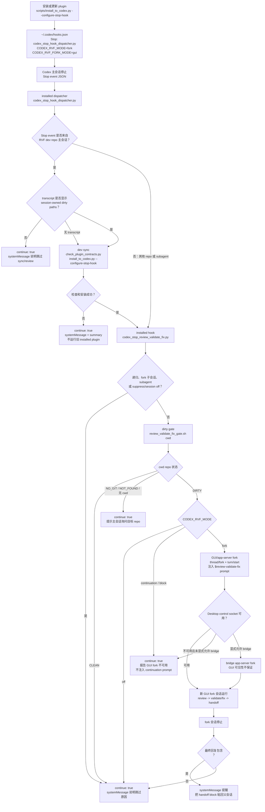

# Review Validate Fix

这是 `$review-validate-fix` Codex workflow 的源仓库。仓库只维护 Codex plugin：`plugins/review-validate-fix/` 是唯一 canonical 交付形态，其中的 `skills/review-validate-fix/` 是运行期 skill 内容。

## 当前结论

Codex 可以接受 plugin。这个 workflow 现在只通过 plugin 分发；plugin 通过 `.codex-plugin/plugin.json` 声明能力，并携带 `skills/review-validate-fix/` 作为实际运行内容。安装脚本只安装 plugin，不维护 standalone skill 路径。

## 核心设计支柱：Stop 后 GUI Fork

`review-validate-fix` 的 Stop hook 自动化必须以“父会话停止，新 GUI fork 会话承载 review checkpoint”为中心设计。父会话触发 Stop hook 后应结束；hook 负责通过 Codex app-server fork 出一个新会话，并像用户手动启动新会话时输入第一个 prompt 一样，在 fork 会话中提交以 `$review-validate-fix` 开头的用户 prompt。

这个新 fork 会话必须保留父会话完整上下文，同时成为 review/validate/fix 的独立可 rewind checkpoint。默认首选路径不得打开 Terminal，不得运行 `codex fork <session-id>` TUI，也不得用当前 chat continuation 代替 fork；如果 Codex Desktop control socket 不可用，hook 只通过 `systemMessage` 报告无法创建 GUI fork，并停止自动 review。Stop continuation 不会创建真正的新用户 prompt，只会作为 hook system context 出现在当前轨迹中，因此不能作为 fallback。

## 维护模型

| 维度 | 当前策略 |
| --- | --- |
| canonical 源码 | `plugins/review-validate-fix/skills/review-validate-fix/` |
| 本机安装位置 | `~/plugins/review-validate-fix` 加 `~/.agents/plugins/marketplace.json` |
| 触发方式 | plugin 暴露 `$review-validate-fix` skill，`agents/openai.yaml` 控制隐式调用 |
| 废弃路径 | `skill/review-validate-fix/` 与 `~/.codex/skills/review-validate-fix` |

## 仓库结构

```text
plugins/review-validate-fix/               # Codex plugin 包装层
plugins/review-validate-fix/.codex-plugin/plugin.json
plugins/review-validate-fix/skills/review-validate-fix/
                                            # canonical skill 内容，人工修改这里
scripts/check_plugin_contracts.py          # 仓库级契约检查入口，委托 check_skill_contracts.sh
scripts/check_skill_contracts.sh           # 覆盖 plugin runtime、安装脚本和 tests/ 的契约检查
scripts/install_to_codex.py                # 安装 plugin 到本机 Codex plugin 空间
tests/                                     # 开发和契约测试；不随 plugin runtime 分发
plugins/review-validate-fix/skills/review-validate-fix/scripts/codex_stop_hook_dispatcher.py
                                            # Stop hook 稳定入口：必要时先检查并安装本 repo plugin
```

## 开发维护流程

日常改动只应把运行期代码放在 `plugins/review-validate-fix/skills/review-validate-fix/`，把开发测试、仓库级契约检查和安装辅助脚本放在仓库根目录的 `tests/` 与 `scripts/`。plugin runtime 不应携带 `test_*.py`、`*_test.py` 或仓库级契约脚本；`scripts/check_skill_contracts.sh` 会检查这条边界。

推荐维护顺序：

```bash
bash scripts/check_skill_contracts.sh
python3 scripts/check_plugin_contracts.py
python3 scripts/install_to_codex.py --configure-stop-hook
```

`scripts/check_skill_contracts.sh` 是最完整的本地验证入口，会执行 shell 语法检查、Python 编译检查和仓库级测试。`scripts/check_plugin_contracts.py` 保留为 plugin 契约入口，当前会委托同一套仓库级检查。安装脚本默认保留本机 `alternative-reviewer.json` 和 `state/`，因此不会覆盖机器相关 setup。

## 安装机制

日常开发只改 `plugins/review-validate-fix/skills/review-validate-fix/`。改完后运行契约检查：

```bash
python3 scripts/check_plugin_contracts.py
```

这个脚本运行 plugin skill 自带的契约检查，不复制内容。

安装到本机 Codex plugin 空间：

```bash
python3 scripts/install_to_codex.py
```

安装会把包装层复制到 `~/plugins/review-validate-fix`，在 `~/.agents/plugins/marketplace.json` 中登记本机 plugin entry。这个路径遵循 Codex plugin scaffold 的本机 marketplace 约定。

配置 Codex Stop hook：

```bash
python3 scripts/install_to_codex.py --configure-stop-hook
```

这会更新 `~/.codex/hooks.json`，让 Stop hook 用 `CODEX_RVF_MODE=fork CODEX_RVF_FORK_MODE=gui` 调用 installed plugin skill 的稳定 dispatcher，并由 dispatcher 在必要检查和安装后转交给 `scripts/codex_stop_review_validate_fix.py`。该模式不会打开 Terminal；正常情况下它通过 Codex app-server 的 `thread/fork` + `turn/start` 创建一个新的 GUI fork 会话，并在新会话中提交以 `$review-validate-fix` 开头的 prompt。这样父会话保留为可 rewind 的稳定 checkpoint。如果 Codex Desktop control socket 不可用，则默认只报告无法创建 GUI fork，不再回退到 Stop continuation。

如果需要让 RVF 子流程完全脱离 Codex GUI，可显式配置 Cline Kanban 模式：

```bash
python3 scripts/install_to_codex.py --configure-stop-hook --fork-mode cline-kanban
```

该模式写入 `CODEX_RVF_FORK_MODE=cline-kanban`，也接受别名 `cline` / `kanban` / `ck`。Stop hook 不再后台运行隐藏 `codex exec`；它先生成 RVF run artifacts，并把当前 session-owned 的 dirty diff / untracked files 冻结为 `worktree-bootstrap.patch`、`worktree-bootstrap-files/`、`worktree-bootstrap.json`，然后通过官方 `kanban` CLI 创建并启动一张真实 Kanban task。task 在 Cline Kanban 创建的独立 git worktree 中运行，第一步会执行 bootstrap helper 重放这些改动，再读取 `review-env.sh` / `review-agent-context.md` 并执行完整 `$review-validate-fix`。

默认 CLI 配置为：

```bash
CODEX_RVF_CLINE_KANBAN_START_CMD='npx -y kanban@0.1.66 --no-open'
CODEX_RVF_CLINE_KANBAN_TASK_CMD='npx -y kanban@0.1.66 task'
CODEX_RVF_CLINE_KANBAN_START_TIMEOUT=90
CODEX_RVF_CLINE_KANBAN_TMUX_SESSION=rvf-cline-kanban
```

installer 支持 `--cline-kanban-start-cmd`、`--cline-kanban-task-cmd`、`--cline-kanban-start-timeout`、`--cline-kanban-tmux-session`、`--cline-kanban-base-ref`、`--cline-kanban-auto-review-enabled`、`--cline-kanban-auto-review-mode`、`--cline-kanban-start-in-plan-mode`，并会从同名 `CODEX_RVF_CLINE_KANBAN_*` 环境变量读取。例如：

```bash
python3 scripts/install_to_codex.py --configure-stop-hook --fork-mode cline-kanban \
  --cline-kanban-start-cmd 'npx -y kanban@0.1.66 --no-open' \
  --cline-kanban-task-cmd 'npx -y kanban@0.1.66 task'
```

Cline Kanban task id、base ref、bootstrap artifact 和生成的 task prompt 都会写入同一份 RunLedger：`events.jsonl`、`summary.json`、`review-env.sh`、`review-agent-context.md` 等位于 `state/runs/<run_id>/artifacts/`。默认不自动 commit 或 open PR；用户可以在 Kanban 的 diff viewer、checkpoints、inline comments 中审查结果，再使用 Kanban 的 Commit/Open PR 入口交付。只有显式启用 `CODEX_RVF_CLINE_KANBAN_AUTO_REVIEW_ENABLED=1` 时，hook 才把 `CODEX_RVF_CLINE_KANBAN_AUTO_REVIEW_MODE=commit|pr|move_to_trash` 传给 Kanban。

实际写入 `~/.codex/hooks.json` 的入口是 installed plugin skill 中的 `scripts/codex_stop_hook_dispatcher.py`，不是直接调用 `codex_stop_review_validate_fix.py`。dispatcher 会在 Stop event 来自本 RVF 源仓库、且不是 subagent 时，先顺序运行：

```bash
python3 scripts/check_plugin_contracts.py
python3 scripts/install_to_codex.py --configure-stop-hook
```

如果当前 Stop hook command 是 Cline Kanban 模式，dispatcher 会在自同步安装时保留 `--fork-mode cline-kanban` 和全部 `--cline-kanban-*` 配置，避免把已配置的管理模式覆盖回默认 `gui`。

如果 Stop event 提供 transcript path，dispatcher 会先生成 session manifest；只有存在当前 chat session 归属的 `owned_dirty_paths` 时，才执行 dev sync 并转交 installed `codex_stop_review_validate_fix.py`。这避免其他 session 或其他 agent 留下的 dirty WIP 触发本 session 的同步、安装或自动 review。没有 transcript 时，dispatcher 仍保留旧行为，按 dev repo 主会话执行 sync。

只有 contract check 和 plugin 安装成功后，dispatcher 才会把同一份 Stop event JSON 转交给 installed `codex_stop_review_validate_fix.py`。如果检查、安装或 installed hook 执行失败，dispatcher 只通过 stdout 输出一个不会触发模型续跑的 hook payload，并把失败详情写入 run ledger；不要把这类 breaking error 写成非零 stderr，因为 Codex Desktop 可能把 hook stderr 包装成当前会话的 `<hook_prompt>` continuation。对其他仓库或 subagent Stop event，dispatcher 不做同步，只转交给 installed hook 正常执行。

### Dev-only 标准

Stop hook 自同步链是 dev-only sync chain：部署后的 dispatcher 只能在 Stop event 的 git root 等于 `CODEX_RVF_DEV_REPO`、事件不是 subagent，且 session scope 允许时，运行 `CODEX_RVF_DEV_REPO/scripts/check_plugin_contracts.py` 和 `CODEX_RVF_DEV_REPO/scripts/install_to_codex.py --configure-stop-hook`。它不得运行 deployed plugin 内的安装脚本，也不得从 installed plugin cache 复用旧 installer。

`scripts/install_to_codex.py`、`scripts/check_plugin_contracts.py`、`scripts/check_skill_contracts.sh` 和未来的 dev-only helper 都属于仓库级开发工具，不属于可分发 plugin runtime。未来新增 dev-only 文件时，优先放在仓库顶层 `scripts/` 或显式 `dev-only` / `dev_only` / `.rvf-dev-only` 路径；安装器会过滤这些名称，契约检查也会阻止它们出现在 deployed plugin skill 目录中。runtime 代码需要跨边界时，只能通过 `CODEX_RVF_DEV_REPO` 指向的 dev repo subprocess 调用，不能 import 或复制 dev-only 模块。

所有 dispatcher、Stop hook、manual run、external reviewer 和 command lock 的排障日志都写入统一 run ledger。入口是 `state/latest.json` 指向的 `state/runs/<run_id>/summary.json` 和 `events.jsonl`；大文本如 Stop event、fork prompt、review packet、stdout/stderr 会作为 `artifacts/` 文件保存。command lock 会记录 `lock_wait_started`、`lock_acquired`、`lock_timeout` 与 `lock_released` 事件。hook stdout 仍只输出 Codex hook payload，用户可见 `systemMessage` 保持短格式：`review-validate-fix: <status>; reason=<reason_code>; detail=<human_readable_note>; summary=<summary_path>`，其中 `detail` 只在需要解释非错误跳过、递归保护等用户易误解状态时出现。可用 `CODEX_RVF_LOG_ROOT` 或兼容别名 `CODEX_RVF_STATE_DIR` 覆盖日志根目录，未设置时使用 plugin skill 的 `state/`。

### 日志排障入口

`state/` 是本机运行状态，已被 gitignore，不属于可分发 plugin 内容。排障时先看：

```bash
cat plugins/review-validate-fix/skills/review-validate-fix/state/latest.json
cat <summary_path>
cat <events_path>
```

`latest.json` 只是 pointer，不是完整状态源；主程序和测试都应读取 `summary.json` 或 `events.jsonl`。如果日志目录不可写，hook payload 仍应可用，并在 `systemMessage` 或 summary diagnostics 中标记 `log_unavailable`。`CODEX_RVF_LOG_MAX_INLINE_BYTES` 和 `CODEX_RVF_LOG_LEVEL` 只用于日志行为调试，不应改变 hook 协议。

hook 会优先使用 Stop event 暴露的 rollout path 进行 fork；只有没有 path 时才退回 thread/session id。这样可以避开 Desktop 环境 id 无法被外部 app-server 直接索引的问题。

如果 Codex Desktop 没有暴露 control app-server socket，hook 默认不会再启动独立 bridge app-server fork，因为该 fork 可能写入 session 文件但不被当前 GUI 立即显示。此时只报告无法创建 GUI fork，并停止自动 review；不会返回 `decision: "block"`，也不会注入 `$review-validate-fix` continuation prompt。需要保留旧 bridge 行为时，显式设置 `CODEX_RVF_BRIDGE_GUI_UNVERIFIED_POLICY=bridge` 或 `CODEX_RVF_ALLOW_BRIDGE_APP_SERVER=1`。

### Stop hook 工作流可视化



这张图里的关键边界是：dispatcher 只负责在本 RVF 源仓库主会话停止时先同步 installed plugin，然后把原始 Stop event 交给 installed hook；真正的 review gate 和 GUI fork 只在 `codex_stop_review_validate_fix.py` 内发生。默认成功路径会创建新的 GUI fork 用户 prompt checkpoint，失败路径只报告原因，不把 `$review-validate-fix` 作为当前 Stop continuation 注入父会话。

### 当前 session 开关

如果只想临时管理当前 chat session 的 Stop hook，而不是改全局 `~/.codex/hooks.json`，可以在用户消息中单独放一行：

```text
RVF_STOP_HOOK: off
```

这会把当前 session 标记为 disabled，后续 Stop hook 对同一 session 只跳过 RVF fork/continuation/review gate。dispatcher 仍会在 transcript 显示当前 session 拥有 dirty 改动时先检查并安装当前 plugin，然后再由 installed hook 看到该 session disabled 并跳过 RVF 流程；如果没有 session-owned dirty paths，则 dispatcher 会直接跳过 dev sync 与 installed hook。恢复时发送：

```text
RVF_STOP_HOOK: on
```

查看当前 session 状态：

```text
RVF_STOP_HOOK: status
```

这些状态写入 plugin skill 的 `state/session-hook/`，安装更新时会随 `state/` 一起保留，只影响当前 chat session 的 RVF 执行 gate，不修改全局 hook 配置，也不阻止本仓库开发时的 installed plugin 检查和安装。

这些 `RVF_STOP_HOOK:*` 行是 Stop hook 的会话控制元数据，不是交给主 agent 的代码任务、review issue、research 对象或 scope-of-work 内容。自动 fork prompt 会显式提醒 fork 会话忽略这类控制行，避免把临时开关误纳入 review 工作。

## Setup 相关配置

有些变化不能简单从仓库覆盖到本机，因为它们绑定机器、凭据或用户选择。当前最典型的是：

- `config/alternative-reviewer.json`
- `state/`
- `~/.codex/hooks.json` 中的 Stop hook / fork hook 绑定
- `~/.codex/hooks.json` 中 `CODEX_RVF_DEV_REPO` 指向的本机源仓库路径
- `~/.codex/app-server-control/rvf-app-server.sock` 和 `~/.codex/app-server-control/rvf-app-server.log` 这类本机 app-server bridge 文件
- 外部 reviewer 的 CLI/MCP/IDE wrapper 认证状态和环境变量

`scripts/install_to_codex.py` 默认会保留本机 plugin 中已有的 `skills/review-validate-fix/config/alternative-reviewer.json` 和 `skills/review-validate-fix/state/`，避免仓库更新覆盖掉已完成的 external reviewer setup。确实要用仓库版本覆盖 setup 配置时，显式加：

```bash
python3 scripts/install_to_codex.py --replace-setup-config
```

这条规则和当前 external reviewer config 的性质一致：workflow 本体应随仓库同步，机器相关配置应由 setup 流程或用户明确授权更新。

Stop hook 的默认首选自动路径是 GUI/app-server fork。不要把 Terminal + `codex fork <session-id>` 作为 Desktop 自动路径：Desktop thread/session id 不一定存在于 CLI 的 saved sessions 中，会出现 Terminal 打开但 fork 失败的旧问题。`CODEX_RVF_MODE=continuation` 已废弃；当 Desktop control socket 缺失且未显式允许 bridge app-server 时，fork 模式只报告无法创建 GUI fork。

显式 `CODEX_RVF_FORK_MODE=cline-kanban` 时，fork 模式不调用 Codex GUI fork；hook 会用官方 `kanban` CLI 创建并启动一张真实 Cline Kanban task。父 worktree 保持原样，session-owned dirty changes 会先冻结为 bootstrap artifact，再由 task 在 Kanban 独立 worktree 中重放。Kanban 服务不可用、task 创建/启动失败、bootstrap artifact 无法安全生成或重放时直接 fail-safe，不启动隐藏 runner。

## 验证

```bash
bash scripts/check_skill_contracts.sh
python3 scripts/check_plugin_contracts.py
```
