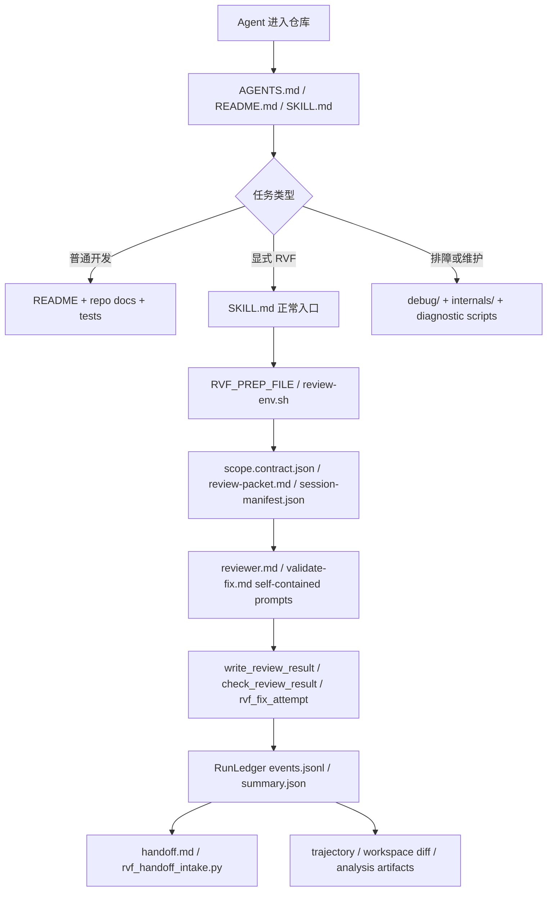

# AI agent 代码库导航基础设施现状报告

日期：2026-05-19

## TL;DR

当前 `review-validate-fix` 已经具备一套较强的 agent navigation infrastructure。它不是单一 README，而是三层结构：

1. **入口层**：`AGENTS.md`、`README.md`、`SKILL.md` 和 command/skill frontmatter 告诉 agent 何时进入、不要进入什么路径、以及当前仓库的主干语义。
2. **运行时事实层**：`prepare_review_run.py`、`build_review_packet.py`、`session_manifest.py`、`diff_tracker.py`、`rvf_logging.py`、review-result checker、handoff intake 等脚本生成机器可读 artifacts。这里是 scope、env、ledger、review result、handoff status 的事实源。
3. **解释/排障层**：`prompts/`、`protocols/`、`references/`、`internals/`、`debug/`、`setup/` 和 `docs/` 为不同 agent 角色提供说明，但其中很多文件只应按需读取。

总体判断：导航体系的核心方向是对的，尤其是“脚本拥有状态，Markdown 只做入口/解释”。主要问题是入口索引不够集中、README 过载、`state/` 中存在旧生成上下文、历史设计文档与当前 contract 混在一起、以及兼容 shim 可能被搜索误判为事实源。

## 审查方法

本报告使用三条并行只读分析线：

- Markdown surface 盘点：检查根目录说明、skill 文档、commands、prompts、references、internals、debug、setup、docs。
- Runtime surface 盘点：检查脚本、generated artifacts、schema/checker、代码注释/docstring、测试中的契约覆盖。
- Workflow drift 追踪：按普通开发 agent、`$review-validate-fix` 主会话、reviewer 子代理、validate/fix 子代理、Cline Kanban task、handoff intake/debug/operator 六条路径检查权威性和漂移风险。

证据以当前 checkout 为准；历史 memory 和子代理结果只用于定位，不作为当前事实替代。

## 当前导航模型



核心边界：正常 agent 不应该靠全文搜索在 `state/`、历史设计稿、legacy reference shim 中拼接当前 contract。它应该先走入口层，再使用脚本生成的 artifacts。

## Surface Inventory

| Surface | 当前角色 | 关键证据 |
|---|---|---|
| `AGENTS.md` | 仓库级行为约束，尤其是本地分支语义、commit 风格、Cline Kanban 与 Vibe-Kanban 区分 | `AGENTS.md:1-15` |
| `README.md` | 项目形态、维护模型、安装/部署、Stop hook 与 Cline Kanban 当前策略的大型入口 | `README.md:1-26`, `README.md:28-51`, `README.md:128-167`, `README.md:195-205` |
| `plugins/.../SKILL.md` | `$review-validate-fix` 正常入口、agent 边界、review/validate/handoff 规则、文档分层 | `plugins/review-validate-fix/skills/review-validate-fix/SKILL.md:1-26`, `:37-43`, `:67-74` |
| `prompts/reviewer.md` | reviewer 子代理 self-contained prompt；规定 scope contract、clean context、artifact 输出 | `plugins/review-validate-fix/skills/review-validate-fix/prompts/reviewer.md:1-18`, `:31-65` |
| `prompts/validate-fix.md` | validate/fix 子代理 self-contained prompt；规定 attempt worktree、fix allowlist、ledger 结果 | `plugins/review-validate-fix/skills/review-validate-fix/prompts/validate-fix.md:1-29`, `:32-52` |
| `protocols/README.md` | 机器协议事实源索引，防止 `SKILL.md` 复制 schema | `plugins/review-validate-fix/skills/review-validate-fix/protocols/README.md:1-38` |
| `internals/` | 维护者解释层；正常 agent 不读 | `plugins/review-validate-fix/skills/review-validate-fix/internals/runtime-contracts.md:1-24`, `internals/stop-hook-workflow.md:1-31` |
| `debug/` | 失败排障入口，优先诊断脚本，不直接读 runtime code | `plugins/review-validate-fix/skills/review-validate-fix/debug/troubleshooting.md:1-20` |
| `references/handoff-template.md` | handoff 生产模板和 deterministic intake hints | `plugins/review-validate-fix/skills/review-validate-fix/references/handoff-template.md:1-48`, `:50-161` |
| `rvf-handoff-commit.md` | handoff 接收命令，要求先跑 deterministic intake，再决定采纳/提交 | `plugins/review-validate-fix/commands/rvf-handoff-commit.md:1-70` |
| `core/README.md` / `adapters/*/README.md` | host-agnostic core 与 host-specific adapter 的规划/边界说明 | `core/README.md:1-21`, `adapters/README.md:1-23`, `adapters/codex/README.md:1-24` |
| `docs/` | 设计、phase report、guideline、历史总结；不能默认当 live contract | 例如 `docs/global-reviewed-diff-tracker-overhaul-plan.md:36-45` 明确混有已落地/部分落地状态 |
| `state/` | runtime/generated、本机状态和旧上下文；不是长期导航入口 | `plugins/review-validate-fix/skills/review-validate-fix/state/current-rvf-session-context.md:3-43` 是旧 Vibe-Kanban 语境 |

## Runtime Authority Map

| Owner | Agent 应从这里拿什么事实 | 关键证据 |
|---|---|---|
| `prepare_review_run.py` | run 目录、`review-env.sh`、`review-agent-context.md`、`scope.contract.json`、`review-packet.md`、workspace snapshot、worktree bootstrap | `prepare_review_run.py:75-120`, `:576-633`, `:930-985`, `:1007-1017` |
| `build_review_packet.py` | filtered status/diff、session context、session manifest、tracker scope、packet metadata | `build_review_packet.py:300-354`, `:370-424` |
| `session_manifest.py` | transcript-derived ownership、write-tool path attribution、patch hunk ownership | `session_manifest.py:20-43`, `:424-456`, `:553-560` |
| `diff_tracker.py` | hunk/unit identity、review lease、scope allocation、tracker events、manual/RVF issue ledger | `diff_tracker.py:31-59`, `:4469-4495`, `:4670-4728`, `:5140-5190` |
| `rvf_logging.py` | `events.jsonl`、`summary.json`、`latest.json`、phase/backend/artifact path metadata | 子代理核对：`rvf_logging.py:181`, `:300`, `:406`, `:463` |
| `write_review_result.py` / `check_review_result.py` | canonical reviewer result schema 与校验；reviewer final prose 只是日志 | `SKILL.md:42`, `prompts/reviewer.md:53-61` |
| `rvf_handoff.py` / `rvf_handoff_intake.py` | handoff marker、handoff ready gate、intake 摘要、scope/worktree/status 复原 | `rvf_handoff.py:18-57`, `:299-420`; `rvf_handoff_intake.py:335-420` |
| `rvf_run_finalize.py` / trajectory / analysis | finalize、trajectory、workspace diff、analysis scaffold、postmortem 输入 | 子代理核对：`rvf_run_finalize.py:269`, `:307`, `:400`; `analysis_artifacts.py:220`, `:781` |
| `scripts/check_plugin_contracts.py` | 仓库级契约检查和 timing report；部署/维护前验证入口 | `README.md:57-67`, 子代理核对：`scripts/check_plugin_contracts.py:145`, `:213`, `:280` |

### 运行时事实归属原则

以下事实应由脚本/artifact 承担，不应主要依赖 prose：

- `run_id`、`run_dir`、`events_path`、`summary_path`
- `scope.contract.json` 中的 `primary_files`、`background_files`、`protected_files`、`fix_allowlist`、`primary_units`、`tracker_scope_hash`
- `session-owned` / `unattributed` dirty paths
- tracker lease、scope hash、unit ids
- review-result 的 kind、issue/request 计数和 schema 合法性
- handoff path、handoff ready gate、opened/advised marker
- before/after workspace snapshot、changed paths
- trajectory raw refs、call ids、artifact refs
- analysis causality 中的 issues、fix attempts、patch events

Prose 可以解释原因、风险和人工交接建议，但不应成为 scope、状态、路径、schema 的最终事实源。

## Agent Workflow Paths

### 1. 普通开发 agent

入口应是 `AGENTS.md` 与 `README.md`。`AGENTS.md` 给出项目特有约束：不混用 `cline-kanban` / `vibe-kanban`，当前 Kanban backend 默认按 `cline-kanban` / `kanban` CLI 契约理解。`README.md` 给出 canonical 源码、安装位置、仓库结构、维护流程。

风险：README 太长，普通开发 agent 容易把 Stop hook 内部策略、setup、本机部署和 runtime debug 全部当成当前任务输入。`SKILL.md:67-74` 已经有更清晰的分层规则，但它只在 RVF skill 内，普通开发 agent 不一定会先读到。

### 2. 显式 `$review-validate-fix` 主会话

主会话应先看 `SKILL.md` 的正常入口：hook-prepared 路径优先读取 `$RVF_PREP_FILE` 和 `$RVF_REVIEW_ENV`，fallback 才自己写 scope-of-work 并调用 `prepare_review_run.py`。`SKILL.md` 明确主会话负责 scope-of-work、模式选择、启动脚本、合并 reviewer artifact、分配 validate/fix 包和最终中文汇总。

关键点：`SKILL.md:26` 明确后续使用脚本生成的 context/env/prompt artifacts，不手写 `RVF_*` export block。这与 `prepare_review_run.py` 的 `review_env_exports()` 形成良好闭环。

### 3. Reviewer 子代理

Reviewer 不继承父线程历史，不读另一路 reviewer 输出，不读 `SKILL.md`，而是接收 `prompts/reviewer.md` self-contained prompt、scope contract、scope-of-work、session manifest 和 review packet。它必须以 `scope.contract.json` 为最终范围合同，`git diff HEAD` 只是证据。

这是当前导航体系最强的一段：角色、scope、clean context、artifact 输出、checker 自检都比较明确。

### 4. Validate/fix 子代理

Validate/fix 子代理只处理主会话分配的 canonical issue。它应该进入 attempt worktree，读取 scope contract 和 fix allowlist，使用 `rvf_fix_attempt.py start/stop/apply` 走 ledger，不重新执行 double review，不生成 handoff。

该路径强依赖主会话正确 upsert issue、prepare attempt，并把 attempt id / worktree / run dir 写进 prompt。报告阶段未发现主要导航缺口，但后续应继续确保主会话 prompt 包含所有 attempt fields。

### 5. Cline Kanban task / follow-up

当前 README 明确 Stop hook 默认通过 Cline Kanban task 或 Kanban follow-up 承载 review checkpoint；Codex GUI fork 是 legacy backup-of-backup。Cline Kanban task 会在独立 worktree 中 source 既有 `review-env.sh`，重放 worktree bootstrap，并继续使用同一个 run artifacts。

关键证据：`README.md:132-167` 明确 `tracker-scope.json` 如何接入 `prepare_review_run.py --tracker-scope`，以及 task prompt、RunLedger、origin、handoff 如何记录原始会话信息。

### 6. Handoff intake / debug / operator

Handoff 生产和接收已经有明确分工。`references/handoff-template.md` 规定 handoff 默认写入 run artifacts，并包含 deterministic intake hints；`rvf-handoff-commit.md` 要求接收方先跑 `rvf_handoff_intake.py`，用脚本输出判断 worktree 差异、scope paths、unrelated dirty 和 intake hints。

Debug 路径也有良好降噪：`debug/troubleshooting.md` 要求先看 summary 和 events，再用诊断脚本，只有具体失败或维护请求才读 internals。

## Findings

### P0. 关键 drift：Cline Kanban tracker scope 与 worktree bootstrap 范围不完全一致

README 当前说 tracker scope 会让 `scope.contract.json.primary_files` / `fix_allowlist` 与 worktree bootstrap 都收窄到 `tracker_scope.paths`（`README.md:132`）。当前实现确实在 contract 侧把 `tracker_scope_payload["paths"]` 设为 primary scope，并把非 allocated dirty path 放入 background（`prepare_review_run.py:761-779`）。

但 bootstrap 侧还有一个额外行为：`build_worktree_bootstrap()` 在 tracker scope 存在时先把 `session_owned_dirty` 替换成 `tracker_scope_paths`（`prepare_review_run.py:488-493`），随后仍收集 `unattributed_dirty_paths`（`:494-517`），最后把 `filtered_session_owned + filtered_unattributed` 合成 `owned_dirty` 并写入 bootstrap（`:519-520`）。也就是说，Kanban task worktree 可能重放 tracker scope 之外的 unattributed/background dirty files。

这对 agent navigation 的影响很大：reviewer 的机器 scope 是 `scope.contract.json`，但 task worktree 中可能实际存在更多 dirty files。若 prompt/handoff 没有强标这些为 protected/background context，后续 agent 可能把“被 bootstrap 带入”误读成“本轮可审查/可提交范围”。

建议：

- tracker scope 存在时，默认 bootstrap 只携带 `tracker_scope.paths`。
- 若确实需要携带背景文件以维持运行环境，应在 bootstrap metadata / review packet / handoff intake 中显式标为 `protected_context_paths` 或等价字段。
- Cline Kanban task prompt 应明确区分 `replayed context` 与 `review scope`。

### P0. 关键 drift：Cline Kanban task prompt 的 handoff open 命令 fence 未闭合

`codex_stop_review_validate_fix.py` 生成 Cline Kanban task prompt 时，在最终 handoff open 命令前写入了 ` ```sh `（`codex_stop_review_validate_fix.py:2644-2646`），但 closing fence 被注释掉（`:2647`）。这不是普通文档问题，而是 generated prompt 质量问题：它可能让 task prompt 后续内容被 Markdown 解析为未闭合代码块，影响 agent 对最终回复 contract 的读取。

建议：

- 抽出 handoff instruction renderer，让 `SKILL.md`、handoff template、command prompt、Cline Kanban generated prompt 共用同一段 final response contract。
- 增加 snapshot/contract 测试，检查 generated task prompt 的 code fence 闭合，并检查包含 `RVF_HANDOFF_FILE` 与 `rvf_handoff.py open` 指令。

### P1. Handoff intake parser 与 handoff template 的验证命令布局不完全匹配

`handoff-template.md` 把验证命令放在 `## 验证` 下的 `### Scoped verification (in-contract)` 和 `### Full-suite results (unrelated)` 子节（`handoff-template.md:133-143`）。但 `rvf_handoff_intake.py` 的 `parse_sections()` 会把任意 `##+` heading 都切成独立 section（`rvf_handoff_intake.py:195-206`），而 `parse_validation_commands()` 只读取 `sections["Validation"]` 或 `sections["验证"]` 的 body（`:240-250`）。

结果是：如果 handoff 严格按当前 template 写验证命令，intake parser 可能因为子节切分而漏掉它们。

建议：

- intake parser 聚合 `验证` section 的子 heading，或显式读取 `Scoped verification (in-contract)` / `Full-suite results (unrelated)`。
- 用当前 `references/handoff-template.md` 生成 fixture，作为 `rvf_handoff_intake.py` parser 回归测试。

### P1. Review packet 顶部对 scope authority 的措辞落后于 SKILL/reviewer prompt

`SKILL.md` 和 reviewer prompt 都已经明确 `scope.contract.json` 是最终范围合同（`SKILL.md:47-50`, `prompts/reviewer.md:31`）。但 `build_review_packet.py` 生成 packet 顶部仍说 reviewer should use scope-of-work as the scope anchor（`build_review_packet.py:375`）；`## Session Manifest` 又说 manifest 是 session-scoped ownership anchor 且 owned paths 是 default review scope（`:403-405`）；只有 `## Tracker Scope` 才说 unit_ids 是 authoritative scope（`:458-464`）。

这会制造阅读顺序风险：reviewer 若先读 packet，可能把 scope-of-work 或 manifest 当 scope authority，而不是把它们降级为 intent/evidence。

建议统一 packet 顶部措辞：

> `scope.contract.json` is the final review-scope authority. The scope-of-work is intent/context. The session manifest and git diff are evidence only. When tracker units are present, `primary_units` / `tracker_scope_hash` define the allocated scope.

同时保留 packet 中的 status/diff 证据价值。

### P1. 缺少一个短的 agent navigation index

当前入口信息分散在 `AGENTS.md`、`README.md`、`SKILL.md:67-74`、`protocols/README.md`、`internals/*`、`debug/troubleshooting.md`。每个文件本身都有价值，但没有一个 10-20 行的“如果你是某类 agent，先读这些，不要读那些”的索引。

影响：新 agent 容易从全文搜索开始，误入 `state/`、历史 plan、legacy shim 或 runtime internals。

建议：新增 `docs/agent-navigation-index.md` 或在 README 前部加入短索引：

| Agent role | 先读 | 不要默认读 |
|---|---|---|
| 普通开发 | `AGENTS.md`, `README.md` 维护模型, relevant code/tests | `state/`, old design docs |
| RVF main | `SKILL.md`, `$RVF_PREP_FILE`, `$RVF_REVIEW_ENV` | 手写 env block |
| Reviewer | `scope.contract.json`, scope-of-work, review packet, `prompts/reviewer.md` | 父线程历史、另一路 reviewer 输出 |
| Validate/fix | canonical issue package, attempt worktree, scope contract | 重新 review、生成 handoff |
| Maintainer/debug | summary/events, `debug/`, diagnostic scripts, then `internals/` | 直接从 runtime code 猜状态 |

### P1. `state/` 可被搜索到，但里面含旧生成上下文

`plugins/.../state/current-rvf-session-context.md:3-43` 仍是旧 Vibe-Kanban 管理路径语境，描述了已经不再是当前默认方向的 `CODEX_RVF_FORK_MODE=vibe-kanban` 工作。它与 `AGENTS.md:7-9` 和 `README.md:132-167` 的当前 Cline Kanban 语义冲突。

这不是 runtime bug，但对 agent navigation 是高风险噪音：如果 agent 用 `rg Vibe-Kanban` 或 `rg session context` 取证，很可能把旧 generated context 当成当前 design。

建议：

- 在报告/索引中明确 `state/` 是 runtime/generated/stale-prone，不是导航入口。
- 考虑将长期保留的 manual context 移到更明确的 archived/generated 路径，或加顶层 README/marker。
- review packet / handoff 的引用可以指向具体 run artifacts，但普通 agent 不应扫描整个 `state/`。

### P1. README 过载，承担了入口、运行时、排障、setup、策略说明

README 当前同时说明项目形态、仓库结构、维护流程、Cline Kanban 配置、Stop hook router/dispatcher、run ledger、debug、setup、session control 和验证。它对维护者有用，但对普通 agent 来说过长。

证据：`README.md:1-67` 是项目入口和维护流程；`README.md:128-180` 是 Cline Kanban backend 配置；`README.md:195-221` 是 dispatcher/run ledger/debug；`README.md:300-326` 又是 session control/setup/backend 策略。

建议：保留 README 作为总入口，但增加短“阅读路径”并把深层 runtime 状态机优先链接到 `internals/stop-hook-workflow.md` 和 `internals/runtime-contracts.md`。不要复制更多 env var/state schema 到 README。

### P2. 历史设计文档混有 live contract 与 phase 状态

`docs/global-reviewed-diff-tracker-overhaul-plan.md` 是有价值的设计/进度记录，但它同时包含背景、目标、非目标、阶段状态和已落地/部分落地说明。比如第 36-45 行列出 phase status，第 414-430 行描述 scope manifest / scope contract 演进。普通 agent 不能直接把整份文档当 live spec。

建议：

- 在最终导航索引中把 `docs/` 标为 design/history/phase report，除非文档标题或 README 明确它是 current contract。
- 对仍作为 current reference 的设计文档，加 `Current Status` 或 `Live Contract Owner` 小节，指回脚本/checker。
- 将“已落地但仍需审计”的部分标成维护待办，而不是 agent 执行规则。

### P2. Compatibility shim 是好路标，但也会被搜索误读

`references/review-prompt.md` 和 `references/validate-then-fix-prompt.md` 只保留 “Moved” 路标，指向 `prompts/reviewer.md` 和 `prompts/validate-fix.md`。这是良好的兼容处理；但如果 agent 只看到旧文件名，仍可能误把 `references/` 下旧路径当 prompt 入口。

建议：保留 shim，但在导航索引中明确 `prompts/` 是子代理 prompt 事实源，`references/` 中的 moved 文件只是跳转。

### P2. Scope authority 已经清晰，但需要在报告中反复强调文件级 vs unit 级

当前系统同时保留 path-level compatibility 和 unit/hunk-level tracker。`docs/global-reviewed-diff-tracker-overhaul-plan.md:424-430` 明确 `scope.contract.json` 扩展了 `primary_units`、`tracker_lease_id`、`tracker_scope_hash`，同时 `primary_files` 继续作为 path-level allowlist 兼容字段。

风险是 agent 把“同一文件内容累积变化”误读成“review scope 扩大了”。正确解释应是：review boundary 由 `scope.contract.json` / tracker `unit_ids` / `scope_hash` 决定，同一文件里可能同时存在 scope 内 hunk、背景 hunk、protected hunk。

建议：报告和后续导航索引中使用固定措辞：

> `git diff HEAD` 是证据，不是 scope。`scope.contract.json` 是 review scope 的最终机器合同；session manifest 是 ownership evidence；review packet 是 filtered evidence bundle。

### P3. Host-specific schema 仍在脚本内聚，应该继续避免散进 prose

Codex/Claude transcript、subagent、hook entry 的差异目前主要由 `trajectory_capture.py`、`trajectory_distill.py`、adapter docs 和 hook scripts 承担。`adapters/codex/README.md` 也明确 Codex hooks chain 仍在 plugin runtime scripts 内，物理迁移需要后续再考虑。

建议：不要在 agent-facing prose 中扩写 host transcript schema；应继续把 host parser 保持在脚本和测试中，Markdown 只说明入口和边界。

## 当前优势

### 1. 文档分层已经明确

`SKILL.md:67-74` 是当前最简洁的分层说明：`prompts/` 给子代理，`protocols/` 指向脚本/checker/schema，`references/` 是主会话按需材料，`internals/` 正常 agent 不读，`debug/` 只在失败/排障时读，`setup/` 只在配置 external reviewer / MCP / agent 集成时读。

这应成为 future navigation index 的核心。

### 2. Runtime artifacts 足够强

`prepare_review_run.py` 生成 `review-env.sh`，导出 `RVF_SCOPE_CONTRACT`、`RVF_REVIEW_PACKET`、`RVF_CHECK_REVIEW_RESULT`、`RVF_WORKTREE_BOOTSTRAP` 等路径；`build_review_packet.py` 生成 filtered packet；`diff_tracker.py` 写 tracker scope；`rvf_handoff_intake.py` 复原 handoff scope/worktree/current status。

这使 agent 可以沿 artifact 链行动，而不是靠聊天记忆或手写路径。

### 3. Reviewer / validate-fix 子代理边界强

Reviewer prompt 明确 clean context、scope contract、artifact 输出、checker 自检和禁止修改源码；validate/fix prompt 明确只处理分配 issue、attempt worktree、allowlist/protected/background 边界和 ledger result。这对多 agent 工作尤其重要。

### 4. Debug 路径优先诊断脚本

`debug/troubleshooting.md` 明确先看 summary/events，再用 deterministic diagnostic scripts，必要时才读 internals。这降低了维护者从 runtime code 猜状态的风险。

## 推荐改进顺序

1. **先修 generated prompt / parser / packet wording drift**：闭合 Cline Kanban task prompt fence；修复 handoff intake 对 template 验证子节的解析；把 review packet 顶部 scope authority 改成 `scope.contract.json` final authority。
2. **澄清 tracker scope 与 bootstrap 的关系**：决定 tracker scope 下是否仍 bootstrap unattributed dirty paths；若保留，必须标成 protected/background context。
3. **新增短导航索引**：`docs/agent-navigation-index.md` 或 README 前部小节，按 agent role 给出“读什么 / 不读什么 / 权威事实源”。
4. **标记 `state/` 非导航入口**：在 `state/` 可见位置加说明，或将旧 manual context 归档，避免 Vibe-Kanban 旧上下文被误用。
5. **README 减负**：保留总入口，但把深层 runtime 状态机转向 `internals/` 和 `debug/`，避免继续扩写。
6. **给 live design docs 加状态标签**：尤其是 tracker/dispatch/phase report，标明 current contract owner 是脚本/checker，文档是 design/history。
7. **保留 compatibility shim，但降低搜索误导**：在索引中明确 `prompts/` 才是子代理 prompt 源。
8. **继续让 host schema 留在脚本/测试里**：不要把 Codex/Claude transcript 细节散进 agent-facing docs。

## 最终结论

RVF 的 agent navigation infrastructure 已经从“agent 读一堆 prose 自行推理”演进到“入口文档路由 + runtime artifacts 定义事实 + prompts 自包含 + checker/ledger 固化结果”的形态。当前最需要的不是新系统，而是一个轻量导航索引和若干噪音隔离措施，让未来 agent 更快区分：

- 什么是当前入口；
- 什么是机器事实源；
- 什么是生成/历史/排障材料；
- 什么是只给维护者看的内部状态机；
- 什么内容绝不能拿来扩大 scope。
