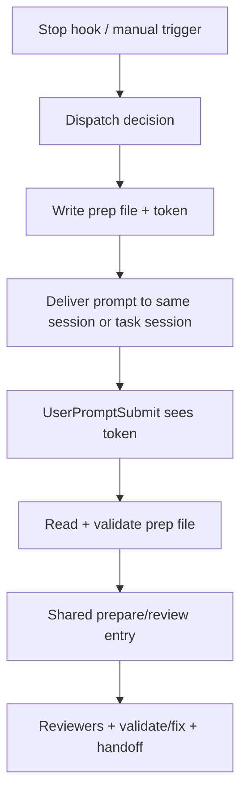

# RVF post-user-prompt shared workflow handoff

## Scope

接手目标是完成 `docs/rvf-dispatch-flow-overhaul-plan.md` 中尚未落地的核心迁移：把 RVF 的实际 prepare/review workflow 从 Stop hook 侧搬到 post-user-prompt / shared workflow entry。Stop hook 应只负责 dispatch 判定、异构 setup、prep file 写入、Cline Kanban task 创建和必要诊断；manual、same-session self-injection、fork+prompt 都应在收到用户 prompt 后走同一个准备与启动路径。

## Current repository state

- Local main HEAD: `cb41b14 fix(rvf): stabilize tracker leases and kanban routing`.
- Local main is ahead of origin. At handoff creation time, the remaining untracked files outside this handoff are `.codex/`, `docs/diff-tracker-unit-lifecycle-state-machine.md`, and `docs/log/2026-05-09-cline-kanban-single-fork-handoff.md`. Do not delete or stage them without inspecting ownership.
- Current detached Cline worktree `/Users/bominzhang/.cline/worktrees/762c4/review-validate-fix` is not the latest implementation source; use `/Users/bominzhang/Documents/GitHub/review-validate-fix` unless the user explicitly says otherwise.

## What is already done

- Flow 3 no longer silently falls back to legacy GUI/app-server fork unless explicit opt-in is set.
- Dispatch prep files exist (`rvf_prep_file.py`) with token generation, TTL, no-clobber writes, stale sweep, diagnostics, and atomic updates.
- Stop hook prompts carry `RVF_DISPATCH=token=<token>` and `RVF_PREP_FILE`.
- UserPromptSubmit detector exists (`rvf_user_prompt_submit.py`) and validates dispatch token / prep file freshness.
- Cline Kanban task creation now passes parent session id, worktree mode, prep file path, and exact current HEAD base ref for automatic branch-mode dispatch.
- Flow 2 branch-mode bootstrap can replay session-owned dirty work into the task worktree, and prep file is updated with real Kanban task/workspace metadata.
- Tracker scope is carried across the dispatch boundary through `rvf_run.tracker_scope_path` in the prep file.

## What is not done

- `rvf_user_prompt_submit.py` still only detects tokens. Its CLI description says it detects dispatch tokens "without starting workflow".
- `codex_stop_review_validate_fix.py` still calls `prepare_review_run.py` inside `freeze_cline_kanban_startup_artifacts()`.
- Cline Kanban task prompt still says not to rerun `prepare_review_run.py`; it reuses Stop-hook-frozen artifacts.
- Manual RVF, same-session self-injection, and fork+prompt are therefore not yet unified behind one post-user-prompt shared workflow.

## Desired after-state



Stop hook must not freeze the normal review run for Cline Kanban tasks. It may still write immutable dispatch facts and diagnostics, but the target session should own prepare/review startup after UserPromptSubmit.

## Suggested implementation slices

### Slice I.1: shared workflow entry

Create or extract a callable shared entry that can be invoked by UserPromptSubmit/manual paths. It should accept a prep file token/path and produce the same run artifacts that `prepare_review_run.py` currently produces.

Likely files:
- `plugins/review-validate-fix/skills/review-validate-fix/scripts/prepare_review_run.py`
- `plugins/review-validate-fix/skills/review-validate-fix/scripts/rvf_user_prompt_submit.py`
- `plugins/review-validate-fix/skills/review-validate-fix/scripts/codex_stop_review_validate_fix.py`
- `tests/test_review_support_scripts.py`
- `tests/test_codex_stop_review_validate_fix.py`

### Slice I.2: move Cline Kanban startup prepare out of Stop hook

Replace `freeze_cline_kanban_startup_artifacts()` usage for normal Cline Kanban dispatch with a prep-file-only dispatch. The task prompt should instruct the target session to rely on the UserPromptSubmit/shared entry, not on Stop-hook-frozen artifacts.

Keep branch-mode semantics from commit `cb41b14`: automatic Cline Kanban dispatch uses exact current `HEAD` and `worktree-mode=branch`; in-place remains explicit/manual/debug.

### Slice I.3: unify manual and same-session self-injection

Manual `/review-validate-fix` and same-session self-injection should either write/read the same prep schema or pass through the same normalized in-memory equivalent. Avoid duplicating prepare setup in prompt text.

### Slice I.4: cleanup and docs

Update the plan and phase report once code is migrated. Any temporary backward-compatibility bridge for old RVF internal behavior must be removed before commit because this repo is not yet distributed.

## Acceptance criteria

- UserPromptSubmit token path can start the shared workflow, not merely log a diagnostic.
- Stop hook Cline Kanban path does not call `prepare_review_run.py` for the target workflow.
- Manual, same-session, and Cline Kanban fork/task paths share the same preparation logic.
- Existing Cline Kanban automatic routing remains deterministic: no manual branch/worktree choice, exact current `HEAD`, branch worktree by default.
- Existing RVF tracker scope, lease metadata, handoff expectations, and worktree bootstrap metadata remain available through the prep file or shared context.

## Validation checklist

Run focused tests first:

```sh
python3 -m py_compile plugins/review-validate-fix/skills/review-validate-fix/scripts/rvf_user_prompt_submit.py plugins/review-validate-fix/skills/review-validate-fix/scripts/rvf_prep_file.py plugins/review-validate-fix/skills/review-validate-fix/scripts/codex_stop_review_validate_fix.py plugins/review-validate-fix/skills/review-validate-fix/scripts/prepare_review_run.py
python3 tests/test_review_support_scripts.py
python3 tests/test_codex_stop_review_validate_fix.py
python3 tests/test_codex_stop_hook_dispatcher.py
bash scripts/check_skill_contracts.sh
python3 scripts/check_plugin_contracts.py
git diff --check
```

Then run at least one live Cline Kanban branch dispatch if the environment is available, because this migration changes process boundaries.

## Reference docs

- `docs/rvf-dispatch-flow-overhaul-plan.md`
- `docs/rvf-dispatch-flow-overhaul-phase-report.md`
- `docs/log/2026-05-09-cline-kanban-single-fork-handoff.md`
- This handoff: `docs/log/2026-05-09-rvf-post-user-prompt-shared-workflow-handoff.md`

## Outcome (2026-05-09)

实现 plan：`/Users/bominzhang/.claude/plans/rvf-dispatch-flow-overhaul-cached-moler.md`。

落地概览：

- **Shared entry**：`prepare_review_run.prepare_run_from_prep_file(prep, *, timeout_seconds=60)` —— 60s `ThreadPoolExecutor` 包裹 `prepare_run`；按 `target_flow` 翻译 backend；用 `rvf_prep_file.update_prep_file()` 把 `rvf_run.shared_workflow_state` 写回；`status="completed"` 后幂等。
- **Hook decision tree**：`rvf_user_prompt_submit.py` 用 origin marker 顺序识别 dispatch source —— `RVF_DISPATCH=token=` / `RVF_FORKED_REVIEW_VALIDATE_FIX` / `RVF_CLINE_KANBAN_TASK` / `RVF_KANBAN_FOLLOWUP_TRIGGER` / `RVF_START_TRIGGERS` 之一未匹配即 manual，无任何匹配 → `no_token` 早退。
- **Manual 路径**：hook 自创 prep file（`target_flow=flow-manual`、`dispatch_origin=post_user_prompt_manual`），起新的 `start_run("user-prompt-submit-manual", ...)`，跑 prepare 写回。
- **Stop hook**：`freeze_cline_kanban_startup_artifacts` 改名 `freeze_cline_kanban_dispatch_artifacts`，仍在 origin 跑 prepare（worktree bootstrap 必须立即捕获 origin dirty work），但写 `shared_workflow_state.status="completed"` 进 prep payload，task session 的 hook 看到 cache hit 即跳过。Cline Kanban task prompt 文案不再禁止重跑 prepare，改为指导 `cat $RVF_PREP_FILE` 看 status。
- **Scope-of-work artifact**：从 `headless-startup-scope-of-work.md` 改名 `startup-scope-of-work.md`，并把 `render_startup_scope_text(...)` 升级成 `dispatch_scope_of_work_text(target_flow, ...)` 覆盖五种 flow（branch / inplace / self-rising / legacy fork / manual）。
- **SKILL.md**：新增 Hook-prepared 默认路径 + Fallback 段，指引 agent 在 hook 已自动 prep 时直接 `source $RVF_REVIEW_ENV` 并跳过手动 gate / prepare。

Verification：见 phase report `## Verification` 段；`tests/test_review_support_scripts.py`、`tests/test_codex_stop_review_validate_fix.py`、`tests/test_codex_stop_hook_dispatcher.py`、`tests/test_install_to_codex.py`、`scripts/check_skill_contracts.sh`、`scripts/check_plugin_contracts.py` 全通过。未提交，等用户跑 RVF 自审。
