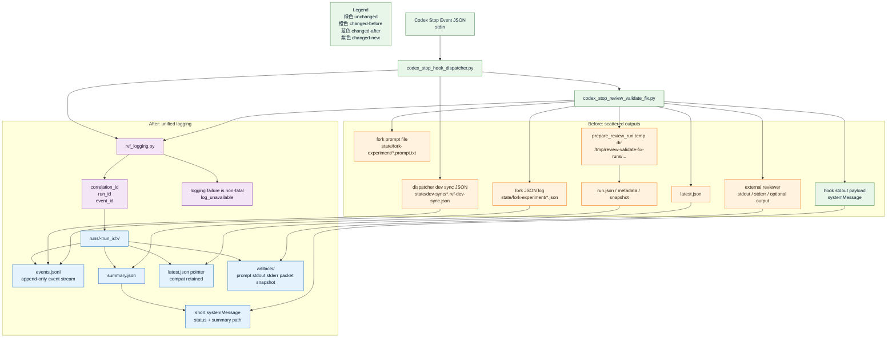

# review-validate-fix 日志系统设计与维护契约

## 当前状态

本文件记录统一 run ledger 的设计目标、已落地行为和后续维护约束。当前实现已经采用 one-shot cutover：skill runtime 的 `scripts/rvf_logging.py` 是唯一日志 helper，dispatcher、Stop hook、manual prepare run 和 external reviewer 都通过 `state/runs/<run_id>/` 写入 `summary.json`、`events.jsonl` 和 `artifacts/`。`state/latest.json` 只保留为指向最新 summary/events 的兼容 pointer。

维护文档时按实现状态更新本文件，不要把已落地契约重新描述成待办迁移计划。

## 背景

改造前的日志系统不是一个统一系统，而是多条输出通道的组合：

- Stop hook 的 stdout 必须输出 Codex hook payload JSON，用户可见内容来自 `systemMessage`。
- dispatcher 会把 dev sync 结果写入独立 JSON 文件。
- Stop hook fork gate 会写 timestamp JSON、prompt 文件和 `latest.json`。
- 手动 `$review-validate-fix` run 会在临时目录生成 `run.json`、review packet、metadata 和 snapshot。
- external reviewer 主要依赖 stdout/stderr 和可选 `--output` 文件。

这些输出都有效，但缺少统一 correlation id、统一 schema 和统一排障入口。结果是一次自动 review 的 dev sync、gate、fork、review run、reviewer 输出和 handoff advisory 很难串起来。

## 一次性改造要求

本设计按 one-shot cutover 落地：不做长期双写、不保留两套可演进日志系统、不用渐进迁移掩盖旧结构。日志 API、目录布局、hook 输出、dispatcher sync、manual run、reviewer 输出、测试契约和文档应在同一行为边界内保持一致。旧日志路径只允许作为兼容指针或调试迁移记录存在，不能继续作为主状态源。

## 实现状态摘要

| 范围 | 当前状态 | 维护要求 |
| --- | --- | --- |
| 统一 helper | 已落地 skill runtime `scripts/rvf_logging.py`，提供 `RunLedger`、`start_run()`、`event()`、`summary()`、`artifact()`、`latest_pointer()`、`hook_payload()` | 新增日志必须经 helper 写入，不直接手写散落 JSON |
| run 目录 | 已落地 `state/runs/<run_id>/summary.json`、`events.jsonl`、`artifacts/` | 大文本和敏感内容只进入 artifacts，事件流只放摘要和路径 |
| latest pointer | 已降级为 `run_id`、`summary_path`、`events_path`、`status`、`reason_code`、`updated_at` | 任何主程序逻辑不得把 `latest.json` 当完整状态源 |
| Stop hook stdout | 保持只输出 Codex hook payload JSON | 诊断信息只能进 `systemMessage` 摘要或 run ledger |
| dispatcher dev sync | 已接入同一 run ledger，失败时非零退出并在 stderr 给 summary path | 不允许把 stale installed plugin 的继续执行作为 fallback |
| prepare/reviewer | 已支持 `--rvf-run-id` 和 `--rvf-run-dir` | manual run 和 external reviewer 必须可通过 run ledger 排障 |
| 日志失败 | helper 返回 `log_unavailable` diagnostics，hook payload 仍可用 | 不得让日志目录不可写破坏 Stop hook 协议 |

日志根目录默认是 plugin skill 的 `state/`；可用 `CODEX_RVF_LOG_ROOT` 覆盖，`CODEX_RVF_STATE_DIR` 作为兼容别名仍可识别。两者都只影响本机排障位置，不改变 hook payload 协议。

## 目标

1. 保持 hook 协议安全：hook stdout 仍只输出 Codex hook payload，不向 stdout 写诊断日志。
2. 引入统一 run / event / correlation 标识，让 dispatcher、Stop hook、skill run 和 reviewer 输出可以互相关联。
3. 将大文本和潜在敏感内容路径化保存，主事件流只保存摘要和 artifact path。
4. 保留现有 `latest.json` 的调试价值，但把它降级为兼容指针或 summary cache；新代码不得再把它当完整状态源。
5. 日志写入失败不得破坏 hook 行为；失败时返回 `log_unavailable` 诊断，而不是让 Stop hook 崩溃。
6. 用结构化事件替代散落 JSON、临时 stdout/stderr 约定和 implicit file naming；任何新增日志必须经过统一 helper。

## Before / After 图

颜色含义：

- 绿色 `unchanged`：保留不变的协议、入口或 artifact。
- 橙色 `changed-before`：现状里会被替换、收敛或重定位的输出点。
- 蓝色 `changed-after`：改造后对应的新形态。
- 紫色 `changed-new`：新增能力。



## 新目标目录布局

```text
state/
  runs/
    <run_id>/
      events.jsonl
      summary.json
      artifacts/
        fork.prompt.txt
        review-packet.md
        review-packet.metadata.json
        before-workspace-snapshot.json
        reviewer-a.stdout.txt
        reviewer-a.stderr.txt
        reviewer-a.normalized.txt
  latest.json
  session-hook/
```

`latest.json` 保留为兼容入口，但内容只允许指向最近一次 `summary.json` 和 `events.jsonl`。所有主程序代码必须改为读取 `summary.json` 或 `events.jsonl`，避免继续依赖 `latest.json` 的旧完整 payload。

单次 run 的文件职责：

- `events.jsonl`：append-only 事件流，供排障、测试和外部工具消费。
- `summary.json`：面向用户和 hook systemMessage 的稳定摘要。
- `artifacts/`：prompt、review packet、snapshot、stdout/stderr、normalized review output 等大文本或敏感内容。
- `latest.json`：仓库级 pointer，只含 `run_id`、`summary_path`、`events_path`、`status`、`reason_code`、`updated_at`。

## 事件 schema

```json
{
  "timestamp": "2026-04-27T00:00:00Z",
  "level": "info",
  "component": "stop-hook",
  "phase": "fork",
  "event": "app_server_fork_started",
  "status": "started",
  "correlation_id": "rvf-...",
  "run_id": "20260427T000000Z-review-validate-fix-...",
  "event_id": "evt-...",
  "repo": "/abs/path/to/repo",
  "cwd": "/abs/path/to/repo",
  "session_id": "parent-session",
  "parent_thread_id": "parent-session",
  "fork_thread_id": "fork-session",
  "duration_ms": 123,
  "paths": {
    "summary": "/abs/path/state/runs/.../summary.json",
    "prompt": "/abs/path/state/runs/.../artifacts/fork.prompt.txt"
  },
  "error": null
}
```

事件约束：

- `timestamp` 使用 UTC ISO-8601。
- `run_id` 在 dispatcher 接收到 Stop event 时生成；manual run 在入口生成；子流程继承。
- `correlation_id` 串联同一次用户触发下的 dispatcher、hook、fork、reviewer。
- `event_id` 每条事件唯一。
- `component` 只能使用受控枚举：`dispatcher`、`stop-hook`、`prepare-run`、`reviewer`、`contract-check`、`installer`。
- `phase` 只能使用受控枚举：`dev-sync`、`gate`、`fork`、`prepare`、`review`、`validate`、`handoff`、`cleanup`。
- 大文本字段不得直接进入事件；必须写入 `artifacts/` 并在 `paths` 里引用。

## 已落地交付范围

### 1. 唯一日志模块

- 使用 skill runtime `scripts/rvf_logging.py`。
- 提供 `RunLedger` / `start_run()` / `new_event_id()` / `event()` / `summary()` / `artifact()` / `latest_pointer()` / `hook_payload()`。
- 日志模块负责目录创建、原子写入、大小限制、artifact 命名、路径归一化和写入失败降级。
- 所有写入失败都返回结构化 `log_unavailable`，不得抛出到 hook 主流程。

### 2. 替换 Stop hook 日志

- `codex_stop_review_validate_fix.py` 在 gate、skip、fork、handoff advisory 各阶段写事件。
- `systemMessage` 缩短为状态摘要和 summary path。
- prompt 继续写文件，但主 JSON 只保存 `prompt_path` 和摘要字段。
- 删除 timestamp 扁平 JSON 作为主日志的角色；同等信息进入 `events.jsonl` 和 `summary.json`。
- `run_codex_fork()` 不再手写 `log_path` / `latest_path` / `prompt_path` 的散落逻辑，改由 `rvf_logging.py` 分配。

### 3. 替换 dispatcher dev sync 日志

- `codex_stop_hook_dispatcher.py` 使用同一 `correlation_id`。
- dev sync 的每一步命令写入 `events.jsonl`，stdout/stderr 作为 artifact 保存或按大小截断。
- sync 失败时仍以非零 stderr 阻止 installed hook 继续运行，并在 stderr 中给出 summary path。
- 删除 `*.rvf-dev-sync.json` 作为主日志；如需兼容，只写一份指向新 run 的短 JSON pointer。

### 4. 替换 skill run 和 reviewer 输出

- `prepare_review_run.py` 接受可选 `--rvf-run-id` / `--rvf-run-dir`。
- `run_alternative_reviewer.py` 接受可选 `--rvf-run-id` / `--rvf-run-dir`，记录 start、activity timeout、result、contract validation 状态。
- reviewer 原始 stdout/stderr 和 normalized output 放入 artifacts。
- manual `$review-validate-fix` run 不再生成孤立 temp run 作为最终排障入口；temp 目录只能作为 artifact staging，最终索引必须落入 `state/runs/<run_id>/`。

### 5. 一次性收紧测试和契约

- 增加 hook stdout 纯 JSON 测试，避免日志污染 hook payload。
- 增加日志写失败不影响 Stop hook payload 的测试。
- 调整依赖 `latest.json` 的测试，让它验证兼容指针而不是完整状态源。
- 更新 `scripts/check_skill_contracts.sh`，要求保留 `systemMessage`、`events.jsonl`、`summary.json`、`log_unavailable` 等关键契约。
- 增加 schema 枚举测试，防止组件随意写新字段或把大文本塞回事件流。
- 增加 end-to-end run fixture：dispatcher sync、hook fork、manual prepare、reviewer timeout 四类路径都必须能通过同一 `run_id` 查完整链路。

### 6. 一次性更新文档与安装

- README 说明新日志位置和排障入口。
- `SKILL.md` 说明正常执行不需要读 setup-only 资源，日志只作为排障 artifact。
- installed hook 路径要和 plugin-only 形态一致；安装脚本不维护旧 `~/.codex/skills/review-validate-fix` 路径。

## 兼容策略

兼容只服务于本项目未分发阶段的开发排障，不作为长期产品行为：

- `latest.json` 保留，但从完整状态文件降级为 pointer。
- 旧 `*.rvf-dev-sync.json`、`*.review-validate-fix-fork.json`、`*.fork-experiment.json` 不再新写主内容。
- 如果实现过程中临时加入 backward compatibility work，完成验证后必须清理主程序兼容代码，并把清理说明记录到已 gitignored 的 `dev_backward_compatibility/`。
- README 不宣传旧日志路径；测试只允许验证旧入口能指向新 summary，不允许验证旧 payload shape。

## 验收标准

后续维护必须持续满足：

1. Stop hook stdout 仍是唯一 Codex hook payload JSON。
2. 任意一次自动或手动 RVF run 都能从 `state/latest.json` 找到 `summary.json` 和 `events.jsonl`。
3. dispatcher、Stop hook、fork、prepare run、reviewer 的事件共享同一 `run_id` 或可解释的 parent/child run 关系。
4. prompt、review packet、stdout、stderr、snapshot 不出现在事件主字段，只出现在 artifacts。
5. 日志目录不可写时，hook 返回仍可用，并包含 `log_unavailable`。
6. `scripts/check_plugin_contracts.py`、`scripts/check_skill_contracts.sh` 和 pytest 全部通过。
7. 没有新增长期 backward compatibility 分支；如有临时兼容工作，已按项目规则清理并记录。

## 不做的事

- 不把 Stop hook 改回 continuation prompt。
- 不在 hook stdout 输出调试文本。
- 不把完整 review packet、prompt、reviewer stdout 全量塞进主事件 JSON。
- 不自动删除或回滚 reviewer 运行造成的 workspace 变化。
- 不做多阶段双写迁移；本项目未分发，日志系统应一次性切换到新结构。
