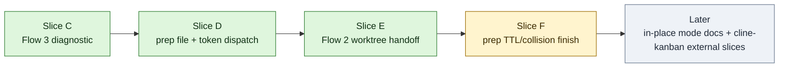

# RVF Dispatch Flow Overhaul Phase Report

本文档记录 `docs/rvf-dispatch-flow-overhaul-plan.md` 的本轮实现进度。代码仍在当前 detached worktree 中，尚未提交；提交前应先跑 RVF review。

## Current Status



## Slice C: Flow 3 Diagnostic

Before:
- `CODEX_RVF_FORK_MODE=auto` could silently fall back from Cline Kanban failure to Codex GUI/app-server fork.
- Kanban failures could create another session sharing the same worktree, hiding the real Kanban problem.

After:
- Auto mode reports `cline-kanban-unavailable` / `cline-kanban-unconfigured` by default.
- Legacy GUI fallback requires explicit opt-in via `CODEX_RVF_AUTO_LEGACY_GUI_FALLBACK=1`; explicit `CODEX_RVF_FORK_MODE=gui` still works.
- Summary records `legacy_gui_fallback_enabled`.

Files:
- `plugins/review-validate-fix/skills/review-validate-fix/scripts/codex_stop_review_validate_fix.py`
- `tests/test_codex_stop_review_validate_fix.py`
- `plugins/review-validate-fix/skills/review-validate-fix/SKILL.md`

## Slice D: Prep File Dispatch Metadata

Before:
- Prep file and UserPromptSubmit detector existed, but target flow metadata was not fully surfaced in summaries.
- Cline Kanban, follow-up, and dry-run prompts had token metadata, but the plan status did not clearly reflect the implemented state.

After:
- Fork/Kanban/dry-run prompts include `RVF_DISPATCH=token=<token>` and `RVF_PREP_FILE`.
- Summary preserves dispatch token, prep file path, status, and target flow.
- Plan now marks prep file / token detector / installer registration / fork prompt metadata as landed.

Files:
- `plugins/review-validate-fix/skills/review-validate-fix/scripts/codex_stop_review_validate_fix.py`
- `plugins/review-validate-fix/skills/review-validate-fix/scripts/rvf_logging.py`
- `tests/test_codex_stop_review_validate_fix.py`

## Slice E: Flow 2 Worktree Handoff

Before:
- Prep file was written before `kanban task create`, so `target_worktree` could only be the origin cwd.
- The real Kanban `workspace_path` was not written back to the prep file.
- Parent hook payload did not explicitly ask the user to pause editing the origin worktree.

After:
- `rvf_prep_file.update_prep_file()` supports atomic updates while preserving token, schema, and TTL timestamps.
- After Cline Kanban create/start succeeds, the prep file is updated with the real `workspace_path` and `task_id`.
- Summary preserves `rvf_dispatch_target_worktree` and `rvf_dispatch_target_kanban_task_id`.
- Hook payload detail includes `pause_origin_edits=true,workspace=<path>`; summary message tells the user to wait for `RVF_HANDOFF_FILE` before merging back.
- Worktree bootstrap remains the mechanism for moving session-owned dirty work into the task worktree.

Files:
- `plugins/review-validate-fix/skills/review-validate-fix/scripts/rvf_prep_file.py`
- `plugins/review-validate-fix/skills/review-validate-fix/scripts/codex_stop_review_validate_fix.py`
- `plugins/review-validate-fix/skills/review-validate-fix/scripts/rvf_logging.py`
- `tests/test_review_support_scripts.py`
- `tests/test_codex_stop_review_validate_fix.py`

## Verification

Last verified commands:

```sh
python3 -m py_compile plugins/review-validate-fix/skills/review-validate-fix/scripts/rvf_prep_file.py plugins/review-validate-fix/skills/review-validate-fix/scripts/codex_stop_review_validate_fix.py plugins/review-validate-fix/skills/review-validate-fix/scripts/rvf_logging.py
python3 tests/test_codex_stop_review_validate_fix.py
python3 tests/test_review_support_scripts.py --shard-count 6 --shard-index 0
bash scripts/check_skill_contracts.sh
python3 scripts/check_plugin_contracts.py
```

All commands above passed in this worktree.

## Remaining Work

- Slice F: tighten prep file TTL sweep/collision handling around the dispatch flow, not just the prep file helper.
- Add explicit user docs for in-place mode and Kanban unavailable troubleshooting.
- Optional thin refactor: once prep file is the canonical dispatch context, make tracker-scope wiring read from `rvf_run.tracker_scope_path` instead of `ledger.tracker_scope_meta` convention.
- External Cline Kanban slices A/B remain outside this repository unless that repo is available in the workspace.
