# RVF Dispatch Flow Overhaul Phase Report

本文档记录 `docs/rvf-dispatch-flow-overhaul-plan.md` 的实现进度。Slice A–I 全部落地；剩下的是真实环境联调（live flow-2 / Cline Kanban Slice B UI），无代码阻塞。

## Current Status

```mermaid
flowchart LR
  A[Slice C<br/>Flow 3 diagnostic] --> B[Slice D<br/>prep file + token dispatch]
  B --> C[Slice E<br/>Flow 2 worktree handoff]
  C --> D[Slice F<br/>prep TTL/collision finish]
  D --> E[Slice G<br/>tracker-scope prep source]
  E --> F[Slice H<br/>Cline Kanban Slice A RVF wiring]
  F --> G[Slice I<br/>post-user-prompt shared workflow]
  G --> H[Later<br/>live flow 2 integration]

  A:::done
  B:::done
  C:::done
  D:::done
  E:::done
  F:::done
  G:::done
  H:::next

  classDef done fill:#dff6dd,stroke:#2f7d32,color:#0f2f13;
  classDef next fill:#fff4ce,stroke:#9a6b00,color:#3b2a00;
  classDef todo fill:#eef2f7,stroke:#64748b,color:#1f2937;
```



## Slice I: Post-User-Prompt Shared Workflow

Before:
- `rvf_user_prompt_submit.py` only validated dispatch tokens and wrote diagnostics; it did not start the RVF workflow.
- `codex_stop_review_validate_fix.py` called `prepare_review_run.py` from Stop hook via `freeze_cline_kanban_startup_artifacts()` and the Cline Kanban task prompt explicitly told the target session not to rerun prepare.
- Manual `/review-validate-fix`, same-session self-injection, and fork+prompt all relied on SKILL.md "正常入口" steps to manually invoke `prepare_review_run.py` (the gate, scope-of-work, prepare command, primary/background flags, env sourcing).
- Startup scope-of-work artifact lived at `headless-startup-scope-of-work.md`.

After:
- `prepare_review_run.prepare_run_from_prep_file(prep, *, timeout_seconds=60)` is a new in-process shared entry. It reads prep payload, picks repo / transcript / tracker_scope / target_flow → backend, writes `startup-scope-of-work.md` stub if missing, runs `prepare_run` under a 60s `ThreadPoolExecutor` timeout, and writes `rvf_run.shared_workflow_state` (`pending|completed|failed|timeout` + artifacts dict) back via `update_prep_file()`. Idempotent on `status="completed"`.
- `rvf_user_prompt_submit.py::inspect_user_prompt_submit()` decision tree by origin marker:
  - token → validate prep, run shared workflow when not yet completed; cached completed = skip + `user_prompt_submit_shared_workflow_skipped` diagnostic.
  - `RVF_FORKED_REVIEW_VALIDATE_FIX` / `RVF_CLINE_KANBAN_TASK` / `RVF_KANBAN_FOLLOWUP_TRIGGER` without token → diagnostic `dispatch_marker_without_token`, no prep created.
  - any of `$/-/:review-validate-fix` triggers without origin marker → manual: hook creates prep file (`target_flow=flow-manual`, `dispatch_origin=post_user_prompt_manual`) under a fresh `start_run("user-prompt-submit-manual", ...)`, then runs shared workflow.
  - else → `no_token` early exit.
- `freeze_cline_kanban_startup_artifacts()` → `freeze_cline_kanban_dispatch_artifacts()`. Still runs full prepare in origin worktree (worktree bootstrap must capture origin dirty work in time), and now writes `shared_workflow_state.status="completed"` into the prep payload so the task-session UserPromptSubmit hook sees a cache hit and skips. The frozen-prepare command artifact is renamed to `cline-kanban-dispatch-prepare-command.json` / `cline-kanban-dispatch-prepare.json`; the ledger event becomes `cline_kanban_dispatch_prepared`.
- `cline_kanban_task_prompt(...)` no longer instructs the agent "do not rerun `prepare_review_run.py`"; it tells the agent to `cat $RVF_PREP_FILE` and confirm `shared_workflow_state.status == "completed"`. `RVF_PREP_FILE` is also embedded in the task prompt header alongside other `RVF_*` env references.
- `render_startup_scope_text(...)` was generalized into `dispatch_scope_of_work_text(target_flow, ...)` covering `flow-2-branch`, `flow-2-inplace`, `flow-1-self-rising`, `flow-3-inplace`, `flow-manual`. The artifact filename is normalized to `startup-scope-of-work.md`.
- `SKILL.md` "正常入口" gains a Hook-prepared default path (cat prep file, source review-env, skip manual gate / prepare) plus a Fallback for `failed` / `timeout` / `pending` states.

Files:
- `plugins/review-validate-fix/skills/review-validate-fix/scripts/prepare_review_run.py`
- `plugins/review-validate-fix/skills/review-validate-fix/scripts/rvf_user_prompt_submit.py`
- `plugins/review-validate-fix/skills/review-validate-fix/scripts/codex_stop_review_validate_fix.py`
- `plugins/review-validate-fix/skills/review-validate-fix/scripts/rvf_dispatch_prompts.py`
- `plugins/review-validate-fix/skills/review-validate-fix/SKILL.md`
- `tests/test_review_support_scripts.py`
- `tests/test_codex_stop_review_validate_fix.py`

## Slice C: Flow 3 Diagnostic

Before:
- `CODEX_RVF_FORK_MODE=auto` could silently fall back from Cline Kanban failure to Codex GUI/app-server fork.
- Kanban failures could create another session sharing the same worktree, hiding the real Kanban problem.

After:
- Auto mode reports `cline-kanban-unavailable` / `cline-kanban-unconfigured` by default.
- Legacy GUI fallback requires explicit opt-in via `CODEX_RVF_AUTO_LEGACY_GUI_FALLBACK=1`; explicit `CODEX_RVF_FORK_MODE=gui` still works.
- Summary records `legacy_gui_fallback_enabled`.

Files:
- `plugins/review-validate-fix/skills/review-validate-fix/scripts/codex_stop_review_validate_fix.py`
- `tests/test_codex_stop_review_validate_fix.py`
- `plugins/review-validate-fix/skills/review-validate-fix/SKILL.md`

## Slice D: Prep File Dispatch Metadata

Before:
- Prep file and UserPromptSubmit detector existed, but target flow metadata was not fully surfaced in summaries.
- Cline Kanban, follow-up, and dry-run prompts had token metadata, but the plan status did not clearly reflect the implemented state.

After:
- Fork/Kanban/dry-run prompts include `RVF_DISPATCH=token=<token>` and `RVF_PREP_FILE`.
- Summary preserves dispatch token, prep file path, status, and target flow.
- Plan now marks prep file / token detector / installer registration / fork prompt metadata as landed.

Files:
- `plugins/review-validate-fix/skills/review-validate-fix/scripts/codex_stop_review_validate_fix.py`
- `plugins/review-validate-fix/skills/review-validate-fix/scripts/rvf_logging.py`
- `tests/test_codex_stop_review_validate_fix.py`

## Slice E: Flow 2 Worktree Handoff

Before:
- Prep file was written before `kanban task create`, so `target_worktree` could only be the origin cwd.
- The real Kanban `workspace_path` was not written back to the prep file.
- Parent hook payload did not explicitly ask the user to pause editing the origin worktree.

After:
- `rvf_prep_file.update_prep_file()` supports atomic updates while preserving token, schema, and TTL timestamps.
- After Cline Kanban create/start succeeds, the prep file is updated with the real `workspace_path` and `task_id`.
- Summary preserves `rvf_dispatch_target_worktree` and `rvf_dispatch_target_kanban_task_id`.
- Hook payload detail includes `pause_origin_edits=true,workspace=<path>`; summary message tells the user to wait for `RVF_HANDOFF_FILE` before merging back.
- Worktree bootstrap remains the mechanism for moving session-owned dirty work into the task worktree.

Files:
- `plugins/review-validate-fix/skills/review-validate-fix/scripts/rvf_prep_file.py`
- `plugins/review-validate-fix/skills/review-validate-fix/scripts/codex_stop_review_validate_fix.py`
- `plugins/review-validate-fix/skills/review-validate-fix/scripts/rvf_logging.py`
- `tests/test_review_support_scripts.py`
- `tests/test_codex_stop_review_validate_fix.py`

## Slice F: Prep TTL And Collision Finish

Before:
- Dispatch prep files used a random 16-hex token, but the write path could replace an existing file if a token collision or stale file was present.
- TTL cleanup existed as a helper-level API, but dispatch did not run it before writing a new prep file.
- Collision behavior was implicit and therefore hard to review from tests.

After:
- Prep file creation is no-clobber: an existing valid prep file is preserved.
- Generated-token collisions retry with a fresh token; explicit-token collisions fail unless the existing file is already stale.
- Dispatch writing now sweeps stale prep files first and records `dispatch_prep_file_sweep_completed` when anything is removed.
- Tests cover explicit collision failure, stale-token reuse, generated-token retry, parent directory/file permissions, and dispatch-level stale sweep.
- The plan now documents Flow 2 pause-origin expectations, in-place mode semantics, and Kanban-unavailable troubleshooting.

Files:
- `plugins/review-validate-fix/skills/review-validate-fix/scripts/rvf_prep_file.py`
- `plugins/review-validate-fix/skills/review-validate-fix/scripts/codex_stop_review_validate_fix.py`
- `tests/test_review_support_scripts.py`
- `tests/test_codex_stop_review_validate_fix.py`
- `docs/rvf-dispatch-flow-overhaul-plan.md`

## Slice G: Tracker-Scope Prep Source

Before:
- The allocator stashed `tracker_scope_path` on `ledger.tracker_scope_meta`.
- Cline Kanban startup prepare read that ledger convention directly when deciding whether to pass `prepare_review_run.py --tracker-scope`.
- The prep file already carried `rvf_run.tracker_scope_path`, but it was not the canonical dispatch boundary for this wiring.

After:
- `freeze_cline_kanban_dispatch_artifacts()` now reads tracker-scope from the dispatch prep payload.
- The allocator ledger meta remains an internal staging record used while writing prep, but startup dispatch consumes `rvf_run.tracker_scope_path`.
- Tests assert the startup prepare command's `--tracker-scope` value matches the prep file path.

Files:
- `plugins/review-validate-fix/skills/review-validate-fix/scripts/codex_stop_review_validate_fix.py`
- `tests/test_codex_stop_review_validate_fix.py`
- `docs/rvf-dispatch-flow-overhaul-plan.md`

## Slice H: Cline Kanban Slice A RVF Wiring

Before:
- Cline Kanban 外部 Slice A 已支持 `parent-session-id` / `worktree-mode` / `prep-file-path`，但 RVF 仍只传 `base-ref`、prompt、title 和 agent id。
- RVF 的 Cline Kanban 路径固定记录为 `flow-2-branch`，没有办法显式验证 flow-2-inplace。
- Stop hook 安装同步不会保留 Cline Kanban worktree mode 配置。

After:
- `cline_kanban_client.py create` 透传 `--parent-session-id`、`--worktree-mode`、`--prep-file-path`。
- `start_cline_kanban_task()` 默认传 `worktree-mode=branch`，并把 prep file path 与 parent session id 一起交给 Cline Kanban。
- 新增 `CODEX_RVF_CLINE_KANBAN_WORKTREE_MODE=inplace` 配置；inplace 时 prep file 记录 `target_flow=flow-2-inplace`、`workflow_constraints.pause_origin_edits=false`。
- installer / dev sync 会保留 `CODEX_RVF_CLINE_KANBAN_WORKTREE_MODE`。
- Follow-up routing correction：Stop hook 自动 Cline Kanban new task 现在忽略安装时残留的 `CODEX_RVF_CLINE_KANBAN_BASE_REF` / `CODEX_RVF_CLINE_KANBAN_WORKTREE_MODE`，固定使用触发时 origin worktree 的 exact `HEAD` 和 `worktree-mode=branch`。这样自动 RVF 不再要求用户在 branch/worktree 间做额外选择；in-place 只保留为非自动/手动调试语义。

Files:
- `plugins/review-validate-fix/skills/review-validate-fix/scripts/cline_kanban_client.py`
- `plugins/review-validate-fix/skills/review-validate-fix/scripts/codex_stop_review_validate_fix.py`
- `plugins/review-validate-fix/skills/review-validate-fix/scripts/codex_stop_hook_dispatcher.py`
- `scripts/install_to_codex.py`
- `tests/test_codex_stop_review_validate_fix.py`
- `tests/test_review_support_scripts.py`
- `tests/test_codex_stop_hook_dispatcher.py`
- `tests/test_install_to_codex.py`
- `docs/rvf-dispatch-flow-overhaul-plan.md`

## Verification

Last verified commands (Slice I):

```sh
python3 -m py_compile \
  plugins/review-validate-fix/skills/review-validate-fix/scripts/rvf_user_prompt_submit.py \
  plugins/review-validate-fix/skills/review-validate-fix/scripts/rvf_prep_file.py \
  plugins/review-validate-fix/skills/review-validate-fix/scripts/codex_stop_review_validate_fix.py \
  plugins/review-validate-fix/skills/review-validate-fix/scripts/prepare_review_run.py
python3 tests/test_review_support_scripts.py
python3 tests/test_codex_stop_review_validate_fix.py
python3 tests/test_codex_stop_hook_dispatcher.py
python3 tests/test_install_to_codex.py
bash scripts/check_skill_contracts.sh
python3 scripts/check_plugin_contracts.py
git diff --check
```

Slice I 后上述命令在当前 worktree (`/Users/bominzhang/.cline/worktrees/94a82/review-validate-fix`) 全部通过。

## Remaining Work
- Live flow-2-branch 联调：真实 `kanban task create --parent-session-id ... --worktree-mode branch --prep-file-path ...` 后确认 Codex fork 继承父 transcript。
- Live flow-2-inplace 联调：真实 `CODEX_RVF_CLINE_KANBAN_WORKTREE_MODE=inplace` 后确认不创建/删除 worktree，且 startShellSession 不 fork worktree。
- External Cline Kanban Slice B UI base-ref dropdown 仍可推迟。
