# RVF Dispatch & Fork-Flow Overhaul Plan

## 背景

`docs/global-reviewed-diff-tracker-overhaul-plan.md` 是 RVF 的**数据/范围**侧：unit / lease / scope_hash / SQLite tracker / allocator / suppression。本文档独立出 RVF 的**派发/fork**侧：当 Stop hook（或 user 手动）触发 RVF 时，**用哪条路径起 review/validate/fix workflow，session 怎么 fork，worktree 怎么准备，参与方之间的 context 怎么流转**。

两份 plan 的实现路径与依赖面不同，唯一耦合点是 tracker plan 的 Slice 6 (`--tracker-scope` 拼接)。当前 Cline Kanban 路径已先行 ship：Stop hook allocator 将 `tracker_scope_path` 存入 run ledger，startup prepare 调 `prepare_review_run.py --tracker-scope <path>`，并由 `tracker_scope.paths` 收窄 review packet、scope contract path allowlist 和 Kanban bootstrap diff。一旦本 plan 落地，tracker scope path 自然进入 prep file 字段，届时只需把路径来源从 ledger convention thin-refactor 到 prep file。

## 当前状态：4 个并存 flow

| # | from | trigger | to | session 关系 | tree | setup 方式 |
|---|---|---|---|---|---|---|
| 1 | kanban main session | stop hook → kanban hook 自接 | **同 session 自我注入 prompt** | 同 session（self-rising） | 同 worktree | 程序化（kanban CLI inject prompt） |
| 2 | non-kanban main session | stop hook | new kanban task **brand-new session** | 不继承 context | 新 worktree（kanban 自动 copy uncommitted） | **prompt 驱动**（agent 自己读自然语言 setup） |
| 3 | non-kanban main session | stop hook（kanban 不可用 fallback） | **诊断态 systemMessage**；显式 `CODEX_RVF_FORK_MODE=gui` 或 `CODEX_RVF_AUTO_LEGACY_GUI_FALLBACK=1` 才走 legacy GUI fork | 默认不新建 session | 默认不共享 tree | 程序化报告 |
| 4 | 任意 main session | 手动 `/review-validate-fix` | 同 session | 同 session | 同 worktree | skill 内置 setup |

## 痛点

1. **Flow 2 prompt 驱动 setup 脆弱**：fork 出来的 brand-new session 拿到一个长 prompt，要自己解析"读这个、跑那个"。代码错位、prompt 漂移都会让 setup 失败。
2. **Flow 3 自动 fork 隐藏故障**：kanban 不可用时静默回退到 codex GUI fork，用户看不见 kanban 坏了。fallback 失去了诊断价值。
3. **同样的 setup 逻辑分散在三条路径**：每条 flow 的 prompt 各自维护一份"如何起 RVF"的指引。漂移风险高。
4. **Flow 2 brand-new session 浪费 parent context**：codex `fork` CLI 已经支持继承 conversation history，但当前 flow 2 用的是 plain `codex`，agent 完全不知道 parent session 在干什么。
5. **Flow 3 同 worktree 风险**：main 与 fork 共享 dirty work；用户继续编辑 main → 与 fork 进度发散，selectively merge 工作量爆炸。
6. **Cline-kanban base-ref 限定 main**：实际项目大量在 feature branch 上工作，每次都要绕。

## 目标

- **统一 dispatch 路径**：把"起 RVF workflow"这件事抽到一个 shared workflow，flow 1/2/3 都走同一个 entry。
- **程序化 setup**：用 prep file 承载 dispatch context（JSON），避免 prompt 驱动的脆弱解析。
- **Token-based dispatch**：UserPromptSubmit hook 见 token 才动，不见 token 早退（≈ 5-15ms）。
- **Codex fork 继承 context**：flow 2 改用 `codex fork <session-id>`，新 session 带 parent 的对话历史。
- **Flow 3 改诊断态**：kanban 不可用 → 系统消息引导用户手动 `/rvf` 或调试 kanban；不再自动 fork。
- **Flow 2 worktree env setup 程序化**：把 main 的未 commit work 搬运到 fork worktree（rsync / git stash apply / cp）；附 "暂停在 main 上继续编辑" 的系统消息。
- **支持 in-place 模式**：可选参数让 fork 与 main 共用 worktree，跳过创建 + 跳过 copy + 跳过 pause 提示，等价于现 flow 3 的行为，作为 universal-edit 的逃生舱。
- **Cline-kanban arbitrary base-ref**：`--base-ref` 接受任意 commit-ish；UI dropdown 增强（last-update + git graph preview，可选）。

## Hook 能力前置 facts（已验证）

### Codex `UserPromptSubmit`

- 配置：`~/.codex/hooks.json` 全局 / `.codex/hooks.json` 项目级；要 `[features].codex_hooks=true` in `config.toml`。
- Payload (stdin JSON)：`cwd` / `session_path` / `transcript_path` / `conversation_path` / `source.subagent` 等。**不含 prompt 文本字段** —— prompt 文本要从 transcript path 当场读。⚠ 待二次实测确认。
- 可做：阻止 prompt（`{"continue": false}` 或 exit 2）；返回 `systemMessage` 给 user 看（user-visible UI/event stream warning，**不进 model context**）；通过 `additionalContext` 字段把内容注入 model context（与 Claude Code 同形）。
- 不支持 matcher / source if filters / async / prompt-type / agent-type / http-type hook（codex 只跑 `command` 类型）。
- 已用 codex CLI 0.128.0 实测确认 `additionalContext` 字段官方支持。

### Claude Code `UserPromptSubmit`

- 配置优先级：`.claude/settings.local.json` ≥ `.claude/settings.json` > `~/.claude/settings.json`；plugin `hooks/hooks.json` 与项目级同级。
- Payload (stdin JSON)：`prompt`（完整 user 文本，✅ 直接可用）/ `session_id` / `cwd` / `transcript_path` / `agent_id` / `agent_type` / `permission_mode` / `hook_event_name`。
- 可做：阻止（exit 2 或 `{"decision": "block"}`），**注入 model context**（`{"hookSpecificOutput": {"additionalContext": "..."}}`）。
- 不支持 matcher；子代理也触发（用 `agent_id` / `agent_type` 区分，需脚本自行过滤）。

### 双端能力对齐

两端都通过 `additionalContext` 字段支持 model-context 注入。但**本设计不依赖该字段** —— baseline 是 **agent 自己 Read prep file**，理由：(a) 跨工具同形最简单；(b) prep file 内容可能体积大或机器格式，作为文件比塞进 prompt context 更自然；(c) Read 是普通工具调用，agent 可控、可重读、可调试。`additionalContext` 留作未来可选优化项。

## 架构：agent self-fetches prep file

```mermaid
flowchart LR
  subgraph Origin[Origin Session]
    A[Stop hook fires]
    A --> B[Flow Detector<br/>flow=1/2/3]
    B --> C[Token Generator<br/>16 hex char]
    C --> D[Write Prep File<br/>$XDG_RUNTIME_DIR/rvf-prep/&lt;token&gt;.json<br/>fallback /tmp/rvf-prep/&lt;token&gt;.json]
    D --> E[Inject Prompt to Target<br/>含 RVF_DISPATCH=token=xxx<br/>含 prep file path]
  end
  
  E -. flow 1: kanban CLI message-inject .-> T1[Same Session]
  E -. flow 2: kanban task create + start with parent-session-id .-> T2[Forked Session<br/>codex fork &lt;sid&gt;<br/>worktree env preset]
  E -. flow 3: 不再自动 fork .-> S[System Message:<br/>kanban unavailable; run /rvf manually]
  
  T1 --> H[UserPromptSubmit Hook]
  T2 --> H
  
  H --> I{prompt has<br/>RVF_DISPATCH token?}
  I -- no --> X[exit 0, ≈10ms]
  I -- yes --> J[Validate prep file<br/>exists + fresh ≤ 5min]
  J --> K[Pre-setup actions<br/>lease pre-acquire / scope.contract.json verify]
  K --> M[Pass through<br/>不注入 additionalContext]
  
  M --> N[Agent reads prep file<br/>via Read tool]
  N --> O[Invoke RVF skill<br/>standardized workflow]
```



### Prep file schema

```json
{
  "schema_version": 1,
  "token": "8a4f2c1b9d3e7f6a",
  "created_at": "2026-05-05T10:23:45.123Z",
  "expires_at": "2026-05-05T10:28:45.123Z",
  "origin_session_id": "<parent codex session uuid>",
  "origin_repo": "/Users/bominzhang/Documents/GitHub/review-validate-fix",
  "origin_branch": "feat/global-reviewed-diff-tracker-phase-2",
  "target_flow": "flow-2-branch | flow-2-inplace | flow-1-self-rising",
  "target_worktree": "/Users/bominzhang/.cline/worktrees/<task-id>/review-validate-fix",
  "target_kanban_task_id": "<kanban id>",
  "target_session_id": "<forked codex session uuid, populated post-fork>",
  "rvf_run": {
    "run_id": "rvf-20260505T102345Z-...",
    "scope_contract_path": "<absolute path to scope.contract.json>",
    "tracker_scope_path": "<absolute path to tracker-scope.json>",
    "tracker_lease_id": "lse-...",
    "tracker_scope_hash": "sha256:..."
  },
  "handoff_expectations": {
    "handoff_path": "<expected handoff.md absolute path>",
    "expected_artifacts": ["review-result.json", "merge-table.md", "handoff.md"]
  },
  "workflow_constraints": {
    "pause_origin_edits": true,
    "in_place_mode": false
  }
}
```

### Token 安全

- 16 hex char 随机（64 bit 熵）；user 误输入概率 ~ 2^-64。
- Hook 二级校验：见到 token → 检查 prep file 存在 + `expires_at > now`；任何一条不满足 → 静默放行（不报错以免污染 user 输出）。
- TTL 5 分钟硬上限。`sweep_stale` 周期清理 prep dir。

## 跨组件改动清单

### Cline-kanban（TypeScript，外部仓）

| 改动 | 位置（推测） | 工作量 |
|---|---|---|
| `task` schema 加字段：`parent_session_id`, `worktree_mode ∈ {branch, main, inplace}`, `prep_file_path` | `src/core/api-contract.ts` + `src/core/task-board-mutations.ts` | 低 |
| `task create` / `task start` CLI flag 透传 | `src/commands/task.ts` | 低 |
| `--base-ref` 放宽到任意 commit-ish | `src/core/task-board-mutations.ts` 校验 + `task start` 调 `git worktree add` 时直接传 | 低 |
| Agent 启动器：当 `parent_session_id` 存在时调 `codex fork <parent_session_id> <prompt>` | agent runtime（位置待 grep）| 中 |
| `worktree-mode=inplace` 模式下不创建新 worktree，直接让 agent 在 `--base-ref` 指向的现有 worktree 跑 | task start 路径分支 | 中 |
| UI: base-ref dropdown 显示 last-update + git graph preview（可选；优先级低） | UI 层 | 中-高 |
| **Future（不切 slice，仅记录）**：inter-agent communication for same-base-ref agents | n/a | 大 |

### RVF plugin（Python，本仓）

| 改动 | 位置 | 工作量 |
|---|---|---|
| Stop hook 拆分：抽 flow detection + dispatch | `plugins/.../scripts/codex_stop_hook_dispatcher.py` 与 `codex_stop_review_validate_fix.py` 重构 | 中 |
| `prep_file.py`：token 生成、prep file 写入、TTL sweep | 新文件 `plugins/.../scripts/rvf_prep_file.py` | 低 |
| `flow_dispatcher.py`：决定走 flow 1/2/3 + 调相应 launcher | 新文件或并入现有 dispatcher | 中 |
| `flow_2_launcher.py`：调 `kanban task create` + `task start`（带 parent_session_id, worktree_mode） | 新文件 | 中 |
| `flow_2_worktree_env.py`：搬运未 commit work 到 fork worktree（rsync / git stash apply）；inplace 模式下短路 | 新文件 | 中 |
| Flow 3 fallback：去掉自动 fork，emit `systemMessage` | `codex_stop_review_validate_fix.py` 当前 fork 路径替换 | 低 |
| **新增 UserPromptSubmit hook 脚本**：token-based dispatch | 新文件 `plugins/.../hooks/user_prompt_submit.py`（Claude Code 端 + Codex 端 path 各注册一份；脚本本体可共用） | 中 |
| `pause_origin_edits` 系统消息：flow 2 branch mode 下提示 user 暂停 main session 编辑 | flow_2_launcher 输出 | 低 |
| Hook 注册：`hooks/hooks.json` (Claude Code) + `~/.codex/hooks.json` (codex) 加 UserPromptSubmit 条目；`install_to_codex.py` 同步 | install scripts | 低 |
| Sweep prep file TTL：复用 / 扩展 tracker plan 的 `sweep_stale` 基础 | tracker 端协同 | 低 |

### 工作流文档

- 用户文档加一节："Flow 2 branch mode 下 RVF 已 fork，请暂停在 main session 编辑直至 fork 返回 handoff"。
- "in-place mode" 用法说明：何时用、怎么开。
- "kanban 不可用" 故障排查：检查哪几个文件、跑哪几个命令复活 kanban。

## Slice 切分

本轮实现进度和 before/after 记录见 `docs/rvf-dispatch-flow-overhaul-phase-report.md`。

| Slice | 内容 | 依赖 |
|---|---|---|
| **A** | cline-kanban 后端：parent_session_id / worktree_mode / arbitrary base-ref / codex fork 启动 | 无 |
| **B** | cline-kanban UI：base-ref dropdown 增强（last-update + git graph preview） | A 已落地（可推迟） |
| **C** | RVF plugin Stop hook 拆分 + flow_dispatcher + flow 3 fallback systemMessage | A 字段就位（仅消费侧）；**Flow 3 默认诊断态已落地，legacy GUI fallback 需显式 opt-in** |
| **D** | RVF plugin UserPromptSubmit hook + prep_file 机制 + token-based dispatch | C 已落地；prep file / token detector / installer 注册 / fork prompt metadata 已落地 |
| **E** | Flow 2 worktree env setup（搬运未 commit work + pause-main 系统消息）| C, D 已落地；worktree bootstrap 已搬运 session-owned dirty work，prep file 已回填真实 `workspace_path`，父会话 systemMessage 已提示暂停 origin 编辑 |
| **F** | Sweep prep file TTL + collision handling 收尾 | D 已落地 |
| **Future** | Inter-agent communication（同 base-ref 多 agent）；UI git graph preview 高级化；auto-fork-to-PR 模式 | 不在本 plan 范围 |

依赖序：A → C / D 并行 → E → F。B 与主线独立可推迟。

## 与 global-reviewed-diff-tracker plan 的关系

| 维度 | tracker plan | 本 plan |
|---|---|---|
| 关注 | 数据 / 范围（unit / lease / scope_hash / SQLite） | 派发 / fork（哪条路径起 RVF、context 怎么流转） |
| 触发面 | allocator / Stop hook gate | dispatch / prep file / UserPromptSubmit hook |
| 主修文件 | `diff_tracker.py` / `evaluate_session_gate` / `run_alternative_reviewer.py` | `codex_stop_hook_dispatcher.py` / 新 `rvf_prep_file.py` / 新 `user_prompt_submit.py` / cline-kanban TS 仓 |
| 共享 facts | `lease.holder_kind` / `units.review_state` / `scope_hash` —— prep file 字段 schema 引用这些 | n/a |

**截至 tracker plan Slice 5 已落地**：上表 "共享 facts" 全部 load-bearing。具体地——`lease.holder_kind ∈ {reviewer, validate-fix, manual}` 在 `lease_acquire` 公共 API 强约束（Slice 4）；`units.review_state` 在 lease release / sweep / manual takeover 三条路径上的状态机已有完整测试覆盖；`scope_hash` 在 `_compute_scope_hash` + `_manual_suppression_scope_probe` + `find_manual_rvf_run_for_scope_hash` + `evaluate_session_gate` 抑制路径已贯通。本 plan 的 prep file `rvf_run.tracker_scope_hash` 字段直接复用 `_compute_scope_hash` 的 sha256 形式，无需再生发新型态。

**唯一耦合点**：tracker plan Slice 6 的 `--tracker-scope` wiring。当前实现已在 tracker plan 自身语境下先 ship：`ledger.tracker_scope_meta.tracker_scope_path` → Cline Kanban startup prepare → `prepare_review_run.py --tracker-scope`，并把 `tracker_scope.paths` 用作 contract path allowlist 与 bootstrap diff 的来源。本 plan 落地后，tracker scope path 进入 prep file 的 `rvf_run.tracker_scope_path` 字段，再做一次 thin refactor 把 wiring 改成读 prep file。

## 验证策略

- **Token round-trip**：`Stop hook` 写 prep → inject prompt → 目标 session 的 UserPromptSubmit hook 检测 → 程序化 setup 成功 → file consumed。
- **Codex fork 继承 context**：flow 2 触发 → kanban task 启动 → 目标 session `codex transcript` 含 parent history。
- **Worktree env setup**：flow 2 branch mode 触发 → fork worktree 包含 main 的未 commit work；main worktree 收到"暂停编辑"系统消息。
- **In-place mode**：flag 启用时不创建新 worktree、不 copy、不发送暂停消息。
- **Flow 3 fallback**：kanban runtime 关掉 → Stop hook 触发 → user 看到 system message 引导手动 `/rvf` 或调试。
- **Token 误触发**：用户 prompt 含 `RVF_DISPATCH=token=fake` 字面量 → hook 校验 prep file 不存在 → 静默放行。
- **TTL sweep**：手工写 prep file `expires_at` 设为过去 → sweep 跑完 → file 已删。
- **双端兼容性**：codex flow 2 + Claude Code flow 1 各自走通。

## 不在本 plan scope

- Tracker / unit / lease / scope_hash / suppression 设计（在 `docs/global-reviewed-diff-tracker-overhaul-plan.md`）。
- Cline-kanban 自身的 review pipeline（`autoReviewEnabled` 数据字段当前是 no-op，本 plan 不实装其语义）。
- 跨主机 / 跨机器 dispatch（仍走 git remote / kanban diff viewer 的 cross-host 路线）。
- Auto-fork-to-PR、PR-based review handoff 等更上层流程编排。
- Inter-agent communication for same-base-ref agents（记录为 future slice，未切）。
- 通用 pre-fork orchestration（本 plan 仅 RVF 相关）。

## Future（cold-start 备忘）

- **Inter-agent comms**：当多个 kanban task 在同一 base-ref 上并行工作时（如 phase-2 的 Slice 4 / Slice 5 task —— 已用 file-based scope-of-work + RVF auto-trigger 跑通一次端到端）需要 lease coordination + status broadcast。可能机制：lease ownership query（Slice 4 已暴露 `lease_holder_for_unit` / `units_for_path` 公共查询面，可作 Phase B + 本 future slice 共用入口） / shared events.jsonl topic / kanban side broadcast channel。
- **Multi-base-ref dropdown UI**：base-ref 选择时显示 git graph 可视化（branch fork 关系、ahead/behind 计数、最近 commit）。
- **Auto-fork-to-PR mode**：dispatch 时直接开 GitHub draft PR，handoff 写入 PR description。
- **Cross-tool unification**：把 prep file schema 抽出来作为通用 dispatch 协议，让其它 skill（不仅 RVF）也能用。
