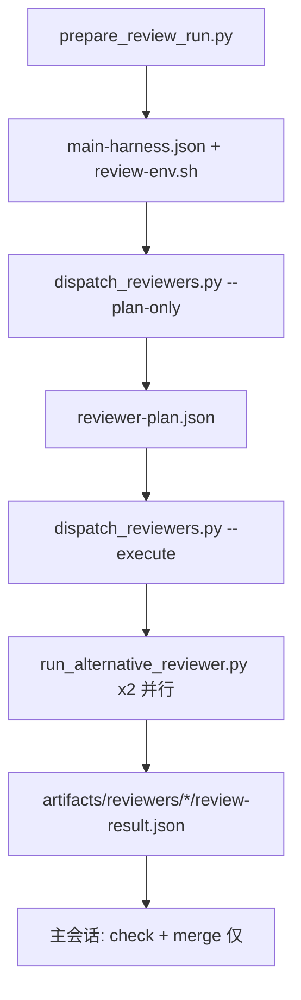

# RVF 多 Harness Reviewer 路由计划

> **状态**：已实现（S1–S6 全量落地，2026-06-21）。下方原设计稿正文保留为历史参考；落地决议与现状以「实现决议批注」为准。
> **范围**：review 阶段的 reviewer 选型、路由、派发与契约更新
> **非范围**：validate/fix 子代理路由、Stop hook / Kanban fork、merge 算法本身（除 source label 契约外）

---

## 实现决议批注（2026-06-21，全量 S1–S6 落地）

8 个开放问题的最终处置（其中 Q1/Q2/Q3/Q4 经用户拍板，其余由实现确定）：

1. **主 harness = Cursor 的 R0 默认（开放 #1 / Q3）**：暂不做 cursor 主探测/host 适配。真实用例（主=Claude / 主=Codex）本就不需要 Cursor 作主 host，**无冲突**。路由表保留 `main_harness == cursor → claude_code + codex` 一条，仅经显式 `--main-harness cursor` / `RVF_MAIN_HARNESS=cursor` 覆盖可达；不接 Kanban、不做自动探测。`detect_transcript_format` 仍只返回 codex/claude_code。
2. **Legacy `codex-reviewer` + 单 external（开放 #2 / #8 / Q2）**：**完全移除** `codex-reviewer` 作为默认第一腿，不保留 env 开关。默认路径恒为两路 external。source label 统一为 `alternative-reviewer:<harness-id>`。`alternative-reviewer.json` 单文件已删除，registry + 三份 per-harness config 成为唯一事实源。
3. **`|A| == 1` 且 `only != M`（开放 #3）**：warning（`available_reviewer_harness_mismatch`）后仍派**同 harness 双 external**（R2），不 fail-close；保持 double review 形态。
4. **Cursor 主 harness 探测（开放 #4 / Q3）**：不实现自动探测；要求显式 `--main-harness cursor` / `RVF_MAIN_HARNESS=cursor`。
5. **同 harness 双 external 的 CLI 并行限制（开放 #5）**：三份模板均已用 headless ephemeral / no-persistence 姿态（`claude --no-session-persistence`、`codex --ephemeral`、`cursor-agent -p` print 模式），判定**默认并行安全**；机制层保留 `SEQUENTIAL_HARNESSES` + `collision_risk` warning + `sequential_execution`（默认空集=全并行），若实机发现锁，把该 harness 加入集合即改顺序执行（仍两份独立 artifact）。
6. **Registry 与本机 setup（开放 #6 / Q4）**：新增独立 `config/reviewer-registry.json`；`install_to_codex.py` 的本机保留集从 `alternative-reviewer.json` 改为 `reviewer-registry.json`（三份 per-harness 模板随仓库同步、不保留）。
7. **Fail-close（开放 #7）**：默认 0 external → `routing_rule: R3` + `needs_last_resort_fallback: true`（走 in-harness mimic 最后兜底，见 `references/zero-external-reviewer-last-resort-in-harness-fallback.md`）；仅 `dispatch_reviewers.py --require-external` 时 fail-close。
8. **Merge policy source label（开放 #8）**：统一 `alternative-reviewer:<harness-id>`；`codex-reviewer` 命名废弃；`codex-mimic-reviewer-a/b` 仅保留为最后兜底来源，setup 文档外置到独立 reference。

### Migration note（本机从单文件迁到 registry）

- 旧：active `config/alternative-reviewer.json`（被 `0ba4a1d` 换成 cursor 内容）。**已删除**。
- 新：`config/reviewer-registry.json` 注册 `cursor` / `claude_code` / `codex` 三个 harness，分别指向 `config/alternative-reviewer.{cursor,claude,codex}.json`。
- `run_alternative_reviewer.py` 的 `DEFAULT_CONFIG` 由 `alternative-reviewer.json` 改指 `alternative-reviewer.cursor.json`（standalone 无 `--config` 行为与今日一致）。
- `run_alternative_reviewer.py` 新增 `--reviewer-id`，供 R2 同 harness 双实例不撞 `artifacts/reviewers/<id>/`。
- 重装（`install_to_codex.py`）默认保留本机 `reviewer-registry.json`；要用仓库版本覆盖加 `--replace-setup-config`。
- 路由矩阵测试用例 ↔ 规则 id 映射见 `tests/test_review_support_scripts.py::test_dispatch_reviewers_routing_matrix` docstring。

## 背景与动机

当前 RVF double review 契约（`references/review-merge-policy.md`）假定：

1. **第一路**固定为 in-harness **`codex-reviewer`**（Codex-native 子代理）。
2. **第二路**为**唯一** active 的 `config/alternative-reviewer.json`（经 `run_alternative_reviewer.py` 调度的 external CLI）。
3. 主 RVF 会话负责理解 policy、选择 reviewer、spawn Codex 子代理并调用 external runner。

这与产品目标不一致：

- **三种 harness**（Cursor Agent CLI、Claude Code、Codex CLI）应同时作为 *可选* external reviewer 注册，而非互斥模板三选一。
- **默认路由**应为 **Cursor + 非主 dispatch harness**（主为 Claude → Cursor + Codex；主为 Codex → Cursor + Claude）。
- **禁止**「external reviewer + 主 harness in-harness subagent」的混合派发（例如主为 Claude 时，不得「Claude Task 子代理 + Codex external」；应为「Claude external + Codex external」或等价双 external）。
- **路由与派发细节必须由专用脚本完成**；主 RVF agent 只消费 plan artifact、等待完成、合并结果。

本计划将 review 派发从「主会话 + 单文件 config」升级为「registry + 路由脚本 + plan artifact + 并行执行器」。

---

## 当前实现快照（调查结论）

| 维度 | 现状 | 缺口 |
|------|------|------|
| External 配置 | 单一 `alternative-reviewer.json`；另有 `.cursor.json` / `.codex.json` 模板；Claude 无独立 `.claude.json` | 无 registry；无法同时 enable 三路 |
| External 执行 | `scripts/run_alternative_reviewer.py`（单实例；`--config` 可覆盖） | 无多 reviewer 编排；无路由 |
| In-harness reviewer | 主会话 spawn Codex `codex-reviewer`；fallback 为 `codex-mimic-a/b` 两个 Codex 子代理 | 与用户要求的「双 external」默认路径冲突 |
| 主 harness 探测 | `trajectory_distill.detect_transcript_format` → `HOST_CODEX` / `HOST_CLAUDE`；Kanban `default_cline_kanban_agent_id` 复用同一探测 | **无 `HOST_CURSOR`**；Cursor 主会话无法自动识别 |
| Prepare | `prepare_review_run.py` 生成 `review-env.sh`、`review-agent-context.md`；提示 `RVF_REVIEWER_ID` 多 reviewer | **不生成 reviewer plan** |
| 主会话职责 | `SKILL.md`：「主会话负责…启动脚本、合并 reviewer artifact」 | 路由逻辑散落在 policy 自然语言中 |
| 契约测试 | `check_skill_contracts.sh` 字面量要求 `alternative-reviewer.json` 含 Claude 字段 | 与已提交的 Cursor active config **已冲突**；实现时需一并更新 |
| Adapter | `adapters/{codex,claude_code}/subagent.py` 用于 analyze/观测 | review 派发未走 adapter 抽象 |

**结论**：`run_alternative_reviewer.py` 是合格的 **单路 external 执行器**，但不是 **路由器/调度器**。需要新脚本（建议名见下文），并修订 merge policy / SKILL 边界。

---

## 目标形态

### 1. Reviewer Harness 注册表

新增机器可读 registry（建议路径）：

`plugins/review-validate-fix/skills/review-validate-fix/config/reviewer-registry.json`

示意：

```json
{
  "harnesses": {
    "cursor": {
      "harness_id": "cursor",
      "label_prefix": "alternative-reviewer:cursor-cli",
      "config_path": "config/alternative-reviewer.cursor.json",
      "dispatch_mode": "external_cli",
      "priority_default": 100
    },
    "claude_code": {
      "harness_id": "claude_code",
      "label_prefix": "alternative-reviewer:claude-code",
      "config_path": "config/alternative-reviewer.claude.json",
      "dispatch_mode": "external_cli"
    },
    "codex": {
      "harness_id": "codex",
      "label_prefix": "alternative-reviewer:codex-cli",
      "config_path": "config/alternative-reviewer.codex.json",
      "dispatch_mode": "external_cli"
    }
  }
}
```

要求：

- 新增 `alternative-reviewer.claude.json`（从仓库历史默认 Claude 配置提取），与 cursor/codex 模板对称。
- 每 harness 的 `enabled` 可在 registry 级或各 config 内表达；**probe 失败 = 本轮不可用**（不 silent enable）。
- 保留 `alternative-reviewer.json` 一段过渡期作为 **legacy override**（可选：仅当存在且 `enabled` 时覆盖 registry 默认路由为「单 external + codex-reviewer」并打 deprecation warning）——实现 agent 需与维护者确认是否完全移除 legacy 路径。

### 2. 专用路由与派发脚本

建议新脚本：`scripts/dispatch_reviewers.py`（名称可调整，但须单一入口）。

**职责（必须全部由脚本完成，不得由主 agent 自行推断）：**

| 阶段 | 行为 |
|------|------|
| Resolve main harness | 见「主 harness 解析」 |
| Probe availability | 对每个 enabled harness 调等价于 `run_alternative_reviewer.py --config <path> --check`（可选 `--preflight`） |
| Plan | 按路由表选出 **恰好 2 路** reviewer spec |
| Warn | 结构化 warnings（stderr + run ledger + plan artifact） |
| Execute（`--execute`） | 并行启动 2 路 external（均通过 `run_alternative_reviewer.py` 或内部复用其 `main()` 逻辑） |
| Emit artifacts | `artifacts/reviewers/reviewer-plan.json`；每路 `artifacts/reviewers/<reviewer_id>/` |

**CLI 草案：**

```bash
python3 scripts/dispatch_reviewers.py \
  --repo <repo> \
  --review-packet <packet> \
  --session-context <file> \
  [--scope-contract <path>] \
  [--main-harness auto|cursor|claude_code|codex] \
  [--rvf-run-id ...] [--rvf-run-dir ...] \
  [--plan-only] [--dry-run] [--execute]
```

**主 RVF agent 新契约（`SKILL.md` 修订后）：**

1. `source review-env.sh`
2. 运行 `dispatch_reviewers.py --execute ...`（或在 prepare 阶段已生成 plan 则只执行）
3. 校验每路 `review-result.json`
4. 按 `review-merge-policy.md` 合并
5. **禁止**主会话自行选择 harness、拼装 CLI、或 spawn in-harness reviewer 作为 double review 的一路（除非 plan artifact 明确记录且用户显式 override——默认不应出现）。

### 3. 路由规则（规范）

记：

- `M` = 主 dispatch harness（本轮 RVF 主会话所在 harness）
- `A` = 当前机器上 probe 通过的 harness 集合
- 目标：选出 **2 个 reviewer slot**，均为 **`dispatch_mode: external_cli`**

#### R0 — 默认（`|A| ≥ 3` 且 cursor ∈ A）

| M | Slot 1 | Slot 2 |
|---|--------|--------|
| `claude_code` | `cursor` | `codex` |
| `codex` | `cursor` | `claude_code` |
| `cursor` | `claude_code` | `codex` | ← **待产品确认**，见「开放问题」 |

两路均通过 external CLI；**不得**使用 in-harness subagent。

#### R1 — 仅两个 harness 可用（`|A| == 2`）

用户约束：此时两路都应为 **external**，且为这 **两个可用 harness**（不得「1 external + 1 主 harness subagent」）。

| 场景 | 派发 |
|------|------|
| `A = {cursor, codex}`, `M = claude_code` | `cursor` external + `codex` external |
| `A = {cursor, claude_code}`, `M = codex` | `cursor` external + `claude_code` external |
| `A = {claude_code, codex}`, `M = claude_code` | `claude_code` external + `codex` external |
| `A = {claude_code, codex}`, `M = codex` | `claude_code` external + `codex` external |

若 `M ∈ A`：仍 **两路 external**，不用 in-harness subagent 顶替 `M`。

#### R2 — 仅一个 harness 可用（`|A| == 1`）

设 `only =` 唯一可用 harness。

| 条件 | 派发 | Warning |
|------|------|---------|
| `only == M` | **同 harness 双 external**（两个独立进程/会话，`reviewer_id` 后缀 `-a`/`-b` 或 `.1`/`.2`） | 可选 info：「仅主 harness 可用，已使用双 external 实例」 |
| `only != M` | **仍派发 `only` 双 external**（保持 double review 形态） | **必须** warning：`available_reviewer_harness_mismatch` — 提示用户将主 dispatch harness 配置为可用 external reviewer |

**禁止**：`|A| == 1` 时 fallback 到 `codex-mimic-a/b` in-harness subagent（除非用户显式 env 开启 legacy fallback）。

#### R3 — 零可用（`|A| == 0`）

- 默认：写入 plan `status: failed`, `reason: no_reviewer_harness_available`；主会话按现有 policy 决定是否 fail-close 或用户显式 `skip review`。
- **不再**自动默认 `codex-mimic-a/b`，除非 `CODEX_RVF_LEGACY_CODEX_MIMIC_FALLBACK=1`（实现时命名可调整）。

#### R4 — Cursor 优先级

在 R0/R1 中 **cursor 作为默认必选一腿** 仅当 `cursor ∈ A`。若 cursor probe 失败，降级：

1. 记录 warning `cursor_unavailable`
2. 在剩余 `A \ {M}` 中选另一非主 harness；若仅剩 1 个非主，则落入 R2 逻辑

实现须单元测试 cursor 不可用时的降级矩阵。

### 4. 双 external 同 harness 实例

当 R2 要求同 harness 双实例：

- `label` 示例：`alternative-reviewer:cursor-cli#a`、`alternative-reviewer:cursor-cli#b`
- `reviewer_id` 必须唯一（复用 `reviewer_id_from_label` + `unique_child_path` 规则）
- 两实例 **clean context**、同 packet、互不可见；command lock 仍适用
- 实现需确认：同 harness CLI 并行两次是否共享 session/auth 冲突——若某 CLI 有全局锁，需在 plan 中加 `collision_risk` 并在 ledger 记录

### 5. 主 harness 解析

优先级（建议）：

1. CLI `--main-harness`（非 `auto`）
2. Prep file / `review-env.sh` 导出：`RVF_MAIN_HARNESS`
3. `detect_transcript_format(transcript_path)` → `codex` / `claude_code`
4. 环境启发：`CURSOR_SESSION` / plugin 上下文 → `cursor`（**需实现 agent 调研 Cursor 侧可可靠信号**）
5. 默认 `codex`（与现有 Kanban 兜底一致）

须在 `prepare_review_run.py` 或 post-prepare 步骤将解析结果写入 `artifacts/inputs/main-harness.json`（或 prep file 字段），供 `dispatch_reviewers.py` 只读。

### 6. Plan Artifact 契约

`artifacts/reviewers/reviewer-plan.json`（schema 实现时固化并加测试）：

```json
{
  "schema_version": 1,
  "main_harness": "claude_code",
  "available_harnesses": ["cursor", "claude_code", "codex"],
  "routing_rule": "R0",
  "reviewers": [
    {
      "slot": 1,
      "harness_id": "cursor",
      "dispatch_mode": "external_cli",
      "label": "alternative-reviewer:cursor-cli",
      "config_path": "...",
      "reviewer_id": "cursor-cli"
    },
    {
      "slot": 2,
      "harness_id": "codex",
      "dispatch_mode": "external_cli",
      "label": "alternative-reviewer:codex-cli",
      "config_path": "...",
      "reviewer_id": "codex-cli"
    }
  ],
  "warnings": [],
  "status": "planned"
}
```

执行完成后更新 `status: completed|partial|failed`，并列出每路 `review-result.json` 路径。

### 7. 与现有组件的集成



- **复用** `run_alternative_reviewer.py` 作为 external 执行内核；避免复制 timeout/lease/artifact 逻辑。
- **可选**：`prepare_review_run.py --plan-reviewers` 在 prepare 阶段预生成 plan（减少主会话步骤），但执行仍只在 `dispatch_reviewers.py`。

### 8. 契约与文档更新清单

| 文件 | 变更 |
|------|------|
| `references/review-merge-policy.md` | 废弃默认 `codex-reviewer` 第一路；改为两路 `alternative-reviewer:<harness>` 或 plan 中的 label；更新 fallback 叙述 |
| `SKILL.md` | Review 节改为「运行 `dispatch_reviewers.py`」；删除主会话 spawn reviewer 子代理职责 |
| `prompts/reviewer.md` | 保持 self-contained；无需 per-harness 分叉 |
| `setup/mcp-setup-startup.md` | 改为 registry setup |
| `scripts/check_skill_contracts.sh` | 移除对单一 `alternative-reviewer.json` 的 Claude 字面量；改为 registry + `dispatch_reviewers.py` 断言 |
| `references/handoff-template.md` | source 枚举与 plan 对齐 |
| `README.md` | 一段「multi-harness double review」说明 |
| `tests/test_review_support_scripts.py` | 路由矩阵 + plan schema + 双实例 + warning 测试 |

### 9. 测试计划

1. **路由单元测试**：覆盖 R0–R4 与 cursor 降级（mock probe 结果）。
2. **集成测试**：fake CLI shim 并行双 external，断言 artifact 路径与 `reviewer_id` 唯一。
3. **契约测试**：`reviewer-plan.json` schema；warnings 必填场景。
4. **回归**：`run_alternative_reviewer.py` 单路行为不变（`--config` 直接调用）。
5. **禁止回归**：无 plan 时主会话不应再文档化「spawn codex-reviewer」为默认路径（grep 契约）。

---

## 实现切片（建议顺序）

| Slice | 内容 | 依赖 |
|-------|------|------|
| **S1** | `alternative-reviewer.claude.json` + `reviewer-registry.json` + probe 辅助函数 | — |
| **S2** | `dispatch_reviewers.py`：`--plan-only`、路由 R0–R4、warnings、plan artifact | S1 |
| **S3** | `--execute` 并行调用 `run_alternative_reviewer.py`；ledger 事件 | S2 |
| **S4** | `main-harness` 解析 + prepare 写入；prep file 字段 | S2 |
| **S5** | 更新 policy / SKILL / contracts / tests | S3 |
| **S6** | 移除或门控 legacy `codex-reviewer` + `codex-mimic` 默认路径 | S5 |

---

## 开放问题（实现前需与维护者确认）

1. **主 harness = Cursor 时的 R0 默认**：本文暂定为 `claude_code + codex`（两路均非主）。是否同意？是否仍强制 cursor 占一腿（则另一腿在 claude/codex 中选）？

2. **Legacy `codex-reviewer` + 单 external**：是否完全删除，还是保留 env 开关一个版本？

3. **`|A| == 1` 且 `only != M`**：warning 后仍双 external 同 harness，还是 fail-close？用户原文倾向 warning + 继续，但需确认 merge 可信度。

4. **Cursor 主 harness 探测**：除 env 外，是否有稳定字段（hook payload / `cursor-agent` metadata）？若无，是否要求 Kanban / manual 显式传 `--main-harness cursor`？

5. **同 harness 双 external 的 CLI 限制**：`claude` / `codex` / `cursor-agent` 是否支持无 session 冲突的并行 headless？需 spike；若不行，plan 需记录 `sequential_required` 并仍保持两 artifact 来源独立。

6. **Registry 与本机 setup**：`install_to_codex.py` 保留本机 config 的策略是否扩展到整个 `config/reviewer-registry.json`？

7. **Fail-close 用户显式要求 external**：现有 policy 一句是否改为「plan 含 0 external 且用户要求」？

8. **Merge policy source label**：是否统一为 `alternative-reviewer:<harness-id>`，废弃 `codex-reviewer` / `codex-mimic-*` 命名？

---

## 实现 agent 交付物

- [ ] 上述切片代码 + 测试全绿
- [ ] `reviewer-plan.json` schema 与示例
- [ ] 路由矩阵表（测试用例名 ↔ 规则 id）写入 `docs/` 或测试文件头
- [ ] `check_skill_contracts.sh` / `check_plugin_contracts.py` 通过
- [ ] 简短 migration note：本机如何从单文件 `alternative-reviewer.json` 迁到 registry

---

## 参考资料

- `plugins/review-validate-fix/skills/review-validate-fix/references/review-merge-policy.md`
- `plugins/review-validate-fix/skills/review-validate-fix/scripts/run_alternative_reviewer.py`
- `plugins/review-validate-fix/skills/review-validate-fix/scripts/prepare_review_run.py`
- `plugins/review-validate-fix/skills/review-validate-fix/scripts/trajectory_distill.py`（`detect_transcript_format`）
- `plugins/review-validate-fix/skills/review-validate-fix/scripts/codex_stop_review_validate_fix.py`（`default_cline_kanban_agent_id`）
- `docs/agent-skills-review-comparison.md`
- `adapters/README.md`（external reviewer vs host adapter 区分）
