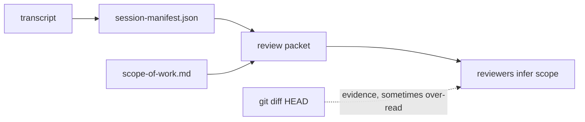
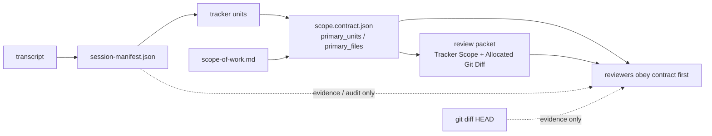

# RVF Scope Contract Slice 6 Phase Report

## Scope

本阶段完成 tracker plan Slice 6 的文案和 reviewer context 收敛：reviewer 的最终范围合同从 session manifest 转为 `scope.contract.json`；当 `primary_units` 非空时，以 tracker unit scope 为主，session manifest 降级为 ownership evidence 和 tracker audit context。

## Before

风险：reference / prompt 中仍有多处把 manifest owned paths 写成默认 review scope，容易让 reviewer 在 tracker scope 已冻结后继续按 manifest 或 live diff 扩大范围。

## After

结果：Codex-native reviewer context、alternative reviewer prompt、Cline Kanban startup prompt 和 skill references 都统一表达同一条规则：先读 `scope.contract.json`；`primary_units` 优先；session manifest 只作证据和审计，不再是最终 scope contract。

## Validation

- `python3 -m py_compile plugins/review-validate-fix/skills/review-validate-fix/scripts/prepare_review_run.py plugins/review-validate-fix/skills/review-validate-fix/scripts/run_alternative_reviewer.py plugins/review-validate-fix/skills/review-validate-fix/scripts/codex_stop_review_validate_fix.py`
- `python3 tests/test_review_support_scripts.py --shard-count 4 --shard-index 1`
- `python3 tests/test_review_support_scripts.py --shard-count 4 --shard-index 2`
- `python3 tests/test_codex_stop_review_validate_fix.py --shard-count 4 --shard-index 3`
- `python3 tests/test_codex_stop_hook_dispatcher.py`
- `python3 scripts/check_plugin_contracts.py`
- `git diff --check`
