# RVF Scope Contract Slice 6 Phase Report

## Scope

本阶段是 systematic slimdown / global tracker scope-contract 的收尾，不是完整 dispatch / fork-flow overhaul。目标是把 reviewer 的最终范围来源从 session manifest、review packet 和 live diff 的混合推断，收敛为 prepare 阶段冻结的 `scope.contract.json`。当合同含 `primary_units` 时，reviewer 按 tracker unit scope 审查；否则回退到 `primary_files` / scope-of-work 的 path scope。session manifest、review packet 和 diff 保留为 evidence、audit、replay 输入。

## Before / After

```mermaid
flowchart TB
  subgraph Before["Before: scope inferred from several artifacts"]
    BT["Codex transcript"] --> BM["session-manifest.json<br/>owned_paths / owned_dirty_paths"]
    BS["scope-of-work.md"] --> BP["review packet"]
    BM --> BP
    BD["live git diff HEAD"] -. "evidence, often over-read" .-> BR["reviewer infers scope"]
    BP --> BR
    BM -. "implicit scope anchor" .-> BR
    BR --> BX["risk: scope too wide<br/>or ownership unclear"]
  end

  subgraph After["After: scope.contract.json is the final contract"]
    AT["Codex transcript"] --> AM["session-manifest.json<br/>ownership evidence"]
    AM --> AU["global tracker units"]
    AU --> AC["scope.contract.json<br/>primary_units first<br/>primary_files fallback"]
    AS["scope-of-work.md"] --> AC
    AC --> AP["review packet<br/>Tracker Scope + Allocated Git Diff"]
    AC --> AR["reviewer obeys contract"]
    AP -. "readable evidence / audit" .-> AR
    AM -. "evidence / tracker splice" .-> AR
    AD["live git diff HEAD"] -. "evidence only" .-> AR
    AR --> AX["bounded review scope<br/>clear responsibility"]
  end
```

## 对照表

| 维度 | Before | After |
|---|---|---|
| scope 来源 | reviewer 主要从 session manifest 的 `owned_paths` / `owned_dirty_paths`、scope-of-work、review packet 和 live `git diff HEAD` 之间推断实际范围。 | `scope.contract.json` 是最终 reviewer scope contract；`primary_units` 非空时优先于 path 级范围，缺少 tracker scope 时才用 `primary_files` / scope-of-work。 |
| reviewer 入口 | Codex-native context、alternative reviewer prompt 和 reference 文案仍可能把 manifest owned paths 写成默认 scope anchor。 | `review-agent-context.md`、`run_alternative_reviewer.py` prompt、`references/review-prompt.md` 和 `SKILL.md` 统一要求先读 `$RVF_SCOPE_CONTRACT`。 |
| manifest 角色 | `session-manifest.json` 同时承担 ownership evidence 和实际 review scope anchor，容易把 transcript 推导结果误当冻结合同。 | manifest 降级为 ownership evidence、tracker scope splice 容器和 audit context；`unattributed_dirty_paths` 仍是背景 WIP，除非被合同范围直接连带影响。 |
| diff 角色 | review packet 内的 session-owned diff 与 live diff 容易被 reviewer 当作扩大范围的入口。 | tracker scope 存在时 packet 生成 `## Tracker Scope` / `## Allocated Git Diff`；`Full Git Diff HEAD` 只作 evidence，不能重定义 scope。 |
| Kanban prompt 角色 | Cline Kanban task startup 文案曾把 review packet / session manifest / bootstrap 统称为启动 scope anchor，存在 task 排队后按 worktree 实时状态重算 scope 的诱因。 | Cline Kanban prompt 明确 `scope.contract.json` 才是最终合同；review packet、session manifest、workspace snapshot、worktree bootstrap 只作为冻结证据、审计上下文或重放输入。这里指当前 `cline-kanban` / `kanban` CLI 路径，不重新引入或混用旧 `vibe-kanban` runner/client 设计。 |
| 测试覆盖 | 已有 Slice 2-B / 3 / 4 / 5 覆盖 tracker-scope splice、contract v2、packet tracker section、allocator 到 prepare 的串接，但 reviewer 文案收敛缺少直接断言。 | `tests/test_review_support_scripts.py` 断言 generated reviewer context 和 alternative reviewer prompt 包含 contract precedence；`tests/test_codex_stop_review_validate_fix.py` 断言 Cline Kanban prompt / startup scope 不再说以 review packet 和 manifest 为准；dispatcher env 清理覆盖 `KANBAN_*` / `CLINE_KANBAN_*` 变量残留。 |
| 剩余风险 | 多入口文案漂移会让 reviewer 继续依赖 manifest 或 live diff，造成重复审查、scope 过宽或背景 WIP 被误报。 | scope-contract 语义已收敛，但 Phase 5 tail 的 activity probe、stale release、Codex-native reviewer lease lifecycle audit 仍未完全完成；dispatch / fork-flow overhaul 尚未开始。 |

## 阶段总结

这轮 slimdown 删除或降低了三类隐式耦合：

- 降低 `session-manifest.json` 与 reviewer 最终 scope 的耦合：manifest 仍从 transcript 提供 ownership evidence，但不再是冻结合同。
- 降低 review packet / live diff 与 scope 决策的耦合：packet 负责可读证据和 replay/audit，diff 负责核实，不负责扩大审查面。
- 降低 Cline Kanban startup prompt 与实时 worktree 状态的耦合：task 只能复用已冻结 run artifacts，且最终范围以 `scope.contract.json` 为准。

本阶段没有做完整 overhaul：没有启动 `docs/rvf-dispatch-flow-overhaul-plan.md` 中的 flow 1/2/3/4 统一，没有引入 prep file / UserPromptSubmit token dispatch，没有改造 fork-flow，也没有完成 global tracker Phase 5 的 activity probe / stale release 全矩阵。

下一阶段应按 `docs/rvf-dispatch-flow-overhaul-plan.md` 的 preparatory slice 衔接：把当前 `ledger.tracker_scope_meta.tracker_scope_path -> prepare_review_run.py --tracker-scope` 的临时路径约定，thin-refactor 到 prep file 的 `rvf_run.tracker_scope_path` / `scope_contract_path` 字段；同时保持本阶段确立的约束，即 prep file 可以传递路径，但不能让 session manifest、review packet 或 Kanban worktree live diff 重新成为 scope authority。

## Validation Evidence

- `git show --stat --oneline --decorate 5178057` 显示 commit `5178057 feat(rvf): finish tracker scope contract guidance` 修改 13 个文件，包含本报告、global tracker handoff、tracker overhaul plan、reviewer prompt/reference、`prepare_review_run.py`、`run_alternative_reviewer.py`、`codex_stop_review_validate_fix.py` 及相关测试。
- 文档依据：`docs/global-reviewed-diff-tracker-overhaul-plan.md` Phase 6 标为已落地，并说明 Cline Kanban startup prepare 已接入 `--tracker-scope`；`docs/global-tracker-finishing-handoff.md` 明确不要重做 Slice 6，后续剩余工作集中在 activity probe / heartbeat / stale release。
- 脚本依据：`prepare_review_run.py` 在 `--tracker-scope` 存在时 splice 到 `manifest.tracker.tracker_scope`，写出 `scope.contract.json.primary_units`、`tracker_lease_id`、`tracker_scope_hash`，并用 tracker paths 生成 `primary_files` / `fix_allowlist`；`run_alternative_reviewer.py` 和 generated `review-agent-context.md` 明确 contract precedence。
- 测试依据：现有测试覆盖 `test_tracker_scope_payload_splices_into_manifest`、`test_tracker_scope_unlocks_scope_contract_v2_fields`、`test_packet_emits_tracker_scope_section_when_present`、`test_allocated_git_diff_uses_tracker_scope_paths`、`test_allocator_scope_feeds_prepare_scope_contract`、`test_prepare_review_run_and_command_lock`、`test_alternative_reviewer_prompt_uses_session_env_refs`、`test_cline_kanban_mode_creates_and_starts_task_with_same_run`。
- commit 中记录的验证命令：`python3 -m py_compile ...prepare_review_run.py ...run_alternative_reviewer.py ...codex_stop_review_validate_fix.py`、`python3 tests/test_review_support_scripts.py --shard-count 4 --shard-index 1`、`python3 tests/test_review_support_scripts.py --shard-count 4 --shard-index 2`、`python3 tests/test_codex_stop_review_validate_fix.py --shard-count 4 --shard-index 3`、`python3 tests/test_codex_stop_hook_dispatcher.py`、`python3 scripts/check_plugin_contracts.py`、`git diff --check`。
