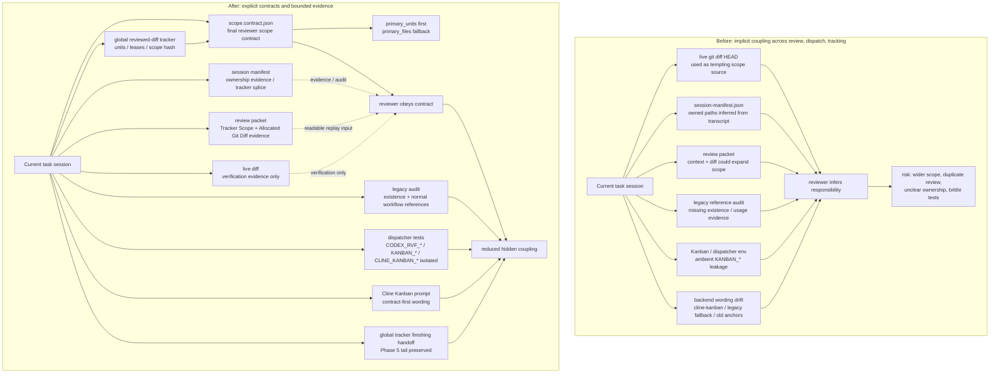
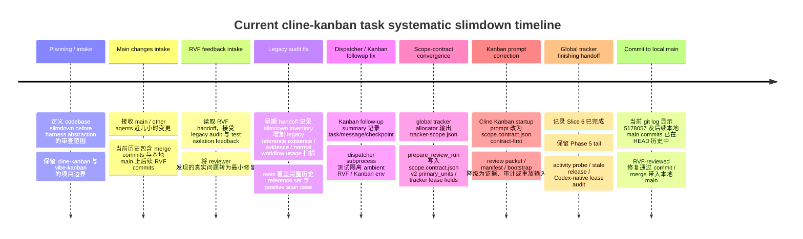

# Systematic Slimdown Session Before / After Report

## Scope

本报告覆盖当前 `cline-kanban` task session 中连续推进的 RVF systematic slimdown 工作，而不是只覆盖 tracker plan Slice 6。这里的 slimdown 指向 review / dispatch / tracking / prompt / reference / test isolation 的职责收口：把隐式 scope 推断、legacy audit 盲区、Kanban 环境继承、review packet 扩散和 backend 文案漂移，收敛为更清楚的合同、证据、审计和 handoff 边界。

这不是完整 overhaul。`docs/rvf-dispatch-flow-overhaul-plan.md` 的 preparatory slice 尚未开始，dispatch / fork-flow abstraction 尚未真正落地；global tracker Phase 5 tail 也仍在 `docs/global-tracker-finishing-handoff.md` 中作为后续工作保留。

## Overall Before / After



## Session Timeline



## 对照表

| 维度 | Before | After | 验证依据 / 相关文件 |
|---|---|---|---|
| review scope 来源 | reviewer 可能从 live diff、session manifest、scope-of-work、review packet 混合推断范围。 | `scope.contract.json` 是最终 reviewer scope contract；`primary_units` 非空时优先，其次 `primary_files` / scope-of-work。 | `docs/rvf-scope-contract-slice-6-phase-report.md`；`plugins/review-validate-fix/skills/review-validate-fix/scripts/prepare_review_run.py`；commit `5178057`。 |
| review packet 角色 | packet 承载 session context / manifest / diff，容易被当作 scope 扩散入口。 | tracker scope 存在时 packet 生成 `## Tracker Scope` / `## Allocated Git Diff`，作为 readable evidence / audit / replay，而不是最终合同。 | `docs/global-reviewed-diff-tracker-overhaul-plan.md` Phase 6；`tests/test_review_support_scripts.py` 中 tracker scope packet / metadata tests。 |
| session manifest 角色 | `owned_paths` / `owned_dirty_paths` 曾被写成默认 review scope anchor。 | manifest 负责 transcript ownership evidence、background WIP 标注和 tracker splice；冻结后不再是最终 reviewer scope contract。 | `docs/rvf-scope-contract-slice-6-phase-report.md`；`plugins/review-validate-fix/skills/review-validate-fix/references/review-prompt.md`；`SKILL.md`。 |
| legacy reference audit | slimdown inventory 的 legacy reference 检查存在盲区：缺少 exists status、missing report、normal workflow usage evidence，以及完整历史 reference set 断言。 | 历史 handoff 记录 inventory / markdown / tests 当时补齐了 legacy reference existence、missing references、normal workflow reference 扫描与 positive scan case；当前 HEAD 已不再包含 `scripts/slimdown_inventory.py`，因此本项只作为 artifact 证据。 | RVF handoff `rvf-20260506T101011Z-dispatcher-57233a8f/artifacts/handoff.md`。 |
| Kanban / Cline backend 文案 | Cline Kanban startup 文案曾把 review packet、session manifest、bootstrap 统称为 scope anchor；backend 语境容易与旧 fallback 或其他 Kanban 项目混杂。 | Cline Kanban prompt 明确 `$RVF_SCOPE_CONTRACT` / `scope.contract.json` 才是最终合同；review packet、manifest、snapshot、bootstrap 只作冻结证据、审计或重放输入。明确当前 backend 是 `cline-kanban` / `kanban` CLI，不混用 `vibe-kanban`。 | RVF handoff `rvf-20260507T064825Z-prepare-run-6fed9c8d/artifacts/handoff.md`；`tests/test_codex_stop_review_validate_fix.py::test_cline_kanban_mode_creates_and_starts_task_with_same_run`；commit `5178057`。 |
| dispatcher 测试环境 | dispatcher subprocess test helper 只清理固定 `CODEX_RVF_*` 列表，真实 Kanban task session 中 inherited `KANBAN_*` / `CLINE_KANBAN_*` 会污染分支选择。 | test helper 改为 prefix-based 清理 `CODEX_RVF_*`、`KANBAN_*`、`CLINE_KANBAN_*`，隔离手动/advisory/follow-up 断言。 | RVF handoff `rvf-20260507T051023Z-prepare-run-4257652e/artifacts/handoff.md`；commit `5178057` 中 `tests/test_codex_stop_hook_dispatcher.py`。 |
| tracker finishing 状态 | tracker plan 已有 SQLite units / leases / allocator / manual takeover 等多阶段落地，但 reviewer scope 文案和后续 finishing 边界容易被继续混写。 | Slice 6 收敛完成后新增 `docs/global-tracker-finishing-handoff.md`，明确不要重做 scope-contract cleanup，后续集中处理 Phase 5 tail。 | `docs/global-tracker-finishing-handoff.md`；`docs/global-reviewed-diff-tracker-overhaul-plan.md`。 |
| 后续 dispatch / fork-flow 准备程度 | flow 1/2/3/4 并存，setup 分散在 prompt，Flow 2 brand-new session / Flow 3 GUI fallback 等问题仍存在。 | 当前 slimdown 只完成数据/范围侧降耦，为后续 prep file / UserPromptSubmit token / dispatch harness 抽象准备更清楚的 scope contract 输入。 | `docs/rvf-dispatch-flow-overhaul-plan.md`；本报告的 Remaining Work。 |

## Handoff Evidence Summary

| Artifact | 可用性 | 标题 / 关键结论 |
|---|---|---|
| `/Users/bominzhang/plugins/review-validate-fix/skills/review-validate-fix/state/runs/rvf-20260506T101011Z-dispatcher-57233a8f/artifacts/handoff.md` | found | `# RVF Handoff`。legacy reference audit 的两个 reviewer 均发现真实问题；validate/fix 当时修复 `scripts/slimdown_inventory.py` 和 `tests/test_review_support_scripts.py`，补齐 missing legacy references、exists status、normal workflow references 和完整 expected set。当前 HEAD 已不再包含 `scripts/slimdown_inventory.py`，所以这里是历史 handoff 证据，不是当前文件清单。 |
| `/Users/bominzhang/plugins/review-validate-fix/skills/review-validate-fix/state/runs/rvf-20260506T103556Z-dispatcher-8fc6a30f/summary.json` | found | status `kanban-followup-started`；Cline Kanban follow-up user message 注入 task `762c4`，记录 message/checkpoint，并处于 `rvf_state.phase=prepare`。 |
| `/Users/bominzhang/plugins/review-validate-fix/skills/review-validate-fix/state/runs/rvf-20260506T143155Z-dispatcher-9f50380f/summary.json` | found | status `handoff-advisory`；指出 handoff 文件已 ready 且已处理，注入 `$rvf-analyze` follow-up 到 Kanban task `762c4`。 |
| `/Users/bominzhang/plugins/review-validate-fix/skills/review-validate-fix/state/runs/rvf-20260506T142724Z-prepare-run-1a0b0bfc/artifacts/handoff.md` | found | `# Review-validate-fix 交接上下文`。对 `c0294af fix(rvf): 默认禁用自动 legacy GUI fallback` 做 clean-path review，两个 reviewer 均 `no_issues`，无源码变更。此路径来自 20260506T143155 summary 的 handoff 指针。 |
| `/Users/bominzhang/plugins/review-validate-fix/skills/review-validate-fix/state/runs/rvf-20260507T051023Z-prepare-run-4257652e/artifacts/handoff.md` | found | `# Review-validate-fix 交接上下文`。review 最新 commit `a5dd0fc feat(rvf): 注入 rvf-analyze follow-up`，发现 dispatcher test helper 继承 ambient Kanban env 的真实问题，并修复测试隔离。 |
| `/Users/bominzhang/plugins/review-validate-fix/skills/review-validate-fix/state/runs/rvf-20260507T064825Z-prepare-run-6fed9c8d/artifacts/handoff.md` | found | `# Review-validate-fix handoff`。发现 Cline Kanban prompt / startup scope 仍可能把 review packet 或 manifest 表述为 scope anchor；修复为 `scope.contract.json` / `$RVF_SCOPE_CONTRACT` final contract。 |

## Remaining Work

- `docs/rvf-dispatch-flow-overhaul-plan.md` 的 preparatory slice 尚未开始。prep file、UserPromptSubmit token dispatch、flow 1/2/3/4 统一入口仍是计划，不是已完成实现。
- `docs/global-tracker-finishing-handoff.md` 中的 Phase 5 tail 仍需执行：Stop hook lazy sweep integration、Kanban task heartbeat、Codex-native reviewer lease lifecycle audit、paused/request state decision，以及完成后的 plan doc cleanup。
- dispatch / fork-flow abstraction 尚未真正落地。当前 Cline Kanban 路径已经能把 allocator 的 `tracker-scope.json` 传给 `prepare_review_run.py --tracker-scope`，但这只是后续 prep file 字段化之前的路径约定，不等价于 dispatch harness 完成。
- 当前 slimdown 的价值是为后续抽象收口和降耦：先稳定 scope authority、review packet 角色、manifest 角色、Kanban prompt 语义、legacy audit 和测试隔离，再把 backend 专属逻辑抽到更统一的 dispatch / prep file 机制里。

## Limits

- 本报告不宣称整个 RVF overhaul 已完成；它只总结当前 task session 的 systematic slimdown 和 scope-contract / global tracker finishing 收敛。
- 本报告不只覆盖 Slice 6；Slice 6 是整个 session 的最后 scope-contract 收口之一。
- `cline-kanban` 与 `vibe-kanban` 是不同项目。当前 RVF 自动化 backend 默认按 `cline-kanban` / `kanban` CLI 契约理解；本报告不重新引入或混用 `vibe-kanban` runner / MCP / client 设计。
- 如后续复核发现其他 RVF run artifact 不存在，应记录为 unavailable；本次重点路径均已存在。

## Validation Evidence

Commands run for this report:

```text
$ git status --short
 M docs/rvf-scope-contract-slice-6-phase-report.md
?? .codex/
?? docs/log/
?? docs/potential-work-cline-kanban-bootstrap-full-dirty-overlay.md
?? docs/systematic-slimdown-session-before-after-report.md
```

```text
$ git log --oneline --decorate -12
a16fd1d (HEAD -> main, feat/tracker-dashboard) test(rvf): accept review_scope_completed alongside lease_released
3ed48c4 Merge branch 'main' into feat/tracker-dashboard
79f7d30 (origin/main, origin/feat/tracker-dashboard, origin/HEAD) Merge remote-tracking branch 'origin/main' into feat/tracker-dashboard
fe833f1 feat(rvf): tracker dashboard polish + v3 lease participants surface
5178057 feat(rvf): finish tracker scope contract guidance
eedf76b fix(rvf): allow codex reviewer to write run artifacts
a5dd0fc feat(rvf): 注入 rvf-analyze follow-up
00e73fc fix(rvf): complete kanban follow-up tracker scopes
c7ff84a Record Kanban task ids in RVF handoff origin
cc13a1e fix(rvf): avoid duplicate handoff opens
762dc7a Fix Kanban follow-up task title origin
1f68cfc Merge branch 'main' of https://github.com/RealmX1/review-validate-fix
```

```text
$ git show --stat 5178057
commit 5178057c1d5b4a5d8fe67175c37c880e29ee327b
Author: Bomin Zhang <30303853+RealmX1@users.noreply.github.com>
Date:   Thu May 7 15:11:56 2026 +0800

    feat(rvf): finish tracker scope contract guidance

 docs/global-reviewed-diff-tracker-overhaul-plan.md |  4 +-
 docs/global-tracker-finishing-handoff.md           | 68 ++++++++++++++++++++++
 docs/rvf-scope-contract-slice-6-phase-report.md    | 45 ++++++++++++++
 .../skills/review-validate-fix/SKILL.md            | 10 ++--
 .../references/review-merge-policy.md              |  2 +-
 .../references/review-prompt.md                    | 12 ++--
 .../session-scoped-change-tracking-plan.md         |  6 +-
 .../scripts/codex_stop_review_validate_fix.py      | 10 ++--
 .../scripts/prepare_review_run.py                  |  2 +
 .../scripts/run_alternative_reviewer.py            | 13 ++++-
 tests/test_codex_stop_hook_dispatcher.py           | 29 +--------
 tests/test_codex_stop_review_validate_fix.py       |  9 +++
 tests/test_review_support_scripts.py               |  5 ++
 13 files changed, 166 insertions(+), 49 deletions(-)
```

Additional artifact checks:

- All five user-specified RVF artifact paths existed.
- The 20260506T143155 summary pointed to an additional existing handoff: `rvf-20260506T142724Z-prepare-run-1a0b0bfc/artifacts/handoff.md`.
- Handoff titles and key conclusions are summarized in `Handoff Evidence Summary` above.
