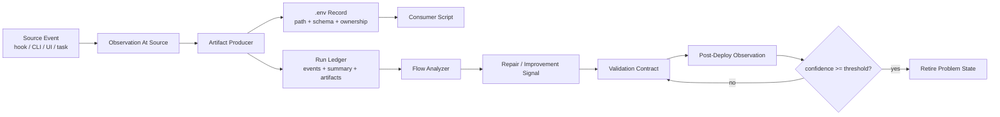

# Workflow Plugin Design System

本文档把构建 review-validate-fix workflow plugin 过程中反复学到的经验抽象成一套可复用设计体系。它不是 RVF 当前实现的逐行说明，而是面向后续 workflow plugin、agent runtime、hook、Kanban backend、local deploy 和诊断 UI 的设计准则。

## Capability

After this ships, workflow plugin maintainers can design each new feature, fix, runtime hook, artifact, diagnostic, validation, deployment and follow-up path against the same contracts, so that agent workflow stops depending on repeated prompt memory and becomes mostly script-owned, artifact-driven, observable and self-verifying.

## Before

- agent 需要反复读取路径、手写 env/config block、解释自然语言 setup，导致同一状态在 prompt、日志、脚本和文档之间漂移。
- review、validate、fix、handoff、deploy、diagnose 各自有 artifact，但缺少统一的 ownership、lifecycle、observation 和 post-deploy confidence 模型。
- 问题经常在下游被发现，却没有在 observation 源头同时记录 summary、expected post-fix observation 和下一次自动验证方法。
- 自动验证可行时还不够自动；自动验证不可行时，UI/agent 对人类的验证提示缺少结构化时机、记录和降噪策略。

## After

- artifact 生成者负责同时生成对应 `.env` 记录；消费者只读取 artifact path 或 env diff，不重新推导路径。
- 每个 feature / fix 都带一个 validation contract：自动化验证脚本、manual verification prompt，或两者的组合。
- flow analyzer / hook / diagnostic script 在 observation 源头记录 observation summary、expected post-fix observation、repair/improvement signal 和 suggested validator。
- deploy 后自动收集 observation / verification record；同一问题默认累计 3 次成功观测后吊销 active problem state。
- 成熟 workflow plugin 的状态迁移由脚本和 append-only ledger 表达，agent prose 只负责解释和决策。

## Visual Model



## Core Principles

### 1. Artifact Producer Owns Consumer Env

生成 artifact 的脚本最了解 artifact 的路径、schema、run id、scope hash、lease id 和有效期，因此它必须同时写出机器可消费的 `.env` 或 env diff。

当前 RVF 已经接近这个方向：`prepare_review_run.py` 生成 `review-env.sh`，prep file 记录 `rvf_run.tracker_scope_path`，SKILL.md 要求 agent 优先读取 hook-prepared artifacts。但还没有形成通用规则，仍有路径在 prompt、summary、agent instruction 和测试中重复出现。

推荐契约：

```text
<artifact>.json
<artifact>.env
<artifact>.summary.json
```

`.env` 只承载稳定引用和最小状态，不承载大文本：

```sh
RVF_RUN_DIR=/abs/path/state/runs/...
RVF_REVIEW_ENV=/abs/path/artifacts/review-env.sh
RVF_SCOPE_CONTRACT=/abs/path/artifacts/scope.contract.json
RVF_TRACKER_SCOPE=/abs/path/artifacts/tracker-scope.json
RVF_PREP_FILE=/abs/path/rvf-prep/<token>.json
```

设计要求：

- 任何跨 agent / hook / task / process 的 artifact path 都必须由 producer 写入 env record。
- consumer script 读取 env record；agent 只在缺失或 debug 时读取更底层路径。
- env record 可以被 diff、传递、source、attach 到 handoff；不要要求 agent 重建它。
- env record 需要包含 `schema_version` 对应的 JSON sidecar，避免 shell env 变成隐式 schema。

### 2. Catch And Record At Source

观察发生的位置就是最便宜、最完整的记录位置。下游 summary 只能补充解释，不能替代源头 observation。

RVF 提交史里这个原则反复出现：

- `45cd2e1` 为 command lock 增加 run ledger，说明并发状态要在锁源头记录。
- `0fd6e6b` 启用 external reviewer 活动监控，说明 reviewer 是否活跃应在 reviewer runner 内观察。
- `07a20dc` 在 run 终态捕获 trajectory 与 workspace diff，说明 finalize 源头要捕获最终事实。
- `2aed341` 增加 Stop hook scope 诊断脚本，说明 hook gate 的判断不能靠事后猜测。
- `33af4ef` / `bbc03c2` 记录 local deploy history 和 deploy stamp，说明 deploy 行为要在 installer 源头记录。

每条 observation 至少应包含：

```json
{
  "schema_version": 1,
  "observed_at": "2026-05-10T00:00:00Z",
  "source": "stop-hook|reviewer|validator|installer|dashboard|kanban",
  "subject": "stable identifier",
  "summary": "当前观测到什么",
  "expected_post_fix_observation": "修复后应观测到什么",
  "severity": "info|warning|error",
  "repair_signal": "none|bug|improvement|needs-human-check",
  "suggested_validator": "/abs/path/to/script-or-ui-action",
  "artifacts": {}
}
```

### 3. Workflow State Is Not Prompt State

prompt 可以启动 workflow，但不应该成为 workflow 状态源。状态源必须是脚本、artifact、ledger、tracker 或 hook payload。

历史经验：

- `b6eb3eb` 将 SKILL.md 瘦身并拆分 internals，说明 agent-facing instruction 不应复制 runtime contracts。
- `989173a` / `78473f8` 引入 dispatch prep file 与 post-user-prompt shared workflow，说明自然语言 setup 要下沉到机器可校验的 prep substrate。
- `5178057` 明确 scope contract guidance，说明 reviewer 最终范围应来自 `scope.contract.json`，session manifest 只是 evidence。
- `b6eb3eb` 与 `956918d` 清理 obsolete legacy references，说明旧 prompt 兼容路径会持续拖累维护。

规则：

- agent-facing 文档只描述入口和操作边界。
- runtime facts 留在 owning script、schema、checker 和 internals。
- prompt 中出现的 path 应来自 env record 或 prep file，不由 prompt 自行拼接。
- 新状态字段必须先进入 schema/checker，再进入自然语言说明。

### 4. Commit Does Not Mean Cleared

一个 diff 被 commit，只表示 observed state 变化，不表示 review、validation 或 confidence 已完成。

RVF tracker plan 已经把这个原则落到 `observed_state='committed'` 与 `review_state` 分离。这个原则应推广到所有 workflow plugin：

- deployed 不等于 verified。
- reviewed 不等于 fixed。
- fixed 不等于 post-deploy healthy。
- no current dirty diff 不等于 issue retired。

因此，feature/fix lifecycle 至少需要这几类独立状态：

```text
observed -> diagnosed -> fix-proposed -> fixed -> validated -> deployed -> observed-after-deploy -> retired
```

### 5. Verification Is A First-Class Artifact

每个 feature 或 fix 应当附带验证方式。验证方式不是 commit message 里的备注，而是 artifact。

推荐三档：

| Level | Contract | Example |
|---|---|---|
| automatic | 可直接运行的 script/test/CLI probe | `python3 tests/test_tracker_dashboard.py` |
| assisted | UI 在合适时间提示用户验证，并记录结果 | dashboard 要求用户确认 live flow-2 是否继承 transcript |
| advisory | 自动化不可行，但生成明确观察步骤和 expected result | Cline Kanban UI base-ref dropdown live check |

自动验证不可行时，应该创建 `manual_verification_prompt`，包括：

- 何时提示用户。
- 用户要观察什么。
- 期望看到什么。
- 失败时记录到哪个 observation subject。
- 成功多少次后降低提示侵入强度。

### 6. Confidence Accumulates Across Runs

一次通过只能证明当前环境下当前路径通过。长期 workflow plugin 需要把 post-deploy observation 作为时间序列累计。

推荐默认规则：

- 同一个 `problem_id` 连续 3 次 post-fix observation 成功后，自动 retire active problem。
- 任意失败重置连续成功计数，并提升下一次 observation 的侵入强度。
- 同一个失败在不同 source 重复出现时合并，不创建平行问题。
- confidence record 不进入 agent prompt；dashboard / analyzer / deploy summary 可以展示。

```json
{
  "problem_id": "rvf.stop_hook.scope.false_positive",
  "status": "active|retired|regressed",
  "success_streak": 2,
  "required_success_streak": 3,
  "last_observation": {},
  "next_observation_intensity": "silent|summary|prompt-user|block"
}
```

### 7. Diagnostic Surfaces Beat Runtime Archaeology

维护者不应通过阅读 runtime code 才能判断一次 workflow 为什么这么走。

RVF 已经形成这个方向，但这个原则不应被理解为“每个复杂 `if` 都要单独维护一个诊断脚本”。诊断面的价值不是创造第二事实源，而是提供一个可重复、可测试的解释器：它读取 canonical artifacts，然后说明一次 gate 为什么做出某个决定。

- `diagnose_stop_hook_scope.py` 用 summary 诊断 scope gate。
- `diagnose_codex_fork.py` 用 dry-run 写 requests。
- `debug/troubleshooting.md` 要求优先跑 deterministic diagnostic scripts。

推广规则：

- high-impact、难复现、输入来自多个 runtime artifact 的 gate，应该有 deterministic diagnostic surface；script 是默认形态，但不是唯一形态。
- diagnostic 输入应是 summary / ledger / artifact path，而不是要求用户重放完整环境。
- diagnostic 应尽量复用 gate 的 parser / helper；如果复制 runtime decision tree，它就会变成维护负担。
- diagnostic 输出同时给人读 summary 和机器读 JSON。
- flow analyzer 报修或改进 signal 时，可以引用 diagnostic output，而不是重新解析散 prose。

### 8. Scope, Lease, Ownership Are Control-Plane Concepts

RVF tracker 的核心收益不是成为实时协作平台，也不是替代 transcript / trajectory。它的持久价值在于作为 repo-level control plane，把 session ownership、reviewer lease、scope allocation、observed unit 和 review completion 拆开，并把 review/fix 范围从 prompt 推断收敛到 scope contract。

历史经验：

- `59960e8` / `66d52a4` 引入 session-scoped change tracking。
- `3f62fc1` 到 `6addd82` 将 repo-level reviewed-diff tracker、SQLite backend、allocator CLI 和 gate split 落地。
- `8f62b84` / `112f093` 引入并修复 reviewer lease lifecycle。
- `28c320e` 将 unit tombstone lifecycle 从 review state 中拆出。
- `cb41b14` 稳定 tracker leases 与 Kanban routing。

抽象规则：

- ownership 表示“谁产生或接管了这段工作”。
- lease 表示“谁当前临时处理这段工作”。
- scope 表示“本次 workflow 允许处理的边界”。
- completion 表示“某个 protocol 已完成并被记录”。
- tombstone / superseded 表示“观测对象生命周期变化”，不能混作 completion。
- diff tracker 不应扩张成 trajectory source；transcript / trajectory 对“agent 做了什么”更完整。
- 在 per-task worktree 默认路径下，tracker 应聚焦 scope allocation、duplicate suppression、review-state persistence 和 merge/conflict signaling。

### 9. Dispatch Is A Data Plane, Prompt Is A Control Surface

RVF dispatch overhaul 的核心经验是：prompt 可以携带 token，但真正的数据平面是 prep file。

历史经验：

- `f4890a6` / `7b33755` harden dispatch prep flow 和 worktree metadata。
- `21d0fb9` wire Cline Kanban dispatch modes。
- `78473f8` 让 post-user-prompt hook 调 shared prepare workflow。
- `fe43780` harden Cline Kanban dispatch followups。

设计规则：

- prompt 中只放 token、prep path 和最少 human-readable instruction。
- hook 验 token、检查 TTL、读 prep file、启动 shared workflow。
- prep file 记录 target flow、target worktree、scope artifacts、handoff expectation 和 workflow constraints。
- Cline Kanban、Codex fork、same-session manual、follow-up 都应收敛到同一 prep schema。

### 10. Installed Runtime Must Be Verified, Not Assumed

本地 plugin 的 source checkout 通过测试，不代表 installed runtime 正确。

历史经验：

- `f6a666c` sync Codex plugin cache on install。
- `629cd63` 增加 local deployment skill。
- `33af4ef` 记录 local deploy history。
- `bbc03c2` 在 deployed skill heading 中 stamp version。

规则：

- deploy 前检查 source contracts。
- deploy 后检查 installed file、installed compile、installed deploy log、installed stamp。
- deploy log 必须关联 source git state、runtime hash、hook option、run summary 和 analysis artifact paths。
- source canonical 文件不带 deploy stamp；安装产物才带。

## Commit-Derived Lessons

| Commit range | What happened | Generalized lesson |
|---|---|---|
| `72edad1` to `4cdf4c4` | 初始 skill package 很快进入 fork launch、GUI continuation、context handling hardening。 | workflow plugin 的第一版通常会低估 host/fork/context 边界；早期就要把 host capability matrix 当成设计输入。 |
| `dd55bde` to `429778d` | Stop hook controls、skip diagnostics、dispatcher sync 相继出现。 | hook 不是简单 trigger，而是 protocol boundary；每个 skip/suppress 都应有 reason code 和 diagnostics。 |
| `59960e8` / `66d52a4` | session-scoped change tracking 合入。 | agent workflow 必须先解决“这是谁的改动”，否则 review/fix scope 一开始就是不可信的。 |
| `9e41941` to `4fe366e` | 停止 continuation fallback、保持 plugin-only workflow、分离测试与 plugin runtime。 | runtime packaging 与 dev/test harness 要分层；便利 fallback 容易掩盖真实故障。 |
| `45cd2e1` to `05c9ba8` | run ledger、external reviewer monitoring、review session context、Codex reviewer context entry。 | 外部 agent 不是黑箱；它需要被 ledger 关联、被 activity probe 观察、被 context artifact 喂入。 |
| `8c7bfe3` to `2e51b2b` | Stop hook / Vibe runner 安全边界、handoff artifacts、review standards、empty scope skip。 | backend orchestration 必须先定义安全边界、handoff artifact 和 no-op 语义。 |
| `29a03c8` to `05eaf64` | Cline Kanban bootstrap 契约、dev-only sync 限定、orchestration hardening、contract check silent mode。 | workflow backend 的 CLI 契约需要可测试；dev sync 和 contract checks 应避免污染用户可见协议。 |
| `8898742` | 变量化 Cline Kanban RVF artifact 路径。 | 路径应被参数化和 artifact 化；硬编码路径会快速成为跨 worktree failure source。 |
| `98a30dd` to `1dd4279` | Stop hook 决策流程简化、Kanban follow-up、origin tracing、server ownership、auth/suppress 边界。 | dispatch routing 必须记录 origin，且 runtime ownership 检查要早于 fallback。 |
| `beb363d` / `28c3dd8` | reviewer result artifact 结构化，并强制 kind/severity。 | 自然语言 review output 必须收敛成 canonical schema；否则 validate/fix 无法可靠自动化。 |
| `12c0f6b` / `f03faa7` | 跨 backend 统一 state tracking，增加 stop hook channel router。 | 多 backend 支持不应复制状态机；channel selection 和 state phase 应集中。 |
| `3f62fc1` to `6addd82` | global reviewed-diff tracker、SQLite backend、tracker_scope consumer、allocator CLI、gate split。 | 一旦并发和跨 session scope 出现，JSON/prose ownership 会失效；需要事务化 tracker、allocator 和 scope contract。 |
| `07a20dc` to `059c21c` | finalize 捕获 trajectory/workspace diff，捕获 spawn_agent rollout，distill apply_patch。 | review 之后的分析能力取决于运行时是否捕获真实操作轨迹；trajectory 是 postmortem 和 causality 的原材料。 |
| `9a64316` to `88e32c7` | `/rvf-analyze` deterministic backend 与 sister skill 拆分。 | 分析能力应独立成 deterministic backend；不要让主 workflow skill 承担所有 postmortem 语义。 |
| `8f62b84` to `112f093` | lease lifecycle public API、reviewer heartbeat、lease release edge cases。 | 长任务需要 lease + heartbeat + stale release；completion、failure release 和 stale release 必须分开。 |
| `47c8cae` / `a5dd0fc` | finalize 自动生成 analyze scaffold，注入 rvf-analyze follow-up。 | workflow 结束时应自动准备下一阶段分析入口，而不是等维护者回忆要跑什么。 |
| `45eea87` to `fe833f1` | tracker dashboard live UI、frozen snapshot、dashboard polish、lease participant surface。 | 复杂状态最终需要 UI surface；CLI/JSON 足够记录事实，但不够降低维护者认知负担。 |
| `29adc6c` | plan docs route outside full RVF。 | 并非所有输出都需要完整 review loop；workflow gate 要能识别 low-risk documentation/planning lane。 |
| `63f3a41` | deterministic handoff intake。 | handoff 不是 prose 附件；它需要 intake script、相关文件筛选、验证和 staged-only discipline。 |
| `4ac5d71` | issue-scoped fix causality ledger。 | fix 应按 issue 记录因果关系；否则无法追踪哪段 patch 解决哪个 reviewer finding。 |
| `989173a` to `78473f8` | dispatch prep file substrate、UserPromptSubmit installer、prep metadata、post-user-prompt shared workflow。 | dispatch 应以 prep file 为数据平面，以 prompt/token 为控制面；setup 逻辑应共享入口。 |
| `956918d` / `b6eb3eb` | 删除 obsolete legacy references，瘦身 skill instructions，拆 internals/prompts/protocols。 | 文档分层是 runtime 稳定性的组成部分；agent-facing 文档越厚，漂移风险越高。 |
| `33af4ef` / `bbc03c2` | local deploy history、deployed skill version stamp。 | deploy 需要可审计版本身份；installed runtime 的事实不能只靠 source git HEAD 推断。 |
| `0e9805d` / `0170c10` | dashboard redraw 和 table height 修复。 | UI surface 也是 workflow contract；状态显示的性能和边界会直接影响 operator 对系统的信任。 |

## Current Gaps In RVF

### Gap 1: Env Record 仍不够系统化

现状有 `review-env.sh`、prep file、summary path、installer env capture，但没有统一的 artifact-env sidecar 规则。

建议下一步：

- 定义 `artifact.env` + `artifact.env.json` schema。
- `prepare_review_run.py`、`rvf_prep_file.py`、`rvf_run_finalize.py`、`install_to_codex.py` 先接入。
- SKILL.md 改为要求 source env record，而不是列散路径。

### Gap 2: Observation Summary / Expected Post-Fix Observation 没有统一字段

现状 ledger events 和 diagnostic scripts 有很多事实，但它们不一定记录“修复后应该看到什么”。

建议下一步：

- 在 `rvf_logging.py` 增加 observation event helper。
- diagnostic scripts 输出 `expected_post_fix_observation`。
- flow analyzer 只消费 observation schema，不解析散 prose。

### Gap 3: Feature / Fix Validation Contract 没有作为 artifact 存在

现状测试命令通常写在 phase report 或 final response 里。它们应该成为可复用 artifact。

建议下一步：

- 为每个 RVF run 生成 `artifacts/validation-contract.json`。
- 字段包括 `automatic_commands`、`manual_prompts`、`post_deploy_observations`、`retirement_policy`。
- local deploy 写入 latest deployment 时引用 validation contract。

### Gap 4: Manual Verification UI 尚未成型

自动验证不可行时，目前主要靠 final response 或 phase report 让用户手动看。

建议下一步：

- tracker dashboard 增加 `Verification Prompts` surface。
- 每条 prompt 可以被标记为 `observed_success` / `observed_failure` / `skipped`。
- prompt intensity 随 success streak 降低，失败时升高。

### Gap 5: Post-Deploy Confidence 没有形成闭环

deploy log 已经存在，但还没有把后续 observation 回写成 confidence record。

建议下一步：

- `state/confidence/problems.jsonl` 记录 problem confidence。
- deploy 后注册需要观察的问题。
- Stop hook、dashboard、diagnostic script、local deploy post-check 都可以 append observation。
- 默认 3 次成功 retire，失败转 regressed。

## Maintenance Notes

Backward compatibility work is a project hygiene concern, not a core workflow insight. Because RVF is not distributed yet, temporary compatibility paths should remain explicit, short-lived, and removed or archived before commit when they are only development scaffolding.

## Recommended Implementation Slices

### Slice A: Artifact Env Contract

交付：

- 新增 env record schema 文档。
- `prepare_review_run.py` 写 `artifacts/rvf.env` 和 `artifacts/rvf.env.json`。
- prep file 引用该 env record。
- tests 覆盖 producer 写出、consumer source、path no-recompute。

验收：

- reviewer / validate-fix / handoff / deploy consumer 不需要从 prose 中复制路径。

### Slice B: Observation Event Schema

交付：

- `rvf_logging.py` 增加 `observation()` helper。
- `diagnose_stop_hook_scope.py`、`diagnose_codex_fork.py`、installer post-check 写 observation summary 和 expected post-fix observation。
- flow analyzer 读取 observation JSON。

验收：

- 一次失败 gate 可以从 summary 直接看到 observed、expected、suggested validator。

### Slice C: Validation Contract Artifact

交付：

- 每个 run 生成 `validation-contract.json`。
- phase report / handoff / deploy log 引用它。
- 自动命令可直接执行；manual prompt 可进入 dashboard。

验收：

- local deploy summary 能列出已执行验证、未执行人工验证和下一次 post-deploy observation。

### Slice D: Confidence Ledger

交付：

- `state/confidence/problems.jsonl` append-only 记录。
- 默认 retire threshold = 3。
- diagnostic / deploy / dashboard 都可以 append observations。

验收：

- 同一 problem 连续 3 次成功后自动 retired。
- retired problem 再失败时转 regressed，并提升 prompt intensity。

### Slice E: Verification Prompt UI

交付：

- tracker dashboard 展示 pending manual verification prompts。
- 支持成功、失败、跳过、附注。
- UI 操作写 observation event 和 confidence ledger。

验收：

- 自动验证不可行时，developer 不需要记住何时该验证；UI 在正确上下文提示。

## Design Checklist For Future Workflow Plugin Features

- 这个 feature 的 artifact producer 是谁？
- producer 是否写出 `.env` / env diff？
- consumer 是否能只靠 env record 和 schema 运行？
- observation 是否在源头记录？
- observation 是否包含 summary 和 expected post-fix observation？
- 是否有 automatic validation script？
- 如果没有，是否有 manual verification prompt 和 UI 时机？
- deploy 后谁负责记录 post-fix observation？
- confidence retire policy 是什么？
- 旧路径是否只是 temporary compatibility？
- 状态源是否在 script/schema/checker，而不是 prompt prose？
- installed runtime 是否被验证？

## Decision

PLAN-READY。

这套体系的价值和证据都足够强，且可以从 RVF 当前架构中以小切片落地。推荐先做 Artifact Env Contract，因为它会直接降低 agent 反复读写路径的 cognitive load，并为 observation、validation contract 和 confidence ledger 提供稳定引用层。
